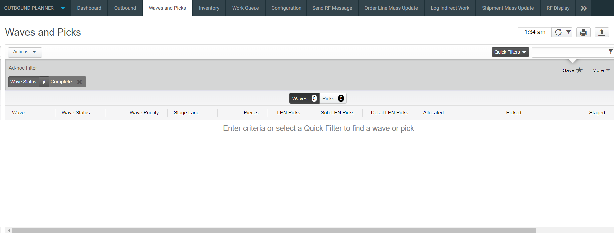
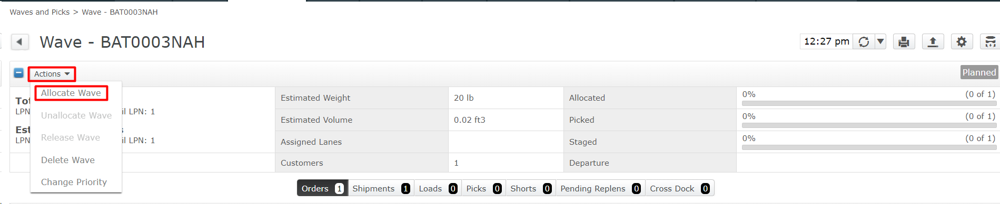

## **BASE_OUB_WAVE_ALLOC_MOCA_V001**
## **Test Category**
**☐** Custom

**☐** Smart IS

**🗹** Standard

## **Overview**
Wave allocation in Blue Yonder is a strategic process that involves
grouping orders together to streamline handling and improve operational
efficiency. By consolidating orders into waves, businesses can better
manage their inventory, optimize warehouse space, and reduce operational
costs. This approach allows for the simultaneous processing of multiple
orders, making tasks such as picking, packing, and shipping more
efficient. Wave allocation also enables businesses to prioritize orders
based on various factors, such as delivery deadlines or order sizes,
ensuring that critical orders are processed quickly and accurately.

Whether done manually or automatically, wave allocation in Blue Yonder
helps businesses plan shipments effectively, minimizing the time and
effort required for order fulfillment. By organizing orders into waves,
businesses can improve the overall workflow in their warehouses, leading
to faster order processing times and improved customer satisfaction.
Additionally, wave allocation can help businesses adapt to changing
demand patterns and seasonal fluctuations, allowing them to adjust their
inventory and production schedules accordingly. Overall, wave allocation
in Blue Yonder is a valuable tool for businesses looking to streamline
their operations and enhance their competitiveness in the market.

## **Applicable versions**

This test is designed to support versions greater than **2008.x.x**,
ensuring compatibility and smooth operation with the latest software
releases. Users can confidently utilize this test, as it is optimized
for newer versions while retaining a user-friendly testing process.

## **Test Arguments**

Test arguments are parameters or inputs that are passed to the test
cases to customize the test execution. These arguments provide
flexibility and allow for the reuse of the same test case with different
sets of data or configurations. The input is as follows:

  | Parameter              | Description                                                                                           |
| ---------------------- | ----------------------------------------------------------------------------------------------------- |
| **uc_test_exec_seqnum** | During each run, it generates a unique base-36 value.                                                 |
| **uc_schbat_expr**     | If an explicit schbat is not passed, this expression is used to default it. The expression seems to concatenate the string 'ADATAW-' with the value of uc_test_exec_seqnum. |
| **schbat**             | This parameter specifies the schbat to create. If it is not passed, the uc_schbat_expr expression is used to determine its value. |
| **Wh_id**              | If this parameter is not passed, the system should use the first shipment line in the wave to determine its value. |
| **Pcktyp**             | If this parameter is not passed, it should default to 'PICK-N-REPLEN-N-SHIP'.                         |
| **Consby**             | If this parameter is not passed, it should default to ship_id.                                        |
| **Pcksts**             | This parameter is passed on allocated wave. If it is not passed, it should default to 'H'.            |
| **uc_move_pcksts_to_p**| After allocation, this parameter is used to mark 'H' picks to 'P'. If it is not passed, it should default to '1'. |

 

## **Equivalent Usecase**

The following steps represent a general procedure for Allocating a
planned wave through GUI.\
**Step:1**

Select **Configuration** \> **Outbound Planner**

**Step:2**

Click on the **\'Wave and Pick\'** screen.

**Step:3**

Use the **Quick Filter** by clicking it.

**Step:4**

Choose **\'All Active Waves\'** from the options.

**Step:5**

Select the **specific wave** you want to **allocate**. Wave will be
shown in wave column.

**Step:6**

Go to the \'**Actions**\' tab and pick **\'Allocate Wave (Planned)**\'.

**Note**: Picks in a specific LPN level are released whenever the check
box for the LPN level is selected for immediate release or when all
three LPN levels are deselected.

**Step:7**

Confirm your choice by clicking \'**OK**\' to allocate the wave.

**Note**: If the application cannot allocate enough inventory to satisfy
the entire wave, the short tag is displayed on the wave as well as on
the associated order, shipment, and load that is short.

## **Applicable MOCA commands**

To allocate a wave using the MOCA command, you can use the following
command.

-   **Allocate wave**

This command will trigger the allocation of a wave based on the
predefined parameters and rules within the MOCA system.

## **Affected DB Tables**
When allocating a wave, the following database tables are typically
affected:

-   **PCKWRK_VIEW**

-   **PCKMOV**

These tables are crucial for tracking inventory movement and allocation
within the warehouse management system.

[SMART-IS](https://www.smart-is.pk) 

[Next-Test](/BASE_OUB_WAVE_PLAN_MOCA_V001/output.md)

