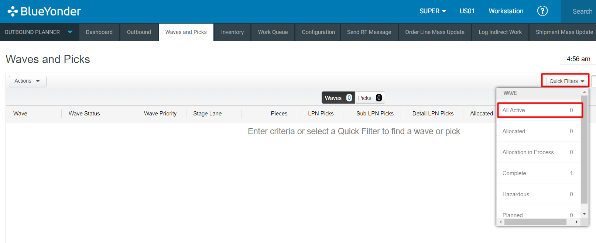
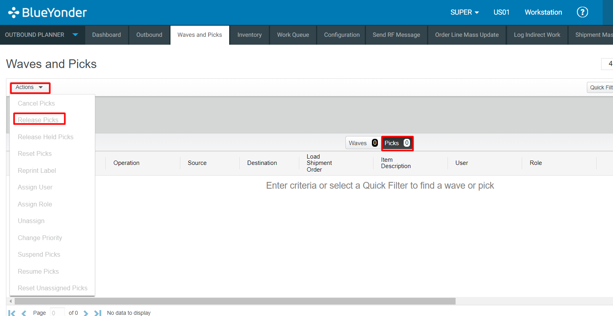

## **BASE_OUB_WAVE_WAIT_REL_MOCA_V001**
## **Test Category**
**☐** Custom

**☐** Smart IS

**🗹** Standard

## **Overview**

Pick release is the process of allocating the locations in the movement path for picked inventory to its destination, and releasing those picks so that operators can perform the work. During pick release, the application considers a group of picks in a wave, determines which picks are for work assignments and which are single picks, builds the work assignments, and then attempts to reserve locations for the entire group of picks.  Pick release can be executed manually or set up for automatic processing based on specific pick release configurations. If there are one or more locations with capacity for the group, the picks are released; if there is not enough capacity for the group, the picks are not released.  

## **Applicable versions**

This test is designed to support versions greater than **2008.x.x**,
ensuring compatibility and smooth operation with the latest software
releases. Users can confidently utilize this test, as it is optimized
for newer versions while retaining a user-friendly testing process.

## **Test Arguments**

Test arguments are parameters or inputs that are passed to the test
cases to customize the test execution. These arguments provide
flexibility and allow for the reuse of the same test case with different
sets of data or configurations. The input is as follows:
| Parameter                              | Description                                                                                                                           |
| -------------------------------------- | ------------------------------------------------------------------------------------------------------------------------------------- |
| **uc_test_exec_seqnum**                | During each run, it generates a unique base-36 value.                                                                                 |
| **Wh_id**                              | If this parameter is not passed, the system should use the first shipment line in the wave to determine its value.                  |
| **uc_schbat_expr**                     | If an explicit schbat is not passed, this expression is used to default it. The expression seems to concatenate the string 'ADATAW-' with the value of uc_test_exec_seqnum. |
| **schbat**                             | This parameter specifies the schbat to create. If it is not passed, the uc_schbat_expr expression is used to determine its value.   |
| **uc_sleep_ms_each_iter**              | It provides a pattern for load numbers to move.                                                                                      |
| **uc_sleep_ms_after_r_before_list_check** | When we are doing list, pckwrk goes to R temporarily and then to L -- so to avoid getting wrong R, once it detects all pckwrk in R -- wait for this many milli-seconds before looking for lists. Default is 10000 |
| **uc_max_iter**                        | To avoid an infinite loop, we cap the number of iterations. Default is 1000.                                                        |

## **Equivalent Usecase**
The following steps represent a general procedure for WAVE RELEASE
through GUI.

**Step:1**
Select **Configuration** \> **Outbound Planner**

**Step:2**

> Click on the **\'wave and picks\'** screen.

**Step:3**

Click on **Quick Filters** tab.

**Step:4**

 Select the **Picks** you want to release. picks will be shown in the column select them and release picks.

**Step:5**
Go to the \'**Actions**\' tab and click on '**Release Wave**

## **Applicable MOCA commands**
For release wave in MOCA We can use the following command.

-  **Release wave**

This command will release the wave and this command is based on the
predefined parameters and rules within the MOCA system.

## **Affected DB Tables**

When wave release action performed, the following database tables are
typically affected:

-   **Pckwrk_view**

-   **pckbat**

-   **rplwrk**

These tables are crucial when releasing wave in warehouse management
 system.

[SMART-IS](https://www.smart-is.pk) 
[Previous-Test](/DOCS/BASE_OUB_WAVE_PLAN_MOCA_V001/readme.md)
