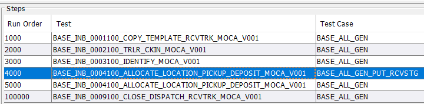
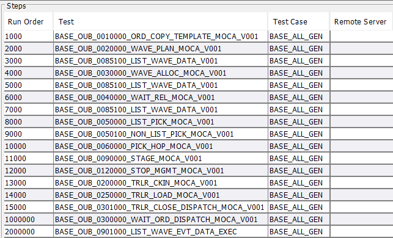

## Creating MOCA Based Tests

### Overview
Creating MOCA based tests requires intimate knowledge of the MOCA language and some concepts. As we create tests, we will utilize some concepts heavily: 

Some of these tests may be performing a series of complex tasks.  When  they are executed in the context of auTest, we want to publish the details about each step.  This requires appropriate use of “&” so that the output of the whole script is then published to the auTest framework.  For example: 
```moca
Publish data where a=1 

& 
publish data where a=2 
```

Will return two rows to the framework which can then be logged.  We utilize this technique in a MOCA test to publish information about each step in the script. 

Developing MOCA based tests requires us to trace the use case first from the front-end to extract the MOCA Commands.  We need to understand how we can easily identify the commands that were executed from the front-end, as those are the ones that will then be used in the test.  The idea is to make the MOCA based test run the same commands as the front-end so that it can expose issues easily. 

This section describes the steps involved in MOCA based tests:

### Get Traces

When developing MOCA based tests, we want to execute the MOCA commands that are as close to the ones executed by the front-end as possible. This is to make sure that our test coverage is as close to the real world as possible.

If the use case involves RF, then getting an MTF trace is a good first step as that shows the MOCA commands easily. Refer to the concepts section above to see how you can use traces to find appropriate commands.

### Decide Which Commands to Use

It may not be important to run every command that the client issued. Generally, we are interested in only those commands that changed the state of the underlying data.

There are exceptions to this rule though. For example, in some cases, it is possible that a “read” command has an error which fails the front-end. But generally, we want to take the middle path and as a first pass only focus on the commands that changed the state. If then we find that we missed something, we can add those “read” commands in the test as well.

### Decide on What Test You Will Create – One Use Case May Create More Than One Test

When we execute tests, we typically run them as part of a run set. A run set has details where each row represents a test case (a test case is a test with some pre-defined data).

It helps if we create smaller tests so that they are easily manageable and then string them together in a run-set. For example, the following run set shows how we receive a truck:



And the following shows how we process an outbound order:



You can see that we have created tests at a manageable level and then we string them together for the final run set.

### Decide on the Arguments That You Need for the Test

We need to then decide on the arguments for the test. There are certain arguments that are always there (see concepts above). In addition to that, we will have certain arguments that are based on the specific test or based on the type of run set that it will be called from. Please note:

To simplify development and testing of the testing script, you can create optional arguments that you default intelligently.

Understand the concept of `uc_test_exec_seqnum`. This is central to how we write tests. We always go by the idea that we have some template data and when running the test we copy from that template to the new data and then use it. That is why we typically have a “copy” test case as the first one in our run sets. But at the same time, we want to also support the idea of passing in explicit values as well to cover any specific scenarios.

Decide input as expressions where appropriate – but at the same time, allow for exact input as well.

### Decide on What Data Will This Test Run On

In some cases, we will process one row – but for MOCA based tests, we will often create them to process a set of data. For example, we may process all inventory in a truck and deposit to a destination.

If we decide to work on more than one row, then it is a good practice to allow for optional input variables to limit how much data is processed. For example here I am defining that I want to process a single row.

```moca
publish data
    where uc_autest_comflg = 1
    and uc_max_rows = 1
```
Then later on I can use `uc_max_rows` to limit the results of a query or use other techniques like “session variables” to limit the processing to a single row.

### Decide if Our Test Needs to Support Stress Testing

Every test is not automatically a candidate for being run as a stress test. To be run as a stress test, we need to make sure that the code has appropriate logic to “lock” and with “nowait” (see concepts above). The test should then also respect `uc_stress_test_mode` to make determination and then should process one row of data.

### Decide if Our Test Will Do a Commit or Rollback

As a general rule, we do not want to do commit or rollback inside a test script. If in a certain case we want to do this as part of a test, then we should make it controllable via input arguments.

The reason for doing commit or rollback will be to support stress testing and free locks such that it represents reality. For example, if we are going to pick up loads and deposit them as part of a script, it is a good idea to commit after pick and then after deposit as that is how the transaction works in reality. If we did not do that, then we would create artificial contention.

### Decide if Your Script Needs to Include a Random “Sleep”

It may be important in some cases to include a sleep inside the script. Typically that will be needed to support stress testing. If needed use `Thread.sleep` or the “go to sleep” MOCA command. But it is a good idea to define an optional input variable that must be set to do this.

### Decide on the Output of the Test Script

When our scripts run, their output is captured and recorded as part of the run. So the output becomes extremely valuable when we want to refer to the execution later.

With that understanding, we should not be stingy in terms of the output we create for the scripts.

 - Enclose each logical “step” of your test in a pair of braces. And then at the end of your logic, publish data that reflects the work done. Also refer to the concept above about capturing the timing. For example:

```moca 
start_ms = System.currentTimeMillis() catch(@?)
{
  <your logic>;
  end_ms = System.currentTimeMillis() catch(@?)
  |
  publish data
  where step = 'my step name'
  and <data that describes what the step did>
  and elapsed = @end_ms - @start_ms
}
```
 - Use `“&”` for each logical “step” inside your test script, for example: 

{ <step 1> } 
& 
{ <step 2> }


### Decide on how the script should behave for no data 

Generally, we want the script to raise an error if it did not find any data to process. However, that should be a conscious decision.

Sometimes, we may be processing a result set – and in those cases, you can use the following technique to raise an error at the end of your script:

`>> res_full 
| 
if ( rowcount(@res_full) = 0 ) 
  [select 1 from invlod where 1=2]`
  
`else 
  publish data combination 
  where res = @res_full `


### Version Proof Commands

If we know of a version issue, then try to make the code version-proof. You can use the following techniques:

- **Abstract `pckwrk` vs `pckwrk_view` as follows:**

`[select 1 from pckwrk_view where 1=2 ] catch(@?)` 
`| `
`publish data where uc_pckwrk_table = iif ( @? = 0 or @? = -1403 or @? = 510, 'pckwrk_view', 'pckwrk' )`

- You can call “list library versions” if you need to know the exact version.
- Prefer to use MOCA commands to get the data rather than SQL.
- Use `catch` to try different commands based on version.

### Creating BASE Tests

**Avoid Using Custom Commands:** The BASE tests are for all customers, so we should not use custom commands.

### Naming the Test

- It is important to decide on a good name for the test.
- The test should have a suitable prefix. For example, all tests that are done for the “world” tenant have a “base_” prefix. If commands are created for a certain tenant, then they need to have a proper prefix.
- The second part of the name (delimited by `_`) should indicate `INB` (for inbound), `OUB` (for outbound), `INV` (for inventory).
- It is suggested that for complex use cases, like inbound and outbound, we use a 7-digit (0 prefixed) number here so that they sort properly.
  - First four for main category, e.g., 0001 for order create, etc.
  - Starting from the fifth character for minor sorting.
  - After that put a meaningful name for the test.

### Naming the Test Script Command

- In many cases, the command is for a specific test (unless you are creating a reusable base command to be called from multiple tests or from other commands).
- Use an appropriate prefix for the command.
- Make a meaningful command name.
- If it is for a certain test, you can name it `<test name>_EXEC`.

### Formally Create Test Arguments

The input parameters are then defined for the test.

### Creating MOCA-Based Test Cases

Once the test has been created, we always want to create at least one test case. For BASE tests, typically create a test case called `BASE_ALL_GEN`. We can define arguments for this test case.

### Create or Change a Run Set

Once a test case has been created, we need to see if a new run-set is needed or we need to add it to an existing run set.

### Create or change a run set arguments 

The run set arguments may need to be created or changed to support test cases. 

**AuTest Data Dictionary** 

| Table             | Comments                                                        |
|-------------------|-----------------------------------------------------------------|
| Les_cmd           | This table maintains all test script commands                   |
| Usr_ossi_test     | This table has all the tests:                                   |
|                   | - Uc_ossi_cmd points to the command that has the test script. It is possible to use ##<command> syntax as well. For example: `##base_gen_sample001_moca_v001_exec##` |
|                   | - Uc_ossi_test_grp_id is MOCA                                   |
|                   | - Uc_ossi_validate_cmd can also be set to a command. Here too we can call command directly or use ##<command> syntax |
|                   | - Uc_ossi_grp is used to categorize the tests. For example INBOUND, INV, OUTBOUND |
| Usr_ossi_test_arg| This table has the arguments for a test                         |
|                   | - Uc_oasi_af_arg_id is the name of the argument. This is the name which is used in the MOCA snippet (in les_cmd) |
|                   | - Uc_ossi_descr is detailed description                         |
|                   | - Uc_ossi_srtseq is used for sorting                            |
|                   | - Uc_ossi_default_value_cmnt is for documentation               |
|                   | - Uc_ossi_example is for documentation                          |
|                   | - Uc_ossi_default_value is the literal default. It can also call a command, or expression, for example: An expression `[['STOLOC' + '@uc_test_exec_seqnum']]` Call a command directly or via “Script” `##publish data where @* and uc_use_context='rcvtrk' | Script("base_get_ossibot_wh_id")##` |
| Usr_ossi_test_case| This is used to define test cases for a test                    |
|                   | - Uc_ossi_test_case_id is the name of the test case            |
|                   | - Uc_env_id is used to define a specific environment. Typically we will set to % to imply all |
|                   | - Uc_ossi_client_id is to define a specific client. We leave it as null |
|                   | - Uc_ossi_descr is detailed description                         |
|                   | - Uc_ossi_valdidate_cmd is executed after the test case has run. Call script directly or as ## |
|                   | - Uc_exepected_exec_ms is the expected execution milliseconds  |
|                   | - Uc_ossi_correct_result is the correct result                 |

## Creating Web-Based Tests 

Web-based tests in the Smart AuTest suite are designed to automate interactions with the web user interface (UI), validating the functionality of web-based applications. This guide outlines the comprehensive steps required to create effective web-based tests.

### Define Application Flow

The application flow refers to the sequence of actions and interactions that a user would typically perform when using an application. It involves navigating through different screens, entering data, interacting with buttons and links, and verifying expected outcomes. 

### Define Application Flow Steps

Application flow steps represent individual actions performed on web forms. These actions can include clicking buttons, entering text, and filtering data. Key examples of application flow steps include:

- **wm.config/wm.config.warehouse**: Launches the specified web form.
- **CLICK_LINKS**: Simulates clicking a hyperlink.
- **ENTER_TEXT**: Simulates entering text into a form field.
- **BUTTON**: Simulates pressing a button.

For example, to allocate a wave we'll do following setps

-  The first step is to wave and pick screen link.
-  Second step is for Quick filter click.
-  Third step is for All Active Wave.
-  The fourth step is to select the wave which we want to allocate.
-  The fifth step is to go to actions tab and select allocate wave which is planned.
-  Sixth is select OK to allocate wave.

And we'll define these steps in application flow steps given below:

- **wm.outboundplanner/wm.wavesandpicks**: Go to wave and pick screen.
- **CLICK_LINKS**: For Quick filter click
- **CLICK_TABLE_CELLS**: For All Active 
- **CLICK**: To select a wave which we want to allocate
- **CLICK_LINKS**: For go to actions tab and select allocate wave which is planned.
- **CLICK**: To select OK to allocate wave.


### Define Application Flow Detail Arguments

Application flow details are typically provided as arguments to the test. These arguments define the specific steps and parameters required to execute the test accurately. By providing application flow details as arguments, testers can easily customize and parameterize their test. This allows for flexible and reusable test that can be executed with different data sets, configurations, or expected results. Moreover, it facilitates better test case management and maintenance, as changes to the application flow can be made by modifying the arguments without modifying the core logic.

### Define Tests

A web test combines application flows to represent a complete web-based scenario. Each test consists of the following components:

- **Name**: Assign a meaningful and descriptive name to the test.
- **Type**: Specify the test type as WEB.

### Test Arguments

Test arguments serve as the customizable parameters or inputs that are fed into test to tailor the test execution according to various scenarios or conditions. They play a crucial role in enhancing the flexibility and reusability of test cases by enabling the same test to be executed with different sets of data.

By leveraging test arguments, testers can efficiently validate diverse scenarios within the application without the need to duplicate test. This flexibility allows for comprehensive testing coverage while minimizing redundancy in test case creation and maintenance efforts.

### Create Test Cases

Test cases define specific input parameters for the test arguments and outline the exact scenarios to be tested. Each test case includes:

- **Name**: A unique identifier for the test case.
- **Arguments**: Specific values for the test arguments to tailor the test scenario.

### Combine in Run Sets

Run sets are collections of test cases that represent comprehensive use cases. To manage run sets effectively:

- **Define Run Set**: Create or update a run set to include the newly defined test cases.
- **Run Set Arguments**: Specify any necessary arguments required for the run set.


## Creating RF Based Tests

RF-based tests in the Smart AuTest suite are designed to simulate user interactions with RF forms, ensuring the workflows function correctly. Here's a step-by-step guide to creating RF-based tests:
For RF based tests, you can use the `MTF trace` option.  That easily provides the commands that were executed by the MTF framework to perform a use case

### Define Application Flow Steps

Application flow steps are the individual actions taken within an RF form, each corresponding to a specific interaction. Examples include:

- **IDENTIFY_LOAD**: Represents the action of identifying a load in the RF form.
- **ENTER_TEXT**: Simulates entering text into a field within the RF form.

### Create Application Flows

Application flows are sequences of these steps that form complete RF workflows. They can include conditional logic to handle different workflow branches. Examples include:

- **AF_IDENTIFY_LOAD**: A flow dedicated to the load identification process.
- **AF_LOAD_ID_MAIN_V002**: A comprehensive flow that includes sub-flows and steps for navigating through various RF forms.

### Define Tests

An RF test combines various application flows and consists of the following components:

- **Name**: A descriptive name for the test.
- **Type**: Specify the test type as RF.
- - **Commands**: Define commands to be executed at different stages of the test:
  - **Pre-Test Command**: Initializes the test environment and prepares the necessary preconditions.
  - **Post-Test Command**: Performs cleanup operations or additional verifications after the main test execution.

### Create Test Cases

Test cases specify the input parameters and scenarios for testing. Each test case includes:

- **Name**: A unique identifier for the test case.
- **Arguments**: Specific values for the test arguments to tailor the test scenario.
- **Validation Command**: A command executed to verify the outcome of the test case.


### Combine in Run Sets

Run sets are sequences of test cases that represent complete use cases. To manage run sets:

- **Define Run Set**: Create or update a run set to include new test cases.
- **Run Set Arguments**: Specify any necessary arguments for the run set.
