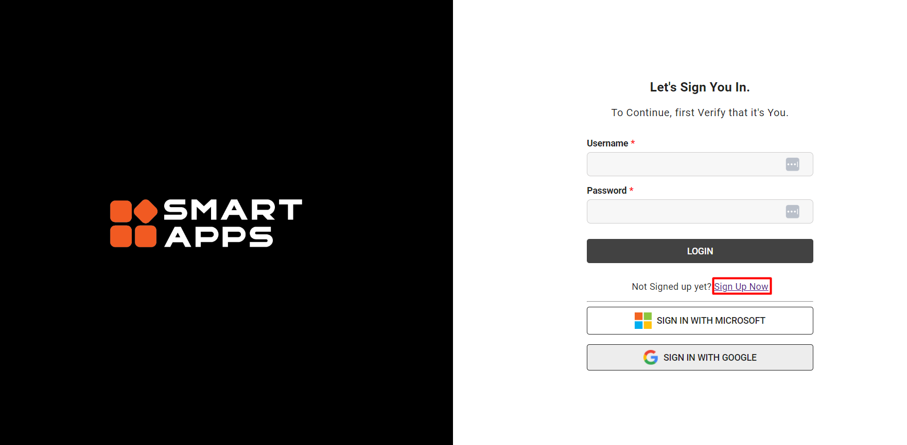

## Overview

The Smart AuTest suite is available in a subscription model. This implies that customers do not need to install any software in their ecosystem. The tests are launched from the Smart MOCA Client but the underlying data is managed from the cloud. 

There are following key features that are listed below:

1. **Cloud-Based Infrastructure**: All test data is stored and managed within the cloud, ensuring scalability, accessibility, and robust security measures.

2. **Seamless Integration**: Tests are launched directly from the Smart MOCA Client, providing a user-friendly interface for initiating and monitoring testing processes.

3. **Subscription Flexibility**: Customers can choose from various subscription options tailored to their specific needs, whether opting for a trial period to evaluate the suite's capabilities or committing to a permanent subscription for ongoing testing requirements.

4. **Effortless Setup**: The subscription model simplifies the onboarding process, allowing users to request a tenant through a straightforward web form. Once the request is submitted, Smart promptly handles the setup process, creating user accounts and providing necessary login credentials.

5. **Automated Confirmation**: Upon submission of the web form, key contacts receive a confirmation email containing essential details and login instructions. This automated process ensures a smooth transition for users into the Smart auTest environment.

6. **Trial Access**: During the trial period, organizations have access to both auTest and stress test functionalities, enabling comprehensive evaluation of the suite's capabilities and suitability for their testing requirements.

## Registration and Setup for SmartApps and AuTest

Following steps are used for registration and setup for SmartApps and AuTest

### Step:1

Users from the organization log in to SmartApps and register. You can also login through Microsoft and Google account.

### Step:2

Each named user creates an app key.

### Step:3

Link the Smart MOCA Client to Smart Apps using the created app key.

### Step:4

Users can now connect to auTest from the Smart MOCA Client.

## Preparing the target environment for Smart auTest
In order to implement a secure protocol where we do not accidently run automated tests against the wrong environment (e.g. production), we require that the target environment has a registry setting called `UC_SMART_AUTEST_ALLOWED` set to `1`.  The registry file (which is typically located in %LESDIR%\registry and is typically called registry.  Environment variable MOCA_REGISTRY points to it as well) will have the following section in `[ENVIRONMENT]` section:
>`UC_SMART_AUTEST_ALLOWED=1`

If this setting is not in place, we will receive an error when trying to execute a test.

## Define Connections in Smart MOCA Client
You will need to create Connections in Smart MOCA Client with appropriate information to later launch the Smart AuTest suite against that environment.  It is strongly recommended that this page defines the various settings first and then we launch the Smart AuTest.  By following this approach, the various connection settings will be used for the automated testing session.

It will show the following page:

