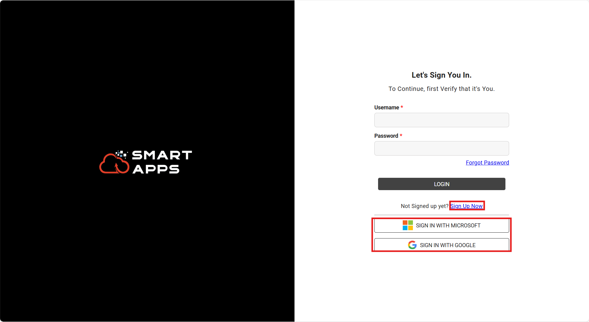
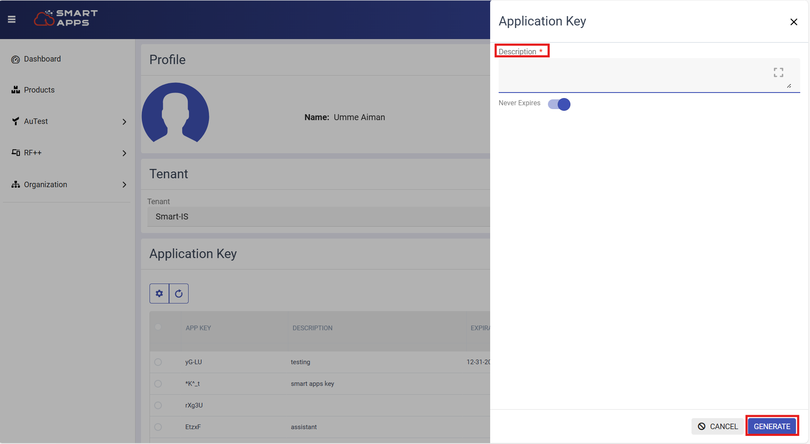
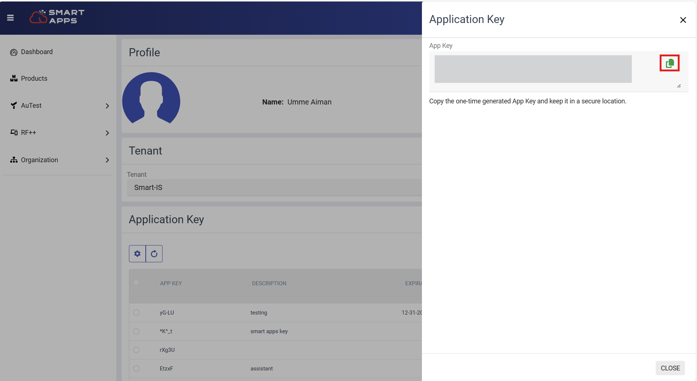

# Getting Started

 Setting up AuTest involves two main steps: generating an application key from SmartApps and using it to launch AuTest through MOCA.

 Follow these simple steps to start automating your WMS testing with ease.

## Application Key Generation 

SmartApps is a centralized cloud-based platform used for maintaining all metadata, test cases, commands, and runsets for Smart AuTest. 

To enable a secure connection between SmartApps and MOCA for launching Smart AuTest, you need to generate an **Application Key**.

Following steps are used for generating key on Smart Apps:

1. Go to the [Smart Apps portal](https://apps.smart-is.com/login).    

2.  **Log in** using your organizational email, or sign in via **Microsoft** or **Google** account.  

    If you don’t have an account yet, you can easily **sign up** directly from the login page.

  
   

3. Navigate to your **Profile** section. 

    

        
   

4. Now click on **Add** button to generate Application key.

    

        
   

5. Locate the **Application Key** section, add the description and click **Generate Key**.

    

        
   

6. Once generated, **copy** the Application Key and keep it **secure and private**.  
   - You’ll need this key in the next step to launch Smart AuTest in MOCA.

    

        
   

## Launching AuTest from MOCA

1. Open the **MOCA** interface.

2. Navigate to the **Smart Connect** section and select **Cloud Connect**.

    

        
   

3. Paste the **Application Key** you copied from SmartApps and save key. 

    

        
   

4. Now click **Add-On**.

    

        
   

5. Select **Smart Innovations** and then select **AuTest** from the list.

    

        
     

6. Smart AuTest will now be launched and ready to use.

## Preparing the target environment for Smart AuTest
In order to implement a secure protocol where we do not accidently run automated tests against the wrong environment (e.g. production), we require that the target environment has a registry setting called `UC_SMART_AUTEST_ALLOWED` set to `1`.  The registry file (which is typically located in %LESDIR%\registry and is typically called registry.  Environment variable MOCA_REGISTRY points to it as well) will have the following section in `[ENVIRONMENT]` section:
>`UC_SMART_AUTEST_ALLOWED=1`

If this setting is not in place, we will receive an error when trying to execute a test.

## Define Connections in MOCA Client

Before launching Smart AuTest, it's important to set up the correct connection settings in the **Smart MOCA Client**. This ensures your tests run against the right environment with the proper configuration.

### Why it Matters
Defining connections in advance allows Smart AuTest to automatically use these settings for a consistent and reliable testing session.

Following steps are required for setting up the environment:

1. Open the **Smart MOCA Client**.
2. Go to the **Files** menu and select **Edit Servers**.

    

        
     

3. In the server editor, **add all required connection details**, such as:
   - **Service URL**
   - **Port Number**
   - **User ID**
   - **Warehouse/Environment Name**

    

        
     

4. Save the server configuration.

Once this is done, you’re ready to launch Smart AuTest with your predefined settings.

---
 

