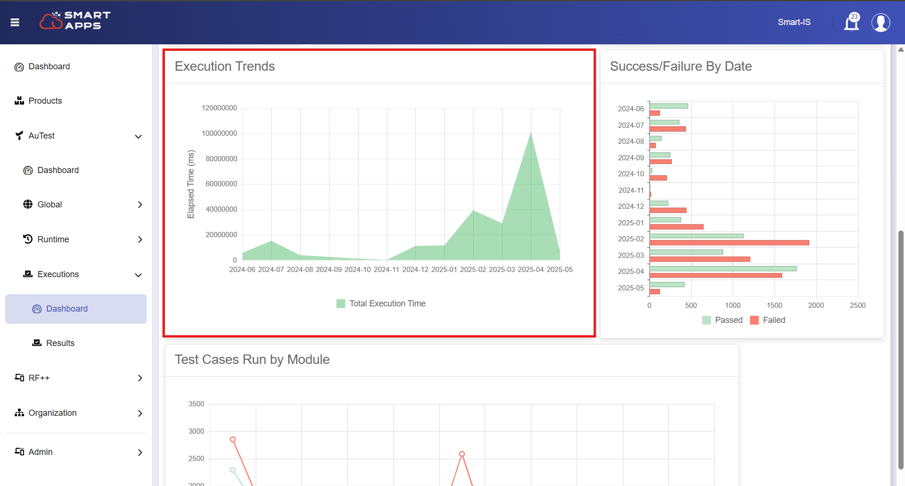

# Execution Analytics

The **Execution Dashboard** in AuTest offers a rich, visual representation of test performance metrics over time.

It enables QA teams to monitor progress, identify bottlenecks, and make data-driven decisions to improve testing quality and coverage.

To access the dashboard, navigate to:  
**`Autest → Executions → Dashboard`**

  
   

## Key Insights Available on the Dashboard

Below are the main insights you can explore on the dashboard, offering a comprehensive overview of Autest execution dashboard.

### Execution Summary

- **Total Executions**: Displays the complete number of executed tests during the selected date range.
- **Success Rate**: Shows the percentage of passed tests visually, including exact counts.
- **Passed vs Failed**: A clear breakdown of successful and failed test cases.

  
   

### Test Types Breakdown

A **pie chart** view showing test executions by category:
- ADHOC
- REGRESSION
- STRESS

  
   

This helps identify the types of testing that are most frequently performed.

### Tests Run by Type

A **bar graph** comparing execution results by platform:
- MOCA
- RF
- WEB

  
   

Each platform shows **Passed** (green) vs **Failed** (red) tests to give a quick status of test reliability.

###  Execution Trends Over Time

This **line graph** tracks the total execution time (in milliseconds) month by month.

  
   

It helps:
- Identify high-load months
- Spot unusual trends or spikes
- Optimize execution planning

###  Success/Failure by Date

A **stacked bar chart** showing the number of passed and failed test executions per month.

  
   

Great for:
- Tracking improvements in test success rates
- Spotting problematic periods
- Visualizing stability over time

### Module-Wise Test Execution

This section shows which WMS modules are being tested the most, and how each performs.

Examples include:
- **INBOUND**
- **INVENTORY**
- **OUTBOUND**
- **ORDER**

  
   

You’ll see a **line chart** that compares **Passed vs Failed** test cases per module.

## Key Benefits of the Dashboard

- **Real-Time Visibility** into testing progress and issues
- **Platform-Based Comparison** for identifying where failures occur
- **Clear Trends** across execution time and module-wise testing
- **Exportable Data** for reports and analysis
- **User-Friendly Filters** for customizing views by date range

> Need help exporting results or analyzing failures? Head over to the [Results Page](./results.md) for detailed instructions.

---
 
