# Case Study

## MOCA Based Test for Receiving

### Overview
Smart AUtest is an advanced automated testing suite designed to facilitate comprehensive testing with minimal setup. This case study focuses on MOCA-based tests for the receiving process, specifically for identifying and processing incoming inventory using the provided Smart AUtest framework.

### Objective
The primary objective of this case study is to execute a MOCA-based test for receiving that simulates the identification and processing of incoming inventory. The goal is to ensure that the system accurately handles inventory data, including the generation of unique identifiers and the updating of relevant database tables.

### Sample Data Creation

**Sample RCVTRK Data**
For the purpose of testing inbound inventory, we create sample RCVTRK data. For example, we use the identifier **RCVSMP001** to represent a sample truck. This data will be utilized to simulate the presence of incoming inventory on a truck.

**Relevant Tables**
- **rcvtrk**: This table contains information about the trucks and their status.
- **rcvinv**: This table contains information about the inventory received.
- **rcvlin**: This table contains line items related to the received inventory.

Optionally, we can include inventory data for ASN testing.

### Running the Test

#### MOCA-Based Test for Receiving
For the MOCA-based test for receiving, we assume a scenario where a truck has arrived and has been checked in. The system will identify all inventory items on the truck. This setup supports ASN scenarios, ensuring that if the truck's inventory is already identified, the test simply returns a success status.

#### Execution Steps

1. **Initiating the Test**
   - To execute the test, press the “Start” button on the Smart AUtest interface.
   - 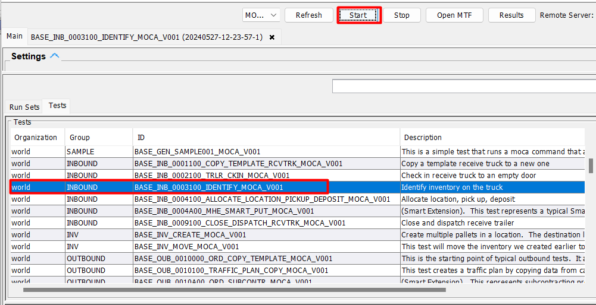
   - 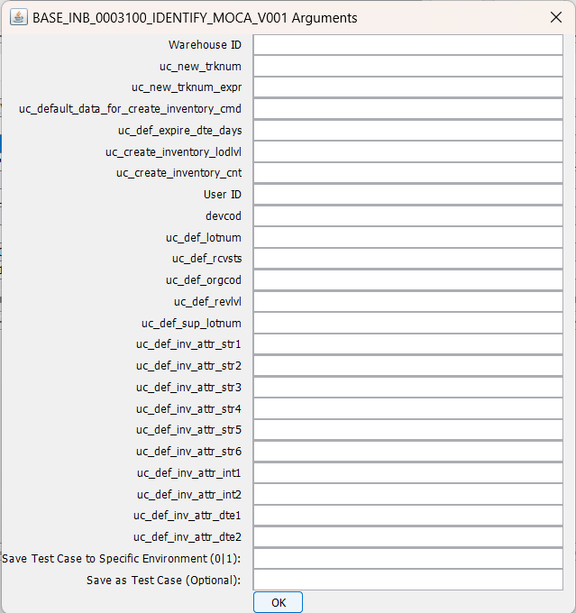

2. **Script Execution for Warehouse Identification**
   - The following script will be called to identify the warehouse ID:
     ```
     ##publish data where @* and uc_use_context='rcvtrk' | Script("base_get_ossibot_wh_id")##
     ```
   - In this script, we will input our sample truck identifier in the variable `uc_src_trknum`, i.e., `RCVSMP001`.

3. **Confirming the Sample Truck**
   - After entering the truck identifier, press "OK" to proceed.

### Execution Console

The execution console provides real-time feedback on the test process. Key features include:

- **Step Highlighting**: The current step being executed is highlighted in yellow.
- **Status Display**: Each row's status is displayed, indicating success or failure.
- **Elapsed Time**: The elapsed time for each row is shown, providing insight into the test duration.
  
  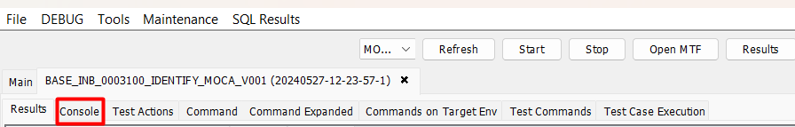

### Detailed Execution Flow

1. **Start Button Pressed**:
   - The test initiates upon pressing the "Start" button.
   - The system begins by verifying the presence of the sample truck (`RCVSMP001`) in the `rcvtrk` table.

2. **Warehouse ID Retrieval**:
   - The script `##publish data where @* and uc_use_context='rcvtrk' | Script("base_get_ossibot_wh_id")## ` is executed, fetching the warehouse ID where the truck 
     is supposed to be received.
   - This ensures that the system is contextually aware of the warehouse environment.

3. **Inventory Identification**:
   - The system then moves to identify all inventory items associated with the truck. This includes checking the `rcvinv` and `rcvlin` tables.
   - If the inventory has already been identified (supporting ASN scenarios), the test will return a success status without re-processing the inventory.

4. **Database Updates**:
   - Unique identifiers for the received inventory are generated.
   - Relevant database tables (`rcvtrk`, `rcvinv`, `rcvlin`) are updated with the latest inventory data.

5. **Completion**:
   - The execution console displays each step, with the current step highlighted.
   - Status and elapsed time for each row are shown, providing a clear overview of the test progress and performance.
 

## RF-Based Test for Receiving

### Overview
Smart AUtest is an advanced automated testing suite designed to facilitate comprehensive testing with minimal setup. This case study focuses on RF-based tests for the receiving process, specifically for identifying and processing incoming inventory using the provided Smart AUtest framework.

### Objective
The primary objective of this case study is to execute an RF-based test for receiving that simulates the identification and processing of incoming inventory. The goal is to ensure that the system accurately handles inventory data, including the generation of unique identifiers and the updating of relevant database tables.

### Sample Data Creation

**Sample RCVTRK Data**
For the purpose of testing inbound inventory, we create sample RCVTRK data. For example, we use the identifier **RCVSMP001** to represent a sample truck. This data will be utilized to simulate the presence of incoming inventory on a truck.

** Relevant Tables**
- **rcvtrk**: This table contains information about the trucks and their status.
- **rcvinv**: This table contains information about the inventory received.
- **rcvlin**: This table contains line items related to the received inventory.

Optionally, we can include inventory data for Advanced Shipping Notice (ASN) testing.

### Running the Test

#### RF-Based Test for Receiving
For the RF-based test for receiving, we assume a scenario where a truck has arrived and has been checked in. The system will identify all inventory items on the truck. This setup supports ASN scenarios, ensuring that if the truck's inventory is already identified, the test simply returns a success status.

#### Execution Steps

1. **Initiating the Test**
   - To execute the test, press the “Start” button on the Smart AUtest interface.
   - 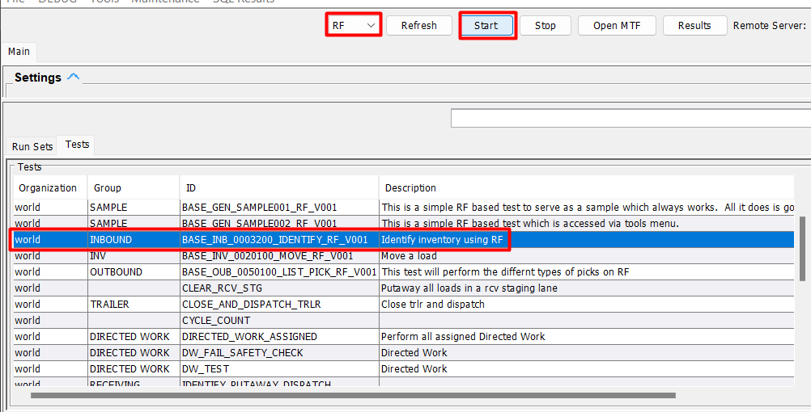
   - 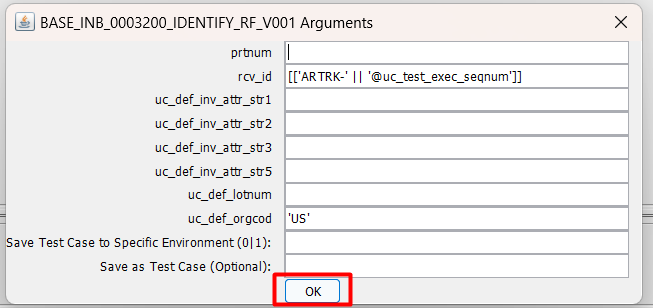

2. **Script Execution for RCV_ID Generation**
   - The following expression will be executed to generate the `rcv_id`:
     ```sql
     [['ARTRK-' || '@uc_test_exec_seqnum']]
     ```
   - This expression concatenates the prefix `ARTRK-` with the unique test execution sequence number, ensuring a unique identifier for each test run.

3. **Confirming the Sample Truck**
   - After generating the `rcv_id`, the system will use this identifier to track the sample truck (`RCVSMP001`) in the `rcvtrk` table.

### Execution Console

The execution console provides real-time feedback on the test process. Key features include:

- **Step Highlighting**: The current step being executed is highlighted in yellow.
- **Status Display**: Each row's status is displayed, indicating success or failure.
- **Elapsed Time**: The elapsed time for each row is shown, providing insight into the test duration.
  
  

### Detailed Execution Flow

1. **Start Button Pressed**:
   - The test initiates upon pressing the "Start" button.
   - The system begins by verifying the presence of the sample truck (`RCVSMP001`) in the `rcvtrk` table.

2. **RCV_ID Generation**:
   - The expression `[['ARTRK-' || '@uc_test_exec_seqnum']]` is executed to generate a unique `rcv_id`.
   - This `rcv_id` is used to uniquely identify the test run and associate it with the specific truck and its inventory.

3. **Inventory Identification**:
   - The system then moves to identify all inventory items associated with the truck. This includes checking the `rcvinv` and `rcvlin` tables.
   - If the inventory has already been identified (supporting ASN scenarios), the test will return a success status without re-processing the inventory.

4. **Database Updates**:
   - Unique identifiers for the received inventory are generated.
   - Relevant database tables (`rcvtrk`, `rcvinv`, `rcvlin`) are updated with the latest inventory data.

5. **Completion**:
   - The execution console displays each step, with the current step highlighted.
   - Status and elapsed time for each row are shown, providing a clear overview of the test progress and performance.


## Web-Based Test for Wave Planning

### Overview
Smart AUtest is an advanced automated testing suite designed to facilitate comprehensive testing with minimal setup. This case study focuses on web-based testing for the wave planning process, specifically for organizing and optimizing order fulfillment using the provided Smart AUtest framework.

### Objective
The primary objective of this case study is to execute a web-based test for wave planning that simulates the organization and optimization of order fulfillment. The goal is to ensure that the system accurately groups and prioritizes orders, generates efficient picking plans, and updates relevant database tables accordingly.

### Sample Data Creation

**Outbound Orders**
For the purpose of testing wave planning, we create sample orders with the following criteria:
 - **Template_flg = 1**: Indicates that these orders are templates for generating actual orders.
 - Orders are named with a **“ATST-TMPL-“** prefix.
 - We generate both orders and order line data to simulate a realistic scenario.

### Running the Test

#### Executing the Test
To execute the test, follow these steps:
1. Press the “Start” button on the Smart AUtest interface.
   - 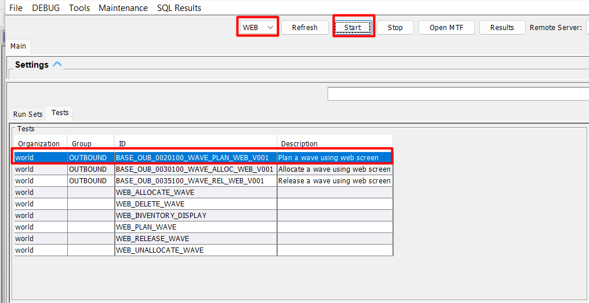
   - 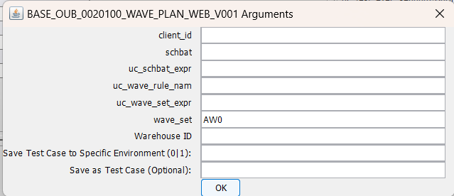
2. Provide the URL for the web-based wave planning module.
   - After pressing the "Start" button, a prompt will appear requesting the URL.
   - Enter the URL and press "OK" to start the test.
   - 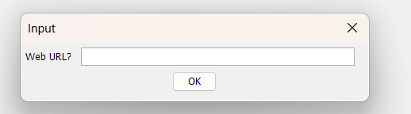

### Execution Console

The execution console provides real-time feedback on the test process. Key features include:

- **Step Highlighting**: The current step being executed is highlighted in yellow.
- **Status Display**: Each row's status is displayed, indicating success or failure.
- **Elapsed Time**: The elapsed time for each row is shown, providing insight into the test duration.

### Detailed Execution Flow

1. **Start Button Pressed**:
   - The test initiates upon pressing the "Start" button.
   - The system begins by loading the web-based wave planning module.

2. **URL Prompt**:
   - After initiating the test, a prompt appears requesting the URL.
   - Enter the URL and confirm to proceed with the test.

3. **Wave Planning Execution**:
   - The system simulates the wave planning process, which involves organizing and optimizing order fulfillment.
   - Orders are grouped and prioritized based on predefined criteria.
   - Efficient picking plans are generated to streamline the fulfillment process.

4. **Database Updates**:
   - Relevant database tables are updated to reflect the changes made during wave planning.
   - This includes updating order statuses, generating picking lists, and recording any modifications to order details.

5. **Completion**:
   - The execution console displays each step, with the current step highlighted.
   - Status and elapsed time for each row are shown, providing a clear overview of the test progress and performance.

## Run Set for RF Receiving

### Overview
Smart AUtest is an advanced automated testing suite designed to facilitate comprehensive testing with minimal setup. This case study focuses on a run set of RF-based tests for the receiving process, specifically aimed at verifying the identification and processing of incoming inventory using the provided Smart AUtest framework.

### Objective
The objective of this run set is to execute a series of RF-based tests for receiving to simulate the identification and processing of incoming inventory. The tests aim to ensure that the system accurately identifies inventory, processes incoming items efficiently, and updates the relevant database tables. This includes scenarios where the truck inventory is already identified, supporting ASN processes by returning success if inventory identification is pre-existing.

### Sample Data Creation

For inbound testing, we create sample RCVTRK data, using identifiers such as **RCVSMP001**. This data includes `rcvtrk`, `rcvinv`, and `rcvlin` records. Optionally, inventory data can be included for ASN testing.

#### Run Set Definition

For this illustration, we use the `BASE_INB_000100_CREATE_TO_DISPATCH_USING_RF` run set, which consists of the following steps:

| **Step (Test)**                             | **Description**                                                                                                                                                              |
|---------------------------------------------|------------------------------------------------------------------------------------------------------------------------------------------------------------------------------|
| `BASE_INB_0001100_COPY_TEMPLATE_RCVTRK_MOCA_V001` | This step copies a `RCVTRK` record and creates new `rcvtrk`, `rcvinv`, and `rcvlin` records for our test run. It utilizes the `uc_test_exec_seqnum` variable to ensure unique record creation. |
| `BASE_INB_0002100_TRLR_CKIN_MOCA_V001`    | Using `uc_test_exec_seqnum`, this step checks in the truck against an open door.                                                                                            |
| `BASE_INB_0003200_IDENTIFY_RF_V001`       | Identifies all inventory in the truck. Supports ASN scenarios, returning success if truck inventory is already identified.                                                    |
| `BASE_INV_0020100_MOVE_RF_V001`           | Moves inventory to the destination location.                                                                                                                                  |
| `BASE_INB_0009100_CLOSE_DISPATCH_RCVTRK_MOCA_V001` | Closes and dispatches the truck.                                                                                                                                             |

### Executing the Run Set

To execute the run set, follow these steps:

1. Press the “Start” button on the Smart AUtest interface.
   - 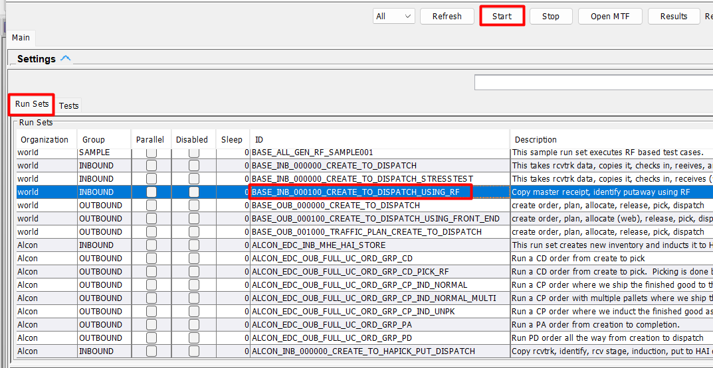
   - 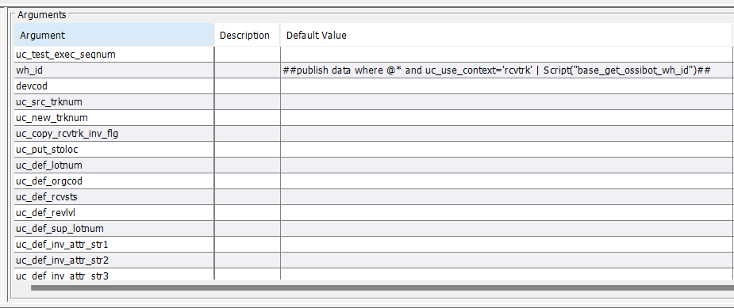
2. Provide the required information, including the sample truck identifier (`RCVSMP001`).
3. Press "OK" to proceed with the execution.

### Execution Console

The execution console provides real-time feedback on the test process, displaying each step as it executes. Key features include:

- **Step Highlighting**: The currently executing step is highlighted in yellow.
- **Status Display**: Each row's status is shown, indicating success or failure.
- **Elapsed Time**: The time taken for each step is displayed, providing insights into test duration and performance.

### Steps Execution

The following steps are executed as part of this run set:

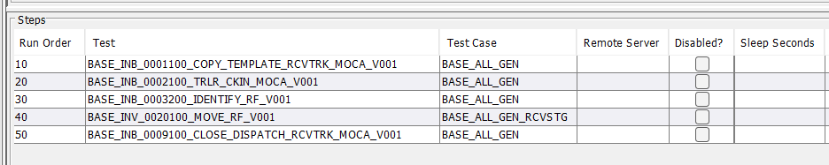

