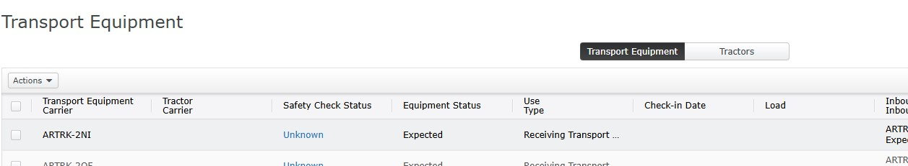
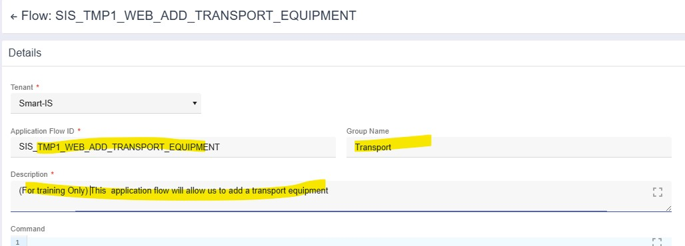
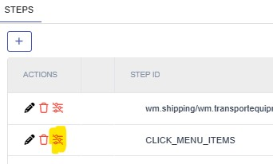
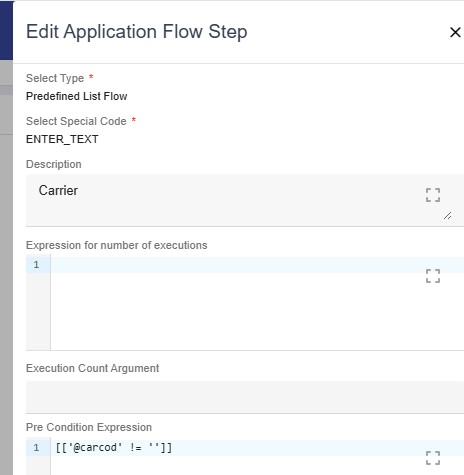
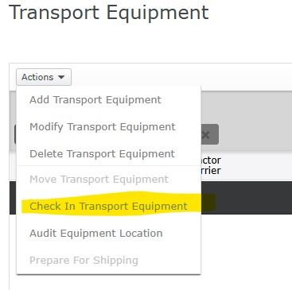
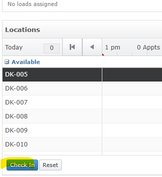
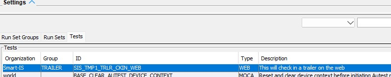

# Overview

## Example
We will work through following example

- Add a trailer (Transport Equipment)
- Look up the trailer
- Check in the trailer
- Dispatch the trailer
Once we have defined our desired "test", we should define the input paramters for the test.  Some guidelines in this regard are:
- The input parameters should be consistent.  Smart IS recommends that for any entity, use the column in the database.  For this test we will have following:

| Argument    | Description          |
|-------------| ---------------------|
| trlr_num    | This is the trailer number.  This is not trlr_id since trlr_id is not exposed in Web UI |
| carcod      | This is the carrier code.  Note that Web UI expects carrier name but we will pass in code as input |
| trlr_cod    | To indicate if it is shipping or receiving |
| trlr_typ    | The type of the trailer |
| yard_loc    | This is where we want to check in the trailer to |

While it is not a requirement to use these consistent names or to use codes instead of text, we strongly recommend it as this improves test reusability.  Using codes in this way allows for running the test when descriptions change or we are running in a differnt language.

- When providing code values, pass in code (even though the Web UI expects text)
- Create small "Application Flows" that are then brought together by other "Application Flows"
- The test should only call a subset of application flows that have CALLABLE in their names.  This strategy simplifies reuse of applicaton flows and also simplifies stringing the application flows together.
- Plan how you want to create the test

Once above is done, we need to design how we want to create this test and which application flows we want to create.  We always want to think about reuse.  Following describes how we can achive this

- Open "Transport Equipment Screen" to create the trailer

    <div style="text-align: left;">
        
    </div>

- Open it again but this time we look up the trailer

    <div style="text-align: left;">
        
    </div>

- Then we check it in

So our plan will be to to create following application flows

- WEB_ADD_TRANSPORT_EQUIPMENT (to add transport equipment)
- WEB_CKIN_TRANSPORT_EQUIPMENT (to check in transport equipment)
- Since our check in will string together these two, we recommend convention of using MAINLINE suffix.  Our intention is to check in a trailer, so we will create WEB_TRLR_CKIN_MAINLINE.  This will then call the core application flows.
- This strategy is important to create complex tests where, for example, sub-steps are executed in a loop until a condition becomes true. 

### Create transport equipment

Once we have our plan in place, now we need to execute the use case manually and capture critical metadata

- Open "Transport Equipment Screen" 

    <div style="text-align: left;">
        
    </div>

- Capture the code we need to call it independently.  This is in the URL after the `#`.  For example

    ````
    http://BLAHBLAH/portal?siteId=ABC&subsite=ABC#wm.shipping/wm.transportequipment////
    ````

The name needed to launch this is **wm.shipping/wm.transportequipment**

- Note that we have the list of standard ones alredy populated.
- See if the form has multiple buttons or tabs which may require us to select one all the time.  For example this form has "Transport Equipment" and "Trailer" button.  But we can ignore this as the one that is selected is what we want
- We want to create a new trailer first.  So we need to press Actions and then selct "Add Transport Equipment"

    <div style="text-align: left;">
        
    </div>

Note down the exact text, i.e. "Add Transport Equipment"

- A new form now shows up 

    <div style="text-align: left;">
        
    </div>

- During add we need to set several fields here.  We will need to record the _names_ of those controls.  In Chrome, you can right click on a control and then choose **"Inspect"**.  For example navigate to "Equipment Number", right click and choose Inspect 

    <div style="text-align: left;">
        
    </div>


- Then see the name of the field.  For example, in this case the name is "trailerNumber"
    
    <div style="text-align: left;">
        
    </div>
    

Using this technique find the names of all the fields that you want to control.  In this case we have
    
| Form Field      | Input Parameter | Description | Comments |
|-----------------|-----------------|---------------------------------|-------------------------|
| trailerNumber   | trlr_num        | Trailer Number | This is what user enters as trailer number |
| carrier         | carcod          | Carrier        | Note that user enters a name as opposed to code |
| trailerCode     | trlr_cod        | Use            | Note that user enters a description |
| trailerType     | trlr_typ        | Type           | Here also we have a description and not the code |

- At the end we press a button called "Save" 

    <div style="text-align: left;">
        
    </div>

So now let us convert what we have into an application flow.  We are performing these steps on https://apps.smart-is.com

1. Select a name for this application flow.  It should be a descriptive name.  For example I will use TMP1_WEB_ADD_TRANSPORT_EQUIPMENT.  _TMP1 is simply to mark that is being created temporarily for training_
2. Choose "Application Flow" and then press "Add" 

    <div style="text-align: left;">
        
    </div>

3. Enter the key data for the application flow and press Save 

    <div style="text-align: left;">
        
    </div>

4. Now add steps 

    <div style="text-align: left;">
        
    </div>
    <br>
    
    - Refer to the [concepts for these steps as listed](https://oracularis.github.io/autest/#/./concepts?id=application-flow-step-non-moca-tests)
    
    - Since we are calling a new application, first step is always to call it.  For that "Select Type" is "Defined AF Steps".  Then in the "Select Application Flow Step" find "wm.shipping/wm.transportequipment".  Then press Save 

    <div style="text-align: left;">
        
    </div>
    
    - As we know from above, the next step is to select the Add option from the Actions.  This is CLICK_MENU_ITEMS and then as data we say the text we want to select.  So press Add to add this step.  It is a "Predefined List Flow" and then select CLICK_MENU_ITEMS 
    
    <div style="text-align: left;">
        
    </div>
    
    - For the newly created step, we need to tell it to choose a certain option.  This is done by clicking on the argumet icon for the step 
    
    <div style="text-align: left;">
        
    </div>
    
    - Click on the icon and then "Add" an argument called "TEXT" and value of "Actions,Add Transport Equipment" 
    
    <div style="text-align: left;">
        
    </div>
    
    - Press Save under "Actions"
    
    - By this point we are in the form.  Now we need to set fields on the form which is "ENTER_TEXT" action and we need arguments of TEXT for the value and VARNAM for the name
    
    - So first add step for trailer number 
    
    <div style="text-align: left;">
        
    </div>

    - Arguments for this step are VARNAM of trailerNumber and value of @trlr_num (see discussion above) 
    
    <div style="text-align: left;">
        
    </div>
    
    - Next is carrier.  This is also ENTER_TEXT.  But we have two interesting things here.  First is that when setting the value for this, note that our input is carcod but we need to type in carrier name.  We need to use [BASE_GET_CODMST_DESC](./quick_ref_cmd_list.md?id=base_get_codmst_desc).  
    
        So our VARNAM is carrier and TEXT will be:\
         ````##publish data where @* and colnam = 'carcod'  and uc_return_colnam='carnam' and codval = '@carcod'|Script("BASE_GET_CODMST_DESC")##````
    
    - We also have a pre-condition for the carrier because we do not want to attempt to enter it if we did not get one from input.  Such constraints often come into play when navigating the Web UI where we may want to avoid certain fields in some conditions.  
    
    <div style="text-align: left;">
        
    </div>   
    
    - Our exact pre-condition is: \
        ````[['@carcod' != '']]````
    
    - Next is the trailer code.  Set VARNAM to trailerCode.  Value here is an expession is:\
         ````##publish data where @*  and uc_return_colnam = 'trlr_cod'  |  Script("BASE_GET_CODMST_DESC")##````
    
    - Next is trailer type.  Here our VARNAM is trailerType and value will be: \
         ````##publish data where @* and colnam = 'trlr_typ'  and codval = '@trlr_typ' |Script("BASE_GET_CODMST_DESC")##````
    
    - And finally we have the save button 
    
    <div style="text-align: left;">
        
    </div> 
    
    - In case of buttons we provide argument TEXT as the text of the button so **Save** 
    
    <div style="text-align: left;">
        
    </div>

### Check In the Transport Equipment

Once trailer is created, we need to check it in.  The manual Steps are:

- Open "Transport Equipment Screen" 

    <div style="text-align: left;">
        
    </div>

- We need to **find** our trailer.  Per our protcols we will know it from input 

    <div style="text-align: left;">
        
    </div>

- That will display a grid which will have only our trailer 

    <div style="text-align: left;">
        
    </div>

- Since only one row is displayed, we do a select all action 

    <div style="text-align: left;">
        
    </div>

- And then from Actions we select Check in 

    <div style="text-align: left;">
        
    </div>

- Note down the exact text which is **Check In Transport Equipment**.

- This launches a new screen where doors are already listed.  We select a specicic door we want 

    <div style="text-align: left;">
        
    </div>

- And then we press the **Check In** button. 

    <div style="text-align: left;">
        
    </div>

Since this is the same form as above, it is simple to create the application flow for it:

1. Select a name for this application flow.  It should be a descriptive name.  For example I will use TMP1_WEB_CKIN_TRANSPORT_EQUIPMENT.  _TMP1 is simply to mark that is being created temporarily for training_

2. Now add steps
    - First step is like above to call the form "wm.shipping/wm.transportequipment"
    
    - Next we need to find our trailer.  For this we will use [FILTER](./concepts.md?id=id=application-flow-step-non-moca-tests).  
    
    - For filters we set TEXT and use [BASE_GET_GLOBAL_VALUE](./quick_ref_cmd_list.md?id=base_get_global_value) , i.e. 
    ````##publish data where @* and uc_gui_filter_colexpr = "'Transport Equipment='||&trlr_num"|Script("BASE_GET_GLOBAL_VALUE")##````
    
    - Next step is to select the first row.  Since filter would have narrowed down to our data that is an appropriate action.
    
    - Now we need to press Action and select our option.  Refer to example above our step is CLICK_MENU_ITEMS and our text is **Actions,Check In Transport Equipment**
    
    - We have the yard location passed in.  The next form does not allow us to type it in, rather we need to find the row in the grid on the form and select it.  This action is CLICK_TABLE_CELLS. wE will set text to **@yard_loc** (our input)
    
    - And then we press the Check In.  So our step is BUTTON and we set TEXT to "Check In"
  
### Make MAINLINE Application Flow for check in

1. As our check in is a series of application flows, we create a new application flow called TMP1_WEB_CKIN_TRANSPORT_EQUIPMENT_MAINLINE.  _TMP1 is simply to mark that is being created temporarily for training_

2. Add a step to call the TMP1_WEB_ADD_TRANSPORT_EQUIPMENT application flow we created above.  "Select Type" is "Application Flow" and choose the application flow.

3. Add a step to call the TMP1_WEB_CKIN_TRANSPORT_EQUIPMENT appliation flow.

### Make Callable Application Flow for check in.  Our tests should only call the CALLABLE

1. We create a new application flow called TMP1_WEB_CKIN_TRANSPORT_EQUIPMENT_CALLABLE.  _TMP1 is simply to mark that is being created temporarily for training_

2. Add a step to call the TMP1_WEB_CKIN_TRANSPORT_EQUIPMENT_MAINLINE

### Create test to call this application flow
Test is the basic object that can be invoked so we will now create a test to call our application flow and define the input parameters.  We already know our inputs

1. Create the test caleld TMP1_TRLR_CKIN_WEB.  Select its type to be WEB 

    <div style="text-align: left;">
        
    </div>

2. Add arguments in the argumenrs Tab 

    <div style="text-align: left;">
        
    </div>

3. We want to set the default value of yard_loc to an empty door.  We have a command [BASE_TRLR_FIND_EMPTY_DOCK_DOOR](./quick_ref_cmd_list.md?id=base_trlr_find_empty_dock_door) alredy defined.  So we set default value for the argument to
 ````## publish data where @*  | Script("BASE_TRLR_FIND_EMPTY_DOCK_DOOR") | publish data where yard_loc=@stoloc ##````

4. Add step to the test to call our CALLABLE application flow 

    <div style="text-align: left;">
        
    </div>

### We are ready to test it

1. Open AuTest from Smart MOCA Client

2. You will see this new test under the "Tests" tab 

    <div style="text-align: left;">
        
    </div>

3. Press Execute

4. Argument Dialog shows up.  Note that we have MLS text for all prompts and the default expression is pre-populated 

    <div style="text-align: left;">
        
    </div>

5. Press OK

6. If you do not have the web URL defined, it will prompt for the URL.  Provide it

### Create a run set

1. While a test can be executed independently we always want to run as part of a run set

2. Add the test to a run set

