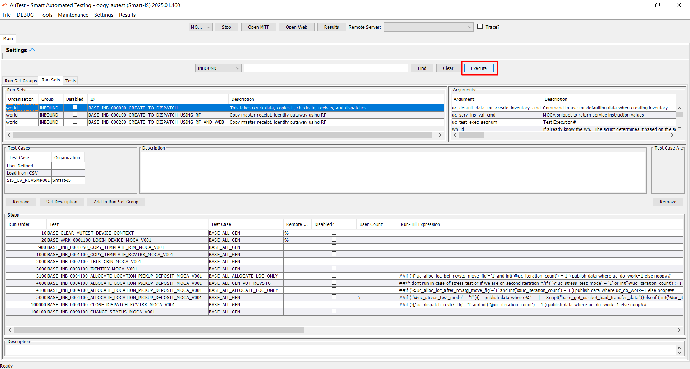
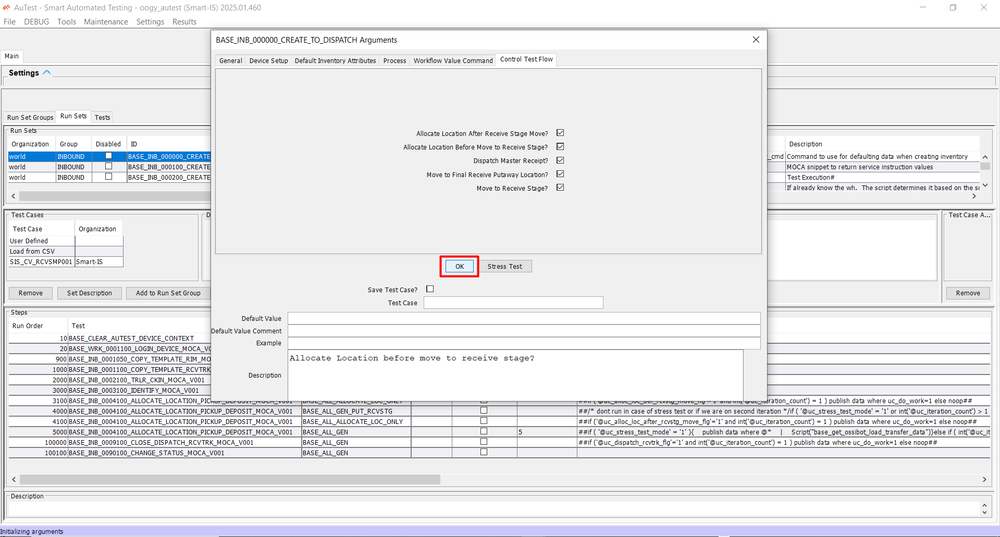
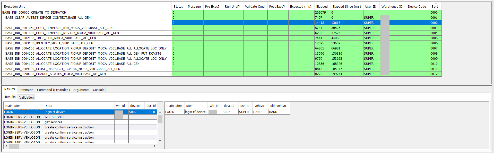

### Overview

This guide provides a detailed walkthrough for executing run sets in AuTest, including explanations of the various grids, tabs, and their purposes. 

In this demonstration, we will be executing run set `BASE_INB_000000_CREATE_TO_DISPATCH`. 

**What this Run set does?**

The runset is designed to manage the complete inbound process from create to dispatch inbound order. Specifically, it:

- Copies the source rcvtrk data and creates new rcvtrk.

- Checks in the trailer, ensuring all required details are validated.

- Identifies and receives inventory to physical location.

- Closes and dispatches the truck, completing the process.

### Run Set Steps

Following steps will be used in run set `BASE_INB_000000_CREATE_TO_DISPATCH`.

| **Step (Test)**                                        | **Description**                                                                                                                                                              |
|--------------------------------------------------------|------------------------------------------------------------------------------------------------------------------------------------------------------------------------------|
| `BASE_INB_0001100_COPY_TEMPLATE_RCVTRK_MOCA_V001`      | This step copies a `RCVTRK` record and creates new `rcvtrk`, `rcvinv`, and `rcvlin` records for our test run. It utilizes the `uc_test_exec_seqnum` variable to ensure unique record creation. |
| `BASE_INB_0002100_TRLR_CKIN_MOCA_V001`                 | Using `uc_test_exec_seqnum`, this step checks in the truck against an open door.                                                                                             |
| `BASE_INB_0003100_IDENTIFY_MOCA_V001`                  | Now that we have a truck that is checked in as well, it will identify all inventory in the truck. We have created this to support ASN scenario as well – so if truck inventory is already identified it simply returns success. |
| `BASE_INB_0004100_ALLOCATE_LOCATION_PICKUP_DEPOSIT_MOCA_V001` | We use this test twice and use test case concept. The first run moves inventory to receive stage and the next one will allocate a putaway location and drop it there. These steps support the concepts to run in a stress test mode as well. So when run normally, they will process everything in the truck. But when run in stress test mode they will process one record only. |
| `BASE_INB_0009100_CLOSE_DISPATCH_RCVTRK_MOCA_V001`     | Closes and dispatches the truck.                                                                                                                                             |

### How to execute Run Set?

Following steps will be used to execute run set:

**Step 1: Find Run Set** 

- Click the "Find" button to view the run sets based on the selected type, scenario, and remote server.

    

**Step 2: Select a Run set** 

- Navigate to the "Run Sets" grid and select `BASE_INB_0009100_CLOSE_DISPATCH_RCVTRK_MOCA_V001` run set. Its associated test cases will populate Test Cases grid and Test Steps will populate the "Steps" grid.

    

**Step 3: Execute the Run set** 

- Click the "Execute" button to start execution.

    

**Step 4: Configure Arguments**

- After pressing Execute button, Arguments screen will populate to set arguments.

- Set necessary fields across the tabs:
  - **General:** General information for copying rcvtrk. 
  - **Device Setup:** Assign devices for execution.
  - **Default Inventory Attributes:** Set up default inventory details.
  - **Process:** Configure process-specific details.
  - **Workflow Value Command:** Define custom workflow commands.
  - **Control Test Flow:** Modify execution flags, if necessary.

- Press OK to confirm the settings.

- Tests will begin execution based on the defined run order in the "Steps" grid.

**Step 4: View Results**

- After clicking OK, an execution of run set will start and an [Execution Console](#overview-of-execution-console) will get open to show an execution of run set and its associated tests. 

### Overview of Execution Console?

An Execution Console is the central interface for monitoring and analyzing the execution of a runset. It consists of multiple tabs and grids, each designed to provide specific information about the execution process and results. 

The Execution Page consists of eight tabs:
    
  1. Results
  2. Console
  3. Test Actions
  4. Error (appears only when one or more steps fail during execution)
  5. Commands on Target Env
  6. Test Commands
  7. Execution Details
  8. Run Set Execution

### Tabs Functionality

Each tab provides specific details related to the execution process, which are dynamically updated during the runset execution.

#### 1. Results

The Results Tab is divided into three grids:
  1. **First Grid: Arguments and Values**
     - Displays the arguments and their respective values used for the runset execution.
   
         

  2. **Second Grid: Execution Units and Details**
     - Shows the hierarchical structure of the execution, starting with the name of the runset at the top level.
      
         

     - Lists all the test steps one by one in sequential order during an execution with following detail:
       - Status
       - Message
       - Pre Exec?
       - Run Until?
       - Validate Cmd
       - Post Exec?
       - Elapsed
       - Expected MS
       - Elapsed Since MS
       - User ID
       - Warehouse ID
       - Device Code
       - Sort Sequence

     - The execution is displayed for each step: 
       - As it executes, the step we are executing is in yellow.

            

       - After successful execution it becomes green.

            

       - In case of an error it becomes red Indicates that the execution failed.

            

  3. **Third Grid: Executed Steps Result View**

     - When each row above is highlighted, the results associated with that specific MOCA snippet are displayed. This allows for an easy and direct examination of the outcomes linked to individual MOCA segments, ensuring clarity and facilitating a thorough review of the data provided in each snippet.
     - It includes five tabs:
          1. Result: Shows a grid containing the output of the command executed for the step.
          2. Command: Displays the name of the executed command.
          3. Command Expand: Presents the full syntax of the executed command, including the argument values.
          4. Argument: Lists all the arguments used during the execution of the step.
          5. Console: Displays the log of the executed step, including messages, warnings, or errors.

        

      **Step:1**

      This is showing result of BASE_CLEAR_AUTEST_DEVICE_CONTEXT (BASE_ALL_GEN).

      

      **Step:2**

      This is showing result of BASE_WRK_0001100_LOGIN_DEVICE_MOCA_V001 (BASE_ALL_GEN).

      

      **Step:3**

      This is showing result of BASE_INB_0001050_COPY_TEMPLATE_RIM_MOCA_V001 (BASE_ALL_GEN).

      

      **Step:4**

      This is showing result of BASE_INB_0001100_COPY_TEMPLATE_RCVTRK_MOCA_V001 (BASE_ALL_GEN).

      

      **Step:5**

      This is showing result of BASE_INB_0002100_TRLR_CKIN_MOCA_V001 (BASE_ALL_GEN).

      

      **Step:6**

      This is showing result of BASE_INB_0003100_IDENTIFY_MOCA_V001 (BASE_ALL_GEN).

      

      **Step:7**

      This is showing result of BASE_INB_0004100_ALLOCATE_LOCATION_PICKUP_DEPOSIT_MOCA_V001 (BASE_ALL_ALLOCATE_LOC_ONLY).

      

      **Step:8**

      This is showing result of BASE_INB_0004100_ALLOCATE_LOCATION_PICKUP_DEPOSIT_MOCA_V001 (BASE_ALL_GEN_PUT_RCVSTG).

      

      **Step:9**

      This is showing result of BASE_INB_0004100_ALLOCATE_LOCATION_PICKUP_DEPOSIT_MOCA_V001 (BASE_ALL_ALLOCATE_LOC_ONLY).

      

      **Step:10**

      This is showing result of BASE_INB_0004100_ALLOCATE_LOCATION_PICKUP_DEPOSIT_MOCA_V001 (BASE_ALL_GEN).

      

      **Step:11**

      This is showing result of BASE_INB_0009100_CLOSE_DISPATCH_RCVTRK_MOCA_V001 (BASE_ALL_GEN).

      

      **Step:12**

      This is showing result of BASE_INB_0090100_CHANGE_STATUS_MOCA_V001 (BASE_ALL_GEN).

      

#### 2. Console

It provides a detailed log of the entire execution process.

   - Useful for tracking step-by-step execution, including timestamps and error messages.

#### 3. Test Actions

It Shows details of test actions performed for each executed test.

   - Useful for understanding the flow and logic of the test actions.

#### 4. Error

It appears only if one or more steps fail during execution and displays step in error status.

#### 5. Commands on Target Env

It displays the commands and base commands executed on the target environment for each test.

   - Useful for analyzing the interaction with the target system.

#### 6. Test Commands

It provides details of commands executed during the test, categorized into:
   - Commands: Commands execution workflow for each step along with other detail.
      
      

   - Select Commands: SQL select queries executed.

      

   - Non-Select Commands: SQL insert, update, or delete queries executed.

      

#### 7. Execution Details

It displays detailed execution information for each step/test, including:
   - Start Date
   - End Date
   - Remote Server
   - Execution Time
   - Validation Details
   - Various flags indicating the success or failure of the step/test.

   

#### 8. Run Set Execution Tab

It provides a summary of the runset execution, including:
   - Remote Server
   - Status
   - Execution Time
   - Start Date
   - End Date

   

### Execution Workflow

#### During Execution

- Initially, the page shows only three tabs:

   1. Results
   2. Console
   3. Test Actions

- The Results Tab dynamically updates as the runset progresses. It displays the execution units (2nd grid) and their statuses in real-time with coding scheme.
- Execution details for each step are populated in the 3rd grid when a step is clicked.

#### After Execution Completion

- Once the execution is complete, all tabs become available, showing detailed information for further analysis.

### Execution Console also shows what was executed

See the tab 'Commands on Target Env' 

If you get an error, you can copy the 'command' from here and try running it directly 

