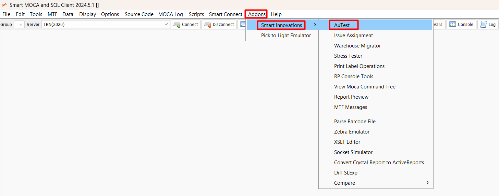

**Overview**

Smart AuTest solution allows the BY WMS users to run through WMS use cases without user intervention. This solution supports the following types of tests:

- **MOCA based tests**  : where the work is performed by the MOCA commands.
- **RF based tests**    : where the work is performed by MTF forms.
- **Web UI based tests**: where the work is performed in the Web UI.

The various tests can be strung together using the concept of “Run Sets”. This allows for scripting end-to-end scenarios. The tests can be executed in a “stress test” mode as well, where we can simulate stress on the system, for example simulating multiple users.

The execution results are captured in a comprehensive manner and in addition to that, we can have specific validation logic as well.

The metadata of the solution is in a secure cloud framework that supports tenant-based security. The execution results are saved in the cloud as well. This implies that the solution can be used without any local footprint.

To launch the tests, users can use our “Smart MOCA Client”.

