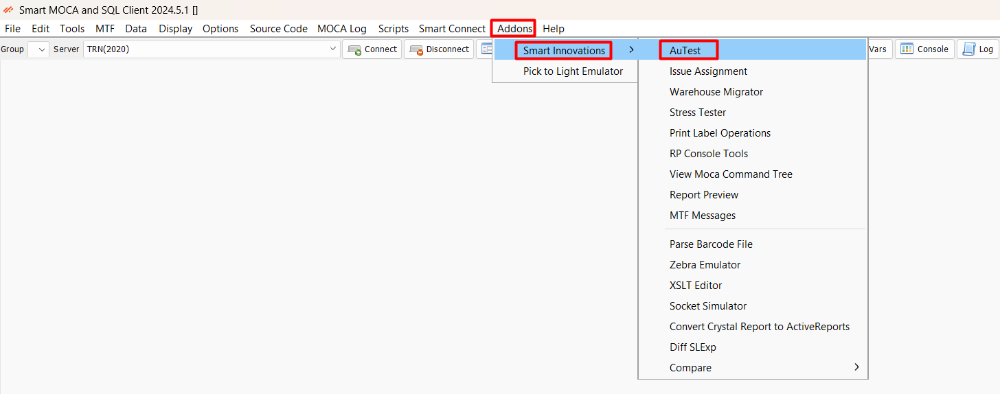

## Introduction

The Smart AuTest solution is designed to streamline and automate the testing of WMS (Warehouse Management System) use cases for BY WMS users, eliminating the need for manual intervention. This advanced testing solution supports several types of tests, ensuring a versatile and robust testing environment:

1. **MOCA Based Tests**: These tests performed work by MOCA Commands

2. **RF Based Tests**: These tests performed work by MTF forms.

3. **Web UI Based Tests**: These tests performed work in the WEB UI.

## Run Sets for End-to-End Scenarios

Smart AuTest empowers users to create customized "Run Sets," which serve as meticulously crafted sequences of tests tailored to script comprehensive end-to-end scenarios. By amalgamating individual tests into cohesive sequences, users can effectively evaluate complex workflows and interactions, thereby ensuring the holistic functionality of the WMS.

## Stress Testing Capabilities

The solution also supports stress testing, a mode where the system is subjected to simulated stress conditions, such as the simultaneous activity of multiple users. This helps in assessing the system’s performance and stability under heavy load conditions.

## Comprehensive Execution Results

The execution results are captured in a comprehensive manner and in addition to that, we can have specific validation logic as well. The results of test executions are meticulously captured, providing detailed insights into each test run. 

## Secure Cloud Framework

The Smart AuTest solution is built on a secure cloud framework that supports tenant-based security, ensuring that data and metadata are protected and isolated per tenant. The execution results are also stored in the cloud, which means the solution can be used without requiring any local installation or footprint. This cloud-based approach enhances accessibility and scalability while maintaining high security standards.

## Launching Tests with Smart MOCA Client

To launch the tests, users can use our “Smart MOCA Client”.

