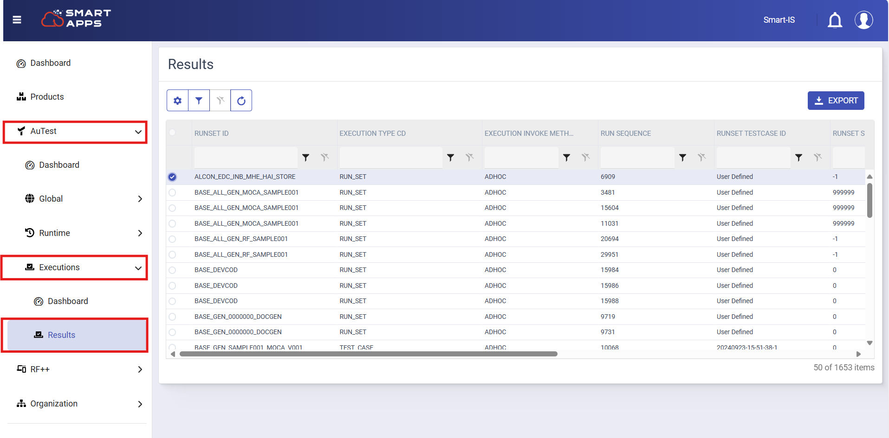
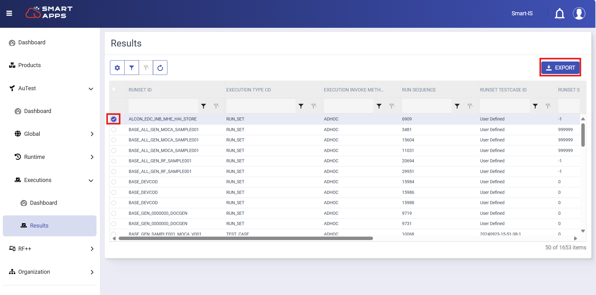

# Result Management

Results represent the outcomes of executed tests or run sets within the system. They play a vital role in identifying issues, validating expected behaviors, and confirming successful execution.

Users can access and interpret results through two primary interfaces:

**1. Results in Smart Apps**

SmartApps provides a dedicated interface to view detailed results for each executed **Runset**.
 
You can view the complete results by the following steps:

- Navigate to **AuTest → Executions → Results** within the SmartApps platform.

  
   

-  From the **Results** screen, select the **Runset** for which you want to view the execution results and click on **Export** to download the pdf file for results.

  
   

-  The pdf file will display:
   - Overall pass/fail status
   - Execution timestamps
   - List of individual test cases and their results
   - Any validation or error messages

SmartApps makes it easy to monitor test outcomes and maintain a record of testing activities, all from one centralized location.

**2. Results in MOCA Client**

Moca Client provides a result history with a detailed view of test or run set execution, offering insights into execution statuses, commands, and specific output details.

Follow the below steps to see result of an executed run set or an individual test:

- Choose the desired run set and click **‘Results’** button to open its result history.

  
   

   
- Now select the date for which you want to see results and click on **Find** button.

  
   

**Note:** Refine your search by providing additional details like Run Set Sequence, Remote Server, Error, Test, or Test Case.

- Results matching your criteria will be displayed.

  
   

- Now select Run ID for which you want to see the results. The arguments along with values will get appear in below grid.

  
   

   
- Double-click the selected row to open the [execution console](execution.md).

  
   

- Review the detailed view of the executed run set and its associated steps.

  
   

Each method is designed to cater to different user needs, ensuring flexibility in result interpretation and analysis.

---
 