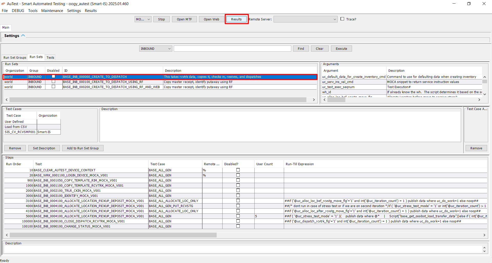
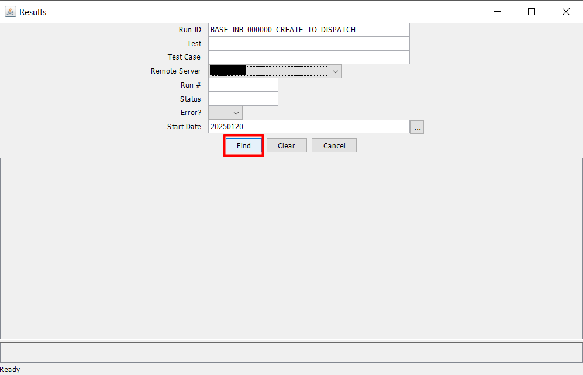
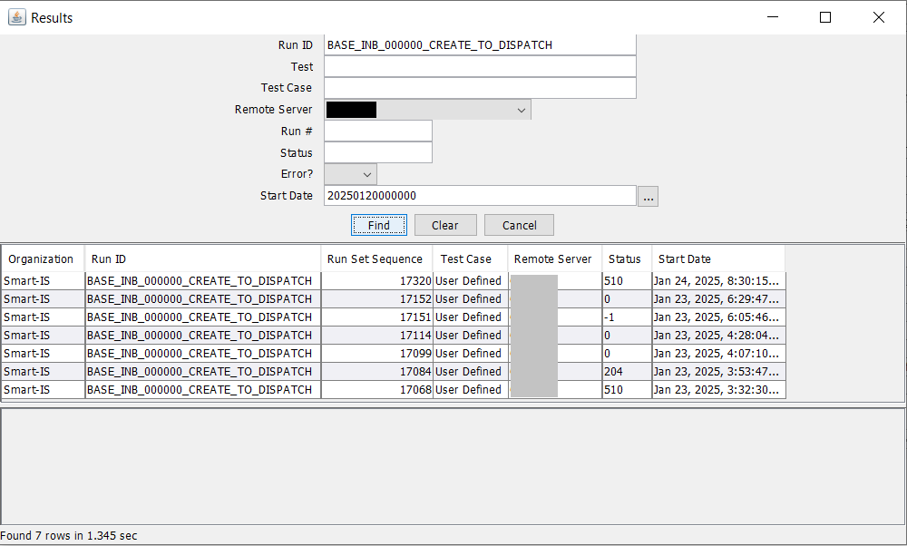
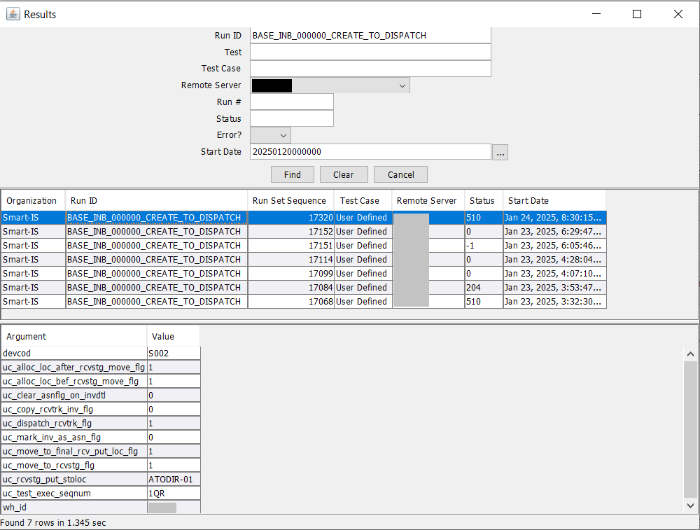
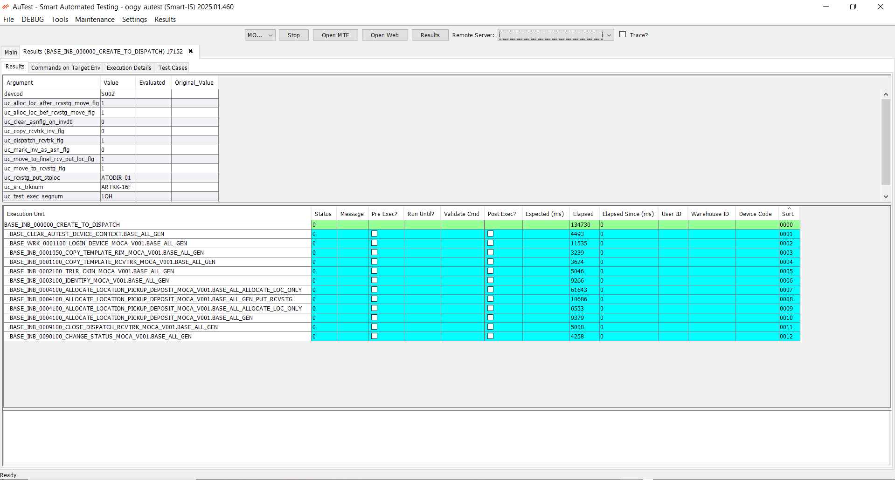
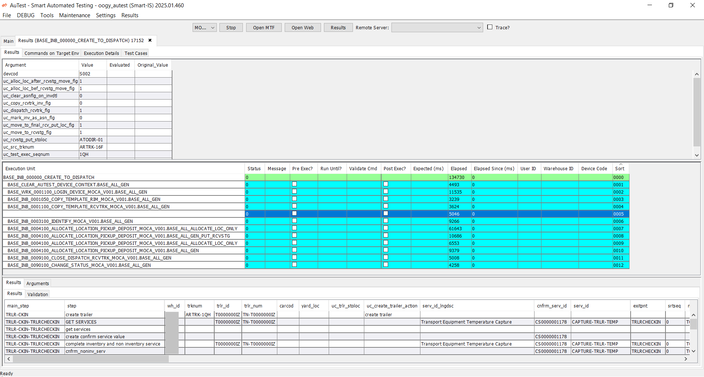

### Results Overview

Results represent the outcomes of executed tests or run sets within the system. They play a vital role in identifying issues, validating expected behaviors, and confirming successful execution.

#### Key Benefits of Results Analysis

Results are crucial in determining the following:

- **Execution Status:** Whether a runset or test case was successful, failed, or still in progress.
- **Performance Metrics:** Key details such as elapsed time and execution time for each step.
- **Error Detection:** Detailed error logs and messages that highlight issues during execution.
- **Validation:** Confirming the accuracy of executed commands and their expected outcomes.

### How to view Results?

Users can access and interpret results through two primary interfaces:

**1. Smart Apps**

   Offers a modern and intuitive interface for result analysis, designed for ease of use and enhanced functionality.

**2. MOCA Client**

   Provides a result history with a detailed view of test or run set execution, offering insights into execution statuses, commands, and specific output details.

   Follow the below steps to see result of an executed run set or an individual test:

   1. Choose the desired run set and click **‘Results’** button to open its result history.

      
   
   2. Now select the date for which you want to see results and click on **‘Find’** button.
    
      **Note:** Refine your search by providing additional details like Run Set Sequence, Remote Server, Error, Test, or Test Case.

      

   3. Results matching your criteria will be displayed.
   
      

   4. Now select Run ID for which you want to see the results. The arguments along with values will get appear in below grid.
   
      
   
   5. Double-click the selected row to open the [execution console](execution.md).

      

   6. Review the detailed view of the executed run set and its associated steps.

      

Each method is designed to cater to different user needs, ensuring flexibility in result interpretation and analysis.