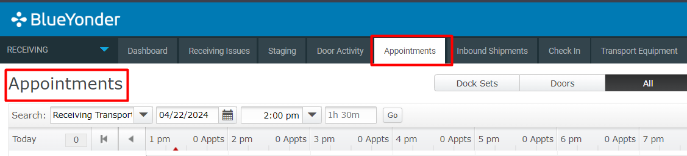

# **BASE_INB_0003100_IDENTIFY_MOCA_V001**

<!-- SMART_DOC_GEN_TEST_DESCR - Start -->
<!-- SMART_DOC_GEN_TEST_DESCR - End -->

## **Test Category**

<input type="checkbox" checked disabled> Standard
 
<input type="checkbox" disabled> Custom
 
<input type="checkbox" disabled> Smart IS

## **Overview**

In the receiving process, the first step is identification, where users assign a unique identifier (LPN) to incoming inventory. They also specify the quantity, status, and any attributes like lot numbers. This identification can happen when inventory arrives or during adjustments. Once identified, inventory can be stored.

The application allows you to configure rules for inventory identification and receipt. You can customize what users validate, what information is displayed to them, how staging locations are reserved, and how the application searches for inventory in transport equipment to fill orders efficiently.

## **Applicable versions**

This test is designed to support versions greater than **2008.x.x**,
ensuring compatibility and smooth operation with the latest software
releases. Users can confidently utilize this test, as it is optimized
for newer versions while retaining a user-friendly testing process.

## **Test Arguments**

Test arguments are parameters or inputs that are passed to the test
cases to customize the test execution. These arguments providesss
flexibility and allow for the reuse of the same test case with different
sets of data or configurations. The input is as follows:

<!-- SMART_DOC_GEN_TEST_ARG - Start -->
<table>
<tr><th>Arguments</th><th>Argument Description</th></tr>
<tr><td>devcod</td><td></td></tr>
<tr><td>uc_create_inventory_cnt</td><td>How many inventory structures to create</td></tr>
<tr><td>uc_create_inventory_lodlvl</td><td>What load level to use for creating inventory.  By default use part lodlvl</td></tr>
<tr><td>uc_def_expire_dte_days</td><td>If defaulting expiry date, how many datys in future</td></tr>
<tr><td>uc_def_inv_attr_dte1</td><td>Default</td></tr>
<tr><td>uc_def_inv_attr_dte2</td><td>Default</td></tr>
<tr><td>uc_def_inv_attr_int1</td><td>Default</td></tr>
<tr><td>uc_def_inv_attr_int2</td><td>Default</td></tr>
<tr><td>uc_def_inv_attr_str1</td><td>Default if neede</td></tr>
<tr><td>uc_def_inv_attr_str2</td><td>Default</td></tr>
<tr><td>uc_def_inv_attr_str3</td><td>Default</td></tr>
<tr><td>uc_def_inv_attr_str4</td><td>Default</td></tr>
<tr><td>uc_def_inv_attr_str5</td><td>Default</td></tr>
<tr><td>uc_def_inv_attr_str6</td><td>Default</td></tr>
<tr><td>uc_def_lotnum</td><td>default lot</td></tr>
<tr><td>uc_def_orgcod</td><td>Default orgcod if needed</td></tr>
<tr><td>uc_def_rcvsts</td><td>default nvsts</td></tr>
<tr><td>uc_def_revlvl</td><td>Default revlvl if needed</td></tr>
<tr><td>uc_def_sup_lotnum</td><td>Default supplier lot number if needed</td></tr>
<tr><td>uc_default_data_for_create_inventory_cmd</td><td>Command to set context for create inventory</td></tr>
<tr><td>uc_new_trknum</td><td>Can pass a specific rcvtrk</td></tr>
<tr><td>uc_new_trknum_expr</td><td>To build new truck number - expression</td></tr>
<tr><td>uc_test_exec_seqnum</td><td></td></tr>
<tr><td>usr_id</td><td></td></tr>
<tr><td>wh_id</td><td></td></tr>
</table>
<!-- SMART_DOC_GEN_TEST_ARG - End -->

## **TestCases using this test**

This section provides a comprehensive list of test cases that are associated with this particular test. It provides a quick reference for understanding the specific tests covered. By reviewing these test cases, users can gain a deeper understanding of how this test is used in different scenarios and ensure comprehensive test coverage.

<!-- SMART_DOC_GEN_TEST_CASE_USING_THIS - Start -->
<!-- SMART_DOC_GEN_TEST_CASE_USING_THIS - End -->

## **RunSets using this test**

This section details the various RunSets that utilize this test as part of their execution. Each RunSet represents a collection of tests and configurations that are executed together to achieve specific testing goals. By examining the RunSets that include this test, users can understand how it fits into larger testing scenarios and how it contributes to overall test coverage and automation.

<!-- SMART_DOC_GEN_RUN_SET_USING_THIS - Start -->
<!-- SMART_DOC_GEN_RUN_SET_USING_THIS - End -->

## **Equivalent Usecase**

The following steps represent a general procedure for identification through GUI.

**Step:1**

Select **Configuration** > **Receiving**

**Step:2**

Click on the **'Check In'** screen.

**Note:** You can check in with or without an appointment. If necessary, after viewing the Check In page, click Check in with appointment. If this option is not available, you are already in the correct check in mode.

**Step:3**

To change the selected appointment, click Select a different appointment, and then select a different appointment.

To change the appointment time:
    Click Change appointment time.
    In the Start Date and End Date fields, change the date and time of the appointment.
    Click Save.

**Step:4**

After that go to your inbound shipment and go to action and select recieve inventory.

## **Applicable MOCA commands**

For identification using the MOCA command, you can use the following command.

-  **create inventory**

## **Affected DB tables**

The following database table is typically affected while identification:

- **rcvtrk**
- **rcvlin**
- **rcvinv**
- **invlod**
- **wh**
- **blng_prd**
- **prtmst_view**

These tables are likely to be affected to ensure proper tracking and management of identification.

---
 **Previous-Test**
 [BASE_INB_0002100_TRLR_CKIN_MOCA_V001](./tests_docs/BASE_INB_0002100_TRLR_CKIN_MOCA_V001.md)
 
 **Next-Test**
  [BASE_INB_0004100_ALLOCATE_LOCATION_PICKUP_DEPOSIT_MOCA_V001](./tests_docs/BASE_INB_0004100_ALLOCATE_LOCATION_PICKUP_DEPOSIT_MOCA_V001.md)
  
[SMART-IS](https://www.smart-is.pk) 