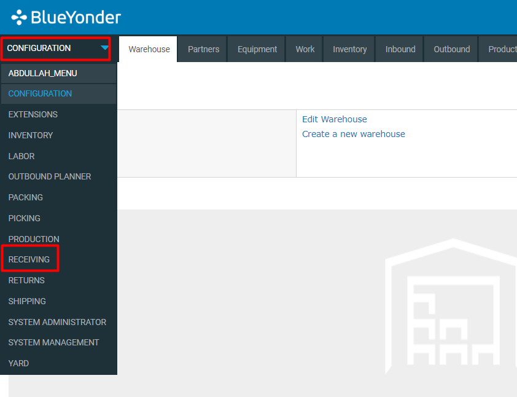
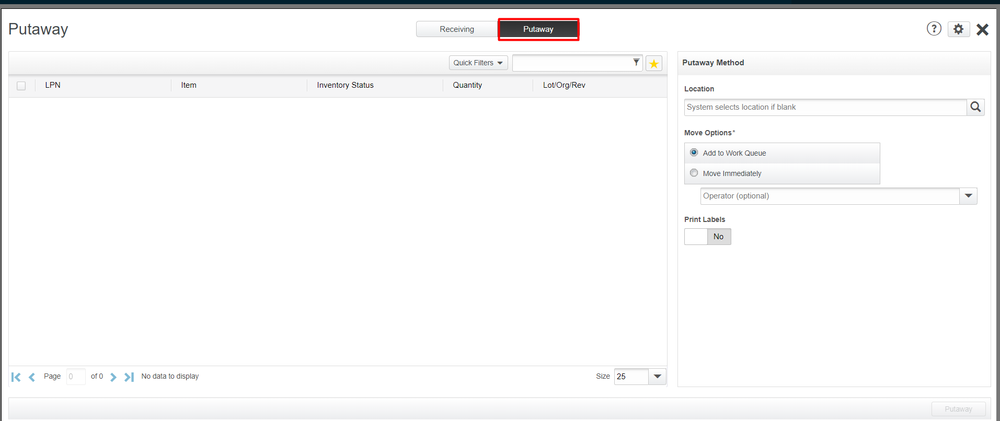

# **BASE_INB_0004100_ALLOCATE_LOCATION_PICKUP_DEPOSIT_MOCA_V001**

<!-- SMART_DOC_GEN_TEST_DESCR - Start -->
Allocate location, pick up, deposit
<!-- SMART_DOC_GEN_TEST_DESCR - End -->

## **Test Category**

<input type="checkbox" checked disabled> Standard
 
<input type="checkbox" disabled> Custom
 
<input type="checkbox" disabled> Smart IS

## **Overview**

It helps optimize warehouse operations by efficiently assigning locations based on various factors such as inventory availability, proximity to pick-up or deposit points, and storage requirements.

This process is crucial for streamlining warehouse workflows, ensuring that inventory is picked up and deposited in the most efficient and cost-effective manner. 

## **Applicable versions**

This test is designed to support versions greater than **2008.x.x**,
ensuring compatibility and smooth operation with the latest software
releases. Users can confidently utilize this test, as it is optimized
for newer versions while retaining a user-friendly testing process.

## **Test Arguments**

Test arguments are parameters or inputs that are passed to the test
cases to customize the test execution. These arguments providesss
flexibility and allow for the reuse of the same test case with different
sets of data or configurations. The input is as follows:

<!-- SMART_DOC_GEN_TEST_ARG - Start -->
<table>
<tr><th>Arguments</th><th>Argument Description</th></tr>
<tr><td>comflg</td><td>If 1 we commit after each transaction</td></tr>
<tr><td>devcod</td><td></td></tr>
<tr><td>uc_max_rows</td><td>How many loads to move</td></tr>
<tr><td>uc_new_trknum</td><td></td></tr>
<tr><td>uc_put_stoloc</td><td>If passed in, we put here and do not allocate a location</td></tr>
<tr><td>uc_stress_test_mode</td><td>When called from stress tester pass 1</td></tr>
<tr><td>uc_test_exec_seqnum</td><td></td></tr>
<tr><td>uc_trx_sleep_ms</td><td>If passed, then after commit we wait for this many milliseconds</td></tr>
<tr><td>wh_id</td><td></td></tr>
</table>
<!-- SMART_DOC_GEN_TEST_ARG - End -->

## **TestCases using this test**

This section provides a comprehensive list of test cases that are associated with this particular test. It provides a quick reference for understanding the specific tests covered. By reviewing these test cases, users can gain a deeper understanding of how this test is used in different scenarios and ensure comprehensive test coverage.

<!-- SMART_DOC_GEN_TEST_CASE_USING_THIS - Start -->
| Test Case ID | Test Case Description |
| ------------ | --------------------- |
| BASE_ALL_GEN |  |
| BASE_ALL_GEN_PUT_RCVSTG |  |

<!-- SMART_DOC_GEN_TEST_CASE_USING_THIS - End -->

## **RunSets using this test**

This section details the various RunSets that utilize this test as part of their execution. Each RunSet represents a collection of tests and configurations that are executed together to achieve specific testing goals. By examining the RunSets that include this test, users can understand how it fits into larger testing scenarios and how it contributes to overall test coverage and automation.

<!-- SMART_DOC_GEN_RUN_SET_USING_THIS - Start -->
| Run Set ID | Run Set Description |
| ---------- | ------------------- |
| BASE_INB_000000_CREATE_TO_DISPATCH | This takes rcvtrk data, copies it, checks in, reeives, and dispatches |
| BASE_INB_000000_CREATE_TO_DISPATCH | This takes rcvtrk data, copies it, checks in, reeives, and dispatches |
| NEW RUN SET | new runset |

<!-- SMART_DOC_GEN_RUN_SET_USING_THIS - End -->

## **Equivalent Usecase**

The following steps represent a general procedure for putaway through GUI.

**Step:1**

Select **Configuration** > **Receiving**

**Step:2**

Click on the **'Check In'** screen.

**Note:** You can check in with or without an appointment. If necessary, after viewing the Check In page, click Check in with appointment. If this option is not available, you are already in the correct check in mode.

**Step:3**

To change the selected appointment, click Select a different appointment, and then select a different appointment.

To change the appointment time:
    Click Change appointment time.
    In the Start Date and End Date fields, change the date and time of the appointment.
    Click Save.

**Step:4**

After that go to your inbound shipment and go to action and select recieve inventory.

**Step:5**

Then click on putaway.

## **Applicable MOCA commands**

For putaway using the MOCA command, you can use the following command.

-  **allocate location**
-  **move inventory**

## **Affected DB tables**

The following database table is typically affected while putaway:

- **rcvtrk**
- **devmst**
- **locmst**
- **rcvlin**
- **invdtl**
- **invsub**
- **invlod**
- **pndinv_view**

These tables are likely to be affected to ensure proper tracking and management of putaway.

---
 **Previous-Test**
 [BASE_INB_0003100_IDENTIFY_MOCA_V001](./tests_docs/BASE_INB_0003100_IDENTIFY_MOCA_V001.md)
 
 **Next-Test**
  [BASE_INB_0004A00_MHE_SMART_PUT_MOCA_V001](./tests_docs/BASE_INB_0004A00_MHE_SMART_PUT_MOCA_V001.md)
  
[SMART-IS](https://www.smart-is.pk) 