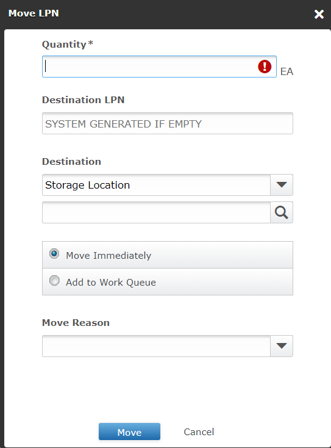

# **BASE_INV_0020100_MOVE_RF_V001**

<!-- SMART_DOC_GEN_TEST_DESCR - Start -->
Move a load
<!-- SMART_DOC_GEN_TEST_DESCR - End -->

## **Test Category**

<input type="checkbox" checked disabled> Standard
 
<input type="checkbox" disabled> Custom
 
<input type="checkbox" disabled> Smart IS

## **Overview**

Moving a load from one location to another within a warehouse is a critical task in logistics management. This operation involves safely transporting the load while ensuring minimal disruption to warehouse operations. The process includes planning the movement, coordinating with warehouse personnel, and updating the inventory system. 

It's essential to use the appropriate equipment and follow safety protocols to prevent damage to the load and ensure the safety of personnel. Efficiently executing load movements helps maintain warehouse efficiency and timely order fulfillment.

**Applicable versions**

This test is designed to support versions greater than **2008.x.x**,
ensuring compatibility and smooth operation with the latest software
releases. Users can confidently utilize this test, as it is optimized
for newer versions while retaining a user-friendly testing process.

**Test Arguments**

Test arguments are parameters or inputs that are passed to the test
cases to customize the test execution. These arguments provide
flexibility and allow for the reuse of the same test case with different
sets of data or configurations. The input is as follows:

<!-- SMART_DOC_GEN_TEST_ARG - Start -->
<table>
<tr><th>Arguments</th><th>Argument Description</th></tr>
<tr><td>uc_dstloc</td><td>This is the location where the inventory will be created.</td></tr>
<tr><td>uc_dstloc_expr</td><td>If no destination location is provided, this expression is used to generate one. The default expression is "ADSTLOC" || @uc_test_exec_seqnum.</td></tr>
<tr><td>uc_mov_lodnum_expr</td><td>Loads matching this wildcard are moved.</td></tr>
<tr><td>uc_new_trknum</td><td>If we want to use a specific trknum, use this.</td></tr>
<tr><td>uc_new_trknum_expr</td><td>To build a new truck number - expression.</td></tr>
<tr><td>uc_srcloc</td><td>Inventory is taken from this source location.</td></tr>
<tr><td>uc_srcloc_expr</td><td>If the source location is not provided, this expression helps determine it. By default, it is 'ADSTLOC-' || @uc_test_exec_seqnum.</td></tr>
<tr><td>uc_test_exec_seqnum</td><td>This gets a new value every time we run the test. It provides a mechanism to generate new data for every test in a predictable way.</td></tr>
<tr><td>wh_id</td><td>Choose the warehouse where you want to perform actions. If not provided, the system will use the warehouse from the source order.</td></tr>
</table>
<!-- SMART_DOC_GEN_TEST_ARG - End -->

## **TestCases using this test**

This section provides a comprehensive list of test cases that are associated with this particular test. It provides a quick reference for understanding the specific tests covered. By reviewing these test cases, users can gain a deeper understanding of how this test is used in different scenarios and ensure comprehensive test coverage.

<!-- SMART_DOC_GEN_TEST_CASE_USING_THIS - Start -->
| Test Case ID | Test Case Description |
| ------------ | --------------------- |
| BASE_ALL_GEN |  |
| BASE_ALL_GEN_RCVSTG |  |

<!-- SMART_DOC_GEN_TEST_CASE_USING_THIS - End -->

## **RunSets using this test**

This section details the various RunSets that utilize this test as part of their execution. Each RunSet represents a collection of tests and configurations that are executed together to achieve specific testing goals. By examining the RunSets that include this test, users can understand how it fits into larger testing scenarios and how it contributes to overall test coverage and automation.

<!-- SMART_DOC_GEN_RUN_SET_USING_THIS - Start -->
| Run Set ID | Run Set Description |
| ---------- | ------------------- |
| BASE_INB_000100_CREATE_TO_DISPATCH_USING_RF | Copy master receipt, identify putaway using RF |

<!-- SMART_DOC_GEN_RUN_SET_USING_THIS - End -->

## **Equivalent Usecase**

The following steps represent a general procedure for moving inventory
from one Location to another location through GUI.

**Step:1**

Select **Configuration** > **Inventory**

**Step:2**

Click on the **Inventory** screen.

**Step:3**

Click on the **LPN** screen.

**Step:4**

After that all LPNs are shown in it. You just need to select the LPN and
click Action and Move inventory from one hop to another.

**Step:5**

At this point we have to give it the next hop location (Destination
location) , After that you just need to click on move.

## **Applicable MOCA commands**
When picked inventory will be transported through a series of hops using
the MOCA command, you can use the following command.

-   **MOVE INVENTORY**

This command will trigger the picked inventory to be transported through
a series of hops based on the predefined parameters and rules within the
MOCA system.

## **Affected DB Tables**

When picked inventory will be transported through a series of hops,
the following database tables are typically affected:

-   **pckwrk_view**

-   **shipment_line**

-   **invlod**

-   **locmst**

These tables are likely to be updated or referenced as the picked
inventory is transported through the series of hops.

---

**Previous-Test**
 [BASE_INV_MOVE_MOCA_V001](./tests_docs/BASE_INV_MOVE_MOCA_V001.md)
 
**Next-Test**
  [BASE_OUB_0050100_LIST_PICK_RF_V001](./tests_docs/BASE_OUB_0050100_LIST_PICK_RF_V001.md)

[SMART-IS](https://www.smart-is.pk) 