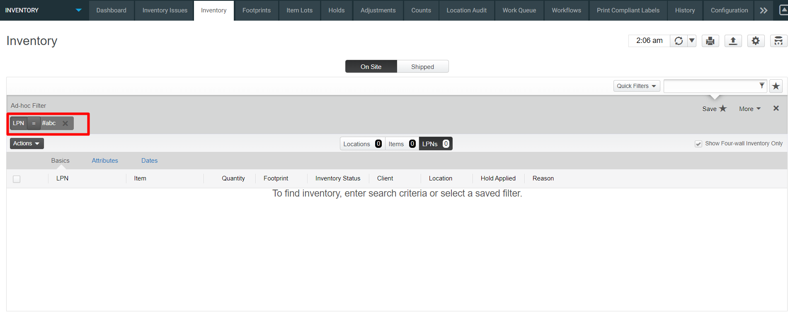
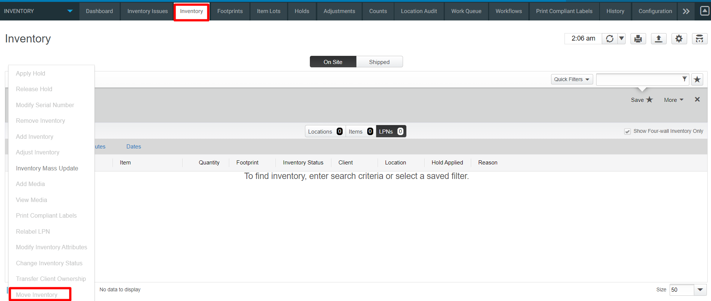
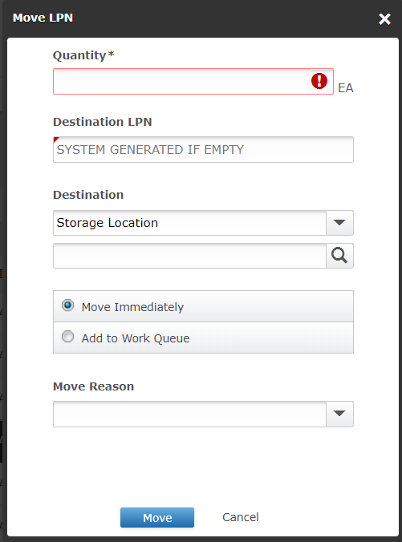

# **BASE_INV_MOVE_MOCA_V001**

<!-- SMART_DOC_GEN_TEST_DESCR - Start -->
This test will move the inventory we created earlier to a storage location.
<!-- SMART_DOC_GEN_TEST_DESCR - End -->

## **Test Category**

<input type="checkbox" checked disabled> Standard
 
<input type="checkbox" disabled> Custom
 
<input type="checkbox" disabled> Smart IS

Inventory move is a fundamental operation where inventory is transferred
from one specific location to another within the supply chain. This
process could involve moving goods between different warehouses,
distribution centers, or even within the same facility to optimize
storage and accessibility. Blue Yonder provides tools and features to
facilitate this movement seamlessly, allowing users to initiate and
track the transfer of inventory with precision. 

By specifying the source and destination locations, users can manage the logistics of the move
efficiently. The platform's real-time visibility and data analytics
ensure that businesses can make informed decisions during the inventory
move process, contributing to better overall supply chain management and
operational efficiency.

## **Applicable versions**

This test is designed to support versions greater than **2008.x.x**,
ensuring compatibility and smooth operation with the latest software
releases. Users can confidently utilize this test, as it is optimized
for newer versions while retaining a user-friendly testing process.

## **Test Arguments**

Test arguments are parameters or inputs that are passed to the test
cases to customize the test execution. These arguments provide
flexibility and allow for the reuse of the same test case with
different sets of data or configurations. The input is as follows:

<!-- SMART_DOC_GEN_TEST_ARG - Start -->
<table>
<tr><th>Arguments</th><th>Argument Description</th></tr>
<tr><td>uc_dstloc</td><td>Specify where you want to move inventory from the source location.</td></tr>
<tr><td>uc_dstloc_expr</td><td>If the destination location is not provided, this expression helps determine it. By default, it is 'AMOVLOC-' || @uc_test_exec_seqnum</td></tr>
<tr><td>uc_max_load_cnt</td><td>Specify the maximum number of loads to move based on the source location and load number expression conditions. If not provided, all loads meeting the condition will be moved.</td></tr>
<tr><td>uc_mov_lodnum_expr</td><td>It provides a pattern for load numbers to move.</td></tr>
<tr><td>uc_srcloc</td><td>Optionally, indicate where you are taking inventory from.</td></tr>
<tr><td>uc_srcloc_expr</td><td>If the source location is not provided, this expression helps determine it. By default, it is 'ADSTLOC-' || @uc_test_exec_seqnum</td></tr>
<tr><td>uc_test_exec_seqnum</td><td>During each run, it generates a unique base-36 value.</td></tr>
<tr><td>wh_id</td><td>Choose the warehouse where you want to perform actions.</td></tr>
</table>
<!-- SMART_DOC_GEN_TEST_ARG - End -->

## **TestCases using this test**

This section provides a comprehensive list of test cases that are associated with this particular test. It provides a quick reference for understanding the specific tests covered. By reviewing these test cases, users can gain a deeper understanding of how this test is used in different scenarios and ensure comprehensive test coverage.

<!-- SMART_DOC_GEN_TEST_CASE_USING_THIS - Start -->
| Test Case ID | Test Case Description |
| ------------ | --------------------- |

<!-- SMART_DOC_GEN_TEST_CASE_USING_THIS - End -->

## **RunSets using this test**

This section details the various RunSets that utilize this test as part of their execution. Each RunSet represents a collection of tests and configurations that are executed together to achieve specific testing goals. By examining the RunSets that include this test, users can understand how it fits into larger testing scenarios and how it contributes to overall test coverage and automation.

<!-- SMART_DOC_GEN_RUN_SET_USING_THIS - Start -->
| Run Set ID | Run Set Description |
| ---------- | ------------------- |

<!-- SMART_DOC_GEN_RUN_SET_USING_THIS - End -->

## **Equivalent Usecase**

The following steps represent a general procedure for Move Inventory
through GUI.

**Step:1**

 Select **Configuration**  **Inventory**

**Step:2**
Click on the **Inventory** screen.

**Step:3**
Click on **LPN** tab.

**Step:4**

Select the **specific LPN** you want to move. LPN will be shown in the
column.

**Step:5**

Go to the **Actions** tab and click on **Move Inventory**

**Note**: from the onsite tab, you can also select locations, and
click on a location and select LPN to view the LPN in the location.

**Step:6**

Confirm your choice by clicking **move** to move inventory from one
location to another.

## **Applicable MOCA commands**

To move a LPN using the MOCA command, you can use the following
command.

- **Move_inventory**

 This command will trigger the inventory move command based on the
 predefined parameters and rules within the MOCA system.

## **Affected DB Tables**

 When move inventory action perform, the following database tables are
 typically affected:

-   **Invlod**

-   **Invsub**

-   **Invdtl**

-   **invsum**

 These tables are crucial for tracking inventory movement and within
 the warehouse management system.

---

 **Previous-Test**
 [BASE_INV_CREATE_MOCA_V001](./tests_docs/BASE_INV_CREATE_MOCA_V001.md)
 
**Next-Test**
  [BASE_INV_0020100_MOVE_RF_V001](./tests_docs/BASE_INV_0020100_MOVE_RF_V001.md)
  

[SMART-IS](https://www.smart-is.pk) 

