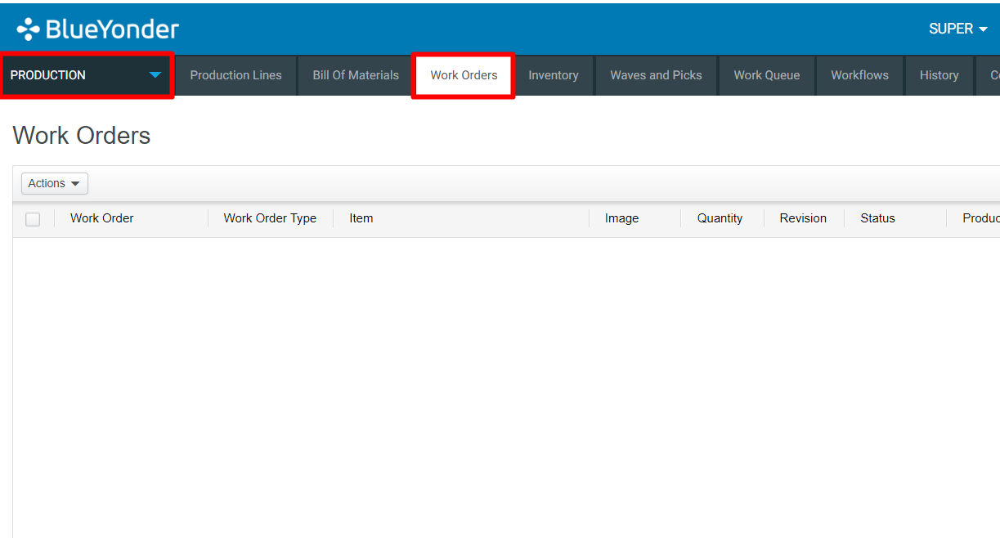
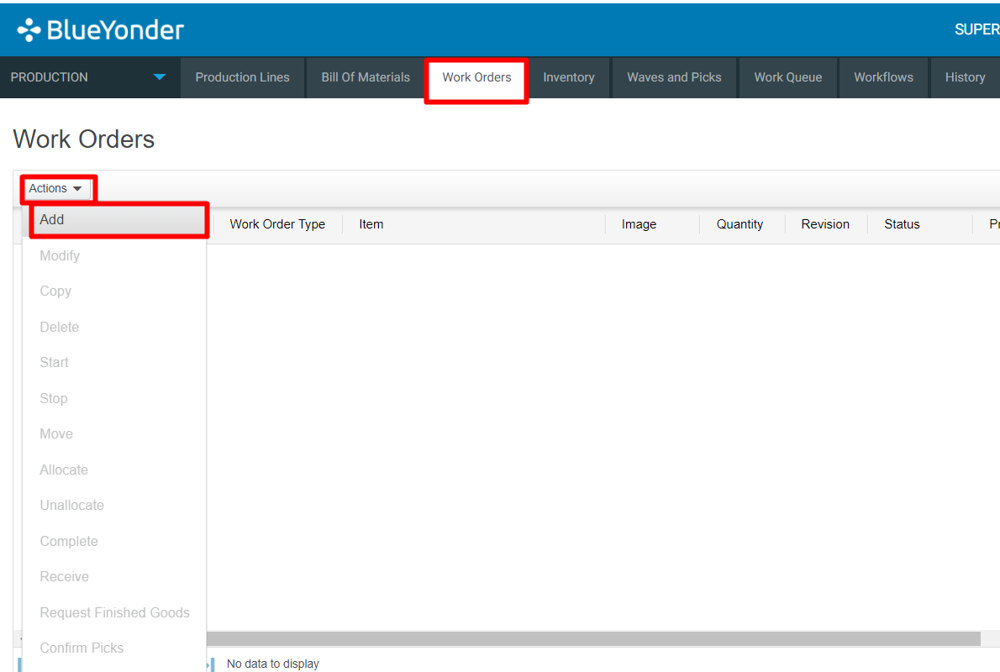
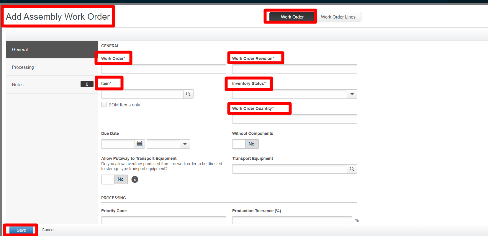

# **BASE_OUB_0010A00_ORD_SUBCONTR_MOCA_V001**

<!-- SMART_DOC_GEN_TEST_DESCR - Start -->
<!-- SMART_DOC_GEN_TEST_DESCR - End -->

## **Test Category**

<input type="checkbox" checked disabled> Standard
 
<input type="checkbox" disabled> Custom
 
<input type="checkbox" disabled> Smart IS

## **Overview**

The initiation of the automated tests involving the subcontract process
commences with the host organization dispatching a comprehensive work
order encompassing the requisite specifications for component picks.
Simultaneously, a corresponding sales order is transmitted, delineating
the parameters for the finished goods item. This meticulous process
ensures a streamlined workflow by systematically orchestrating the
allocation of tasks. As the workflow unfolds, the ultimate output
manifests as a meticulously structured sales order, featuring a
non-allocatable line dedicated to the finished goods, and allocatable
lines meticulously earmarked for the respective components. This
deliberate delineation facilitates a seamless production cycle,
optimizing efficiency and ensuring precision in the execution of the
automated tests.

For new users entering this domain, it is imperative to grasp the
intricacies of this automated testing and subcontracting paradigm. The
pivotal starting point involves the host organization transmitting a
work order tailored for component picks, concurrently accompanied by a
sales order delineating specifications for the product. The ultimate
result of this well-coordinated process is the generation of a sales
order that incorporates a non-allocatable line reserved for the finished
goods and allocatable lines strategically designated for the individual
components. This systematic approach not only enhances operational
efficiency but also ensures clarity in the delineation of tasks,
offering new users a solid foundation to comprehend and navigate the
intricacies of the automated testing and subcontract process.

## **Applicable versions**

This test is designed to support versions greater than **2008.x.x**,
ensuring compatibility and smooth operation with the latest software
releases. Users can confidently utilize this test, as it is optimized
for newer versions while retaining a user-friendly testing process.

## **Test Arguments**

Test arguments are parameters or inputs that are passed to the test
cases to customize the test execution. These arguments provide
flexibility and allow for the reuse of the same test case with different
sets of data or configurations. The input is as follows:

<!-- SMART_DOC_GEN_TEST_ARG - Start -->
<table>
<tr><th>Arguments</th><th>Argument Description</th></tr>
<tr><td>linsts</td><td>If not provided, it defaults to 'P'.</td></tr>
<tr><td>uc_force_uc_fg_proc_flg</td><td>If 1 then we force FG processing</td></tr>
<tr><td>uc_host_supnum</td><td>To set this field in wkohdr.</td></tr>
<tr><td>uc_new_ordnum_expr</td><td>When creating a new order from the specified source, the default order number is 'ADATA-'||substr(@uc_src_ordnum,11)||'-'||@uc_test_exec_seqnum.</td></tr>
<tr><td>uc_new_wave_set_expr</td><td>When we create the work order – what is that number. Default is @uc_new_ordnum || 'W'</td></tr>
<tr><td>uc_ol_inv_attr_str5</td><td>Inventory attribute</td></tr>
<tr><td>uc_set_wave_set</td><td>Decide whether to set the wave set on the work order (WO) created. The default is '1', indicating that the wave set will be set.</td></tr>
<tr><td>uc_src_ordnum_expr</td><td>Specify the source order used to create the work order and finished goods order.</td></tr>
<tr><td>uc_subcontract_cmd</td><td>This is the final command executed once the work order and finished goods sales order exist. The default is 'process usr host subcontract order'.</td></tr>
<tr><td>uc_test_exec_seqnum</td><td>During each run, it generates a unique base-36 value.</td></tr>
<tr><td>uc_wkonum_expr</td><td>It provides a pattern for load numbers to move.</td></tr>
<tr><td>wkorev</td><td>If not provided, it defaults to '1'.</td></tr>
</table>
<!-- SMART_DOC_GEN_TEST_ARG - End -->

## **TestCases using this test**

This section provides a comprehensive list of test cases that are associated with this particular test. It provides a quick reference for understanding the specific tests covered. By reviewing these test cases, users can gain a deeper understanding of how this test is used in different scenarios and ensure comprehensive test coverage.

<!-- SMART_DOC_GEN_TEST_CASE_USING_THIS - Start -->
<!-- SMART_DOC_GEN_TEST_CASE_USING_THIS - End -->

## **RunSets using this test**

This section details the various RunSets that utilize this test as part of their execution. Each RunSet represents a collection of tests and configurations that are executed together to achieve specific testing goals. By examining the RunSets that include this test, users can understand how it fits into larger testing scenarios and how it contributes to overall test coverage and automation.

<!-- SMART_DOC_GEN_RUN_SET_USING_THIS - Start -->
<!-- SMART_DOC_GEN_RUN_SET_USING_THIS - End -->

## **Equivalent Usecase**

The following steps represent a general procedure for Creating work order through GUI.

**Step:1**

Select **Configuration** > **Production **

**Step:2**

Click on the **'Work order'** screen.

**Step:3**

Click on **Action** Button and Click on **Add**

**Step:4**

Select the type of work order to create.

**Step:5**

Go to the '**Add** work order tab and add these required tabs

**Note**: add work order lines against the work order created. You can add multiple work order lines here.

**Step:6**

Confirm your choice by clicking '**save'** to create work order and work order lines.

## **Applicable MOCA commands**

To create a work order using the MOCA command, you can use the following command.

-  **uc_subcontract_cmd**

This command will trigger the work order command based on the predefined parameters and rules within the MOCA system.

## **Affected DB Tables**

When work order action performs, the following database tables are typically affected:

-   **Wkohdr**

-   **Wkodtl**

-   **Ord**

-   **Ord_line**

These tables are crucial for creating work order in the warehouse management system.

---

 **Previous-Test**
 [BASE_OUB_0010000_ORD_COPY_TEMPLATE_MOCA_V001](./tests_docs/BASE_OUB_0010000_ORD_COPY_TEMPLATE_MOCA_V001.md)
 
**Next-Test**
  [BASE_INV_CREATE_MOCA_V001](./tests_docs/BASE_INV_CREATE_MOCA_V001.md)
  
[SMART-IS](https://www.smart-is.pk)  
