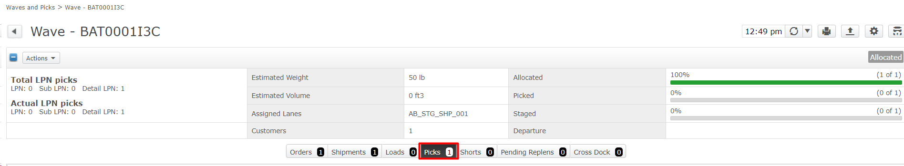

# **BASE_OUB_0050A00_MHE_SMART_PICK_MOCA_V001**

<!-- SMART_DOC_GEN_TEST_DESCR - Start -->
(Smart Extension).  This test represents the typical MHE picking flow implemented by Smart IS.  In this model wrkque entries were created for each pick (carton or list).  The test will pick the list or carton fully.
<!-- SMART_DOC_GEN_TEST_DESCR - End -->

## **Test Category**

**☐** Custom  
**🗹** Smart IS  
**☐** Standard

## **Overview**

In this innovative approach, Material Handling Equipment (MHE) is employed to efficiently execute order picking tasks within a specified wave, following the established standards of Smart IS implementations. By leveraging MHE capabilities, this method enhances order picking processes, ensuring accuracy and efficiency in warehouse operations. This approach integrates seamlessly with Smart IS systems, providing a reliable and standardized solution for order fulfillment within warehouse environments.

Users adopting this concept can expect improved order picking efficiency and accuracy, thanks to the precision and automation offered by MHE. By adhering to Smart IS standards, this approach ensures compatibility and interoperability with existing systems, minimizing integration complexities. Overall, this innovative concept offers a streamlined and effective solution for order picking, enhancing warehouse operations' productivity and reliability.

## **Applicable versions**

This test is designed to support versions greater than **2008.x.x**, ensuring compatibility and smooth operation with the latest software releases. Users can confidently utilize this test, as it is optimized for newer versions while retaining a user-friendly testing process.

## **Test Arguments**

Test arguments are parameters or inputs that are passed to the test cases to customize the test execution. These arguments provide flexibility and allow for the reuse of the same test case with different sets of data or configurations. The input is as follows:

<!-- SMART_DOC_GEN_TEST_ARG - Start -->
<table>
<tr><th>Arguments</th><th>Argument Description</th></tr>
<tr><td>schbat</td><td>If you don't provide a schedule batch, we'll use the uc_schbat_expr to create one.</td></tr>
<tr><td>uc_call_complete_api</td><td>Determines if we should call the underlying pick API. Default to 1, meaning yes.</td></tr>
<tr><td>uc_emulate_pick_cmd</td><td>This command is used to pick one request number. If not specified, the default is 'emulate usr mhe process wrkque'. If you provide a different command, we'll look for it as an LES command.</td></tr>
<tr><td>uc_get_inventory_cmd</td><td>This command retrieves inventory for picking. By default, it uses 'get_usr_inventory_for_pick_emulation'. If you specify a different command, we'll use that instead.</td></tr>
<tr><td>uc_oprcod_expr</td><td>These are the operation codes we'll use for filtering data. By default, we look for codes starting with 'UC%'.</td></tr>
<tr><td>uc_oprcod_list</td><td>Rather than passing in uc_oprcod_expr, we can pass a SQL compatible list of operation codes. Default is nothing.</td></tr>
<tr><td>uc_pick_is_last</td><td>Indicates if this is the last pick of the group. By default, it's set to 1, meaning yes.</td></tr>
<tr><td>uc_pick_to_lodnum</td><td>If you specify a pick-to-load number, we'll use that. Otherwise, we'll intelligently determine the default.</td></tr>
<tr><td>uc_schbat_expr</td><td>If you don't specify a schedule batch (schbat), we will create one using 'ADATAW-' || @uc_test_exec_seqnum.</td></tr>
<tr><td>uc_test_exec_seqnum</td><td>During each run, it generates a unique base-36 value.</td></tr>
<tr><td>Wh_id</td><td>If you don't specify a warehouse ID, we'll use the one from the schedule batch.</td></tr>
</table>
<!-- SMART_DOC_GEN_TEST_ARG - End -->

## **TestCases using this test**

This section provides a comprehensive list of test cases that are associated with this particular test. It provides a quick reference for understanding the specific tests covered. By reviewing these test cases, users can gain a deeper understanding of how this test is used in different scenarios and ensure comprehensive test coverage.

<!-- SMART_DOC_GEN_TEST_CASE_USING_THIS - Start -->
| Test Case ID | Test Case Description |
| ------------ | --------------------- |

<!-- SMART_DOC_GEN_TEST_CASE_USING_THIS - End -->

## **RunSets using this test**

This section details the various RunSets that utilize this test as part of their execution. Each RunSet represents a collection of tests and configurations that are executed together to achieve specific testing goals. By examining the RunSets that include this test, users can understand how it fits into larger testing scenarios and how it contributes to overall test coverage and automation.

<!-- SMART_DOC_GEN_RUN_SET_USING_THIS - Start -->
| Run Set ID | Run Set Description |
| ---------- | ------------------- |
| BASE_OUB_000100_CREATE_TO_DISPATCH_USING_FRONT_END | create order, plan, allocate (web), release, pick, dispatch |

<!-- SMART_DOC_GEN_RUN_SET_USING_THIS - End -->

## **Equivalent Usecase**

The following steps represent a general procedure for Outbound MHE Smart Pick through GUI.

**Step:1**

Select **Configuration** > **Outbound Planner**

**Step:2**

Click on the **'Wave and Pick'** screen. All waves that are **Planned** are shown here.

**Step:3**

We simply allocate the order. MHE smart picks are shown in **picks** after allocation.

**Step:4**

After release pick, MHE smart picks are shown in pick confirmation.

## **Applicable MOCA commands**

For Outbound MHE Smart Pick using the MOCA command, you can use the following command.

-   **uc_emulate_pick_cmd**

This command will trigger the Outbound MHE Smart Pick based on the predefined parameters and rules within the MOCA system.

## **Affected DB tables**

When MHE Smart Picks are created, the following database table is typically affected:

-   **Pckwrk_view**

This table is commonly used to store information related to the picking work in the MHE (Material Handling Equipment) system.

---
 **Previous-Test**
 [BASE_OUB_0301000_TRLR_CLOSE_DISPATCH_MOCA_V001](./tests_docs/BASE_OUB_0301000_TRLR_CLOSE_DISPATCH_MOCA_V001.md)
 
**Next-Test**
  [BASE_OUB_0070A00_VAS_SMART_PREP_MOCA_V001](./tests_docs/BASE_OUB_0070A00_VAS_SMART_PREP_MOCA_V001.md)
  
[SMART-IS](https://www.smart-is.pk) 