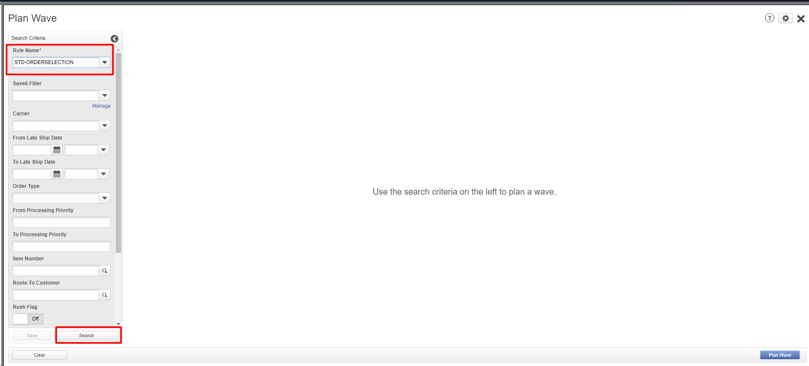
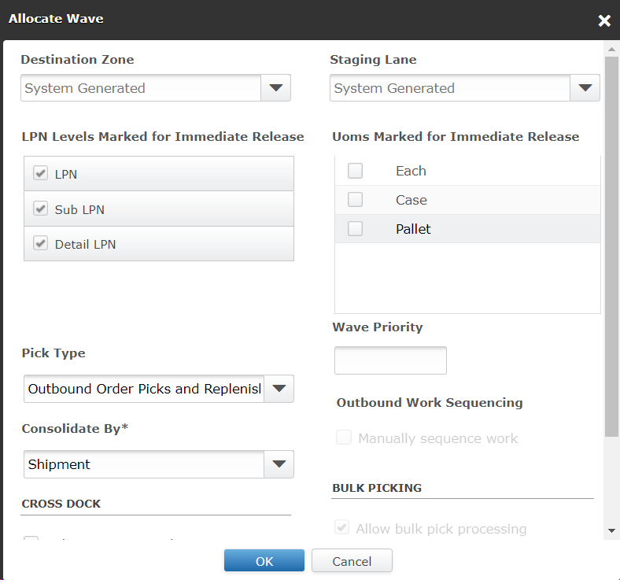

# **BASE_OUB_0200000_TRLR_CKIN_MOCA_V001**

<!-- SMART_DOC_GEN_TEST_DESCR - Start -->
Check in shipping trailers
<!-- SMART_DOC_GEN_TEST_DESCR - End -->

## **Test Category**

<input type="checkbox" checked> Standard
 
<input type="checkbox"> Custom
 
<input type="checkbox"> Smart IS

## **Overview**

In the described use case, the system is designed to manage the process of checking in transport equipment, indicating a procedure that involves registering the arrival of transport vehicles or equipment at a designated location, such as a warehouse or distribution center. This process likely includes verifying the identity of the transport equipment, inspecting it for any damage or defects, and recording its arrival for further processing.

Implementing this use case effectively requires a robust system for managing transport equipment check-ins. It should be able to handle various scenarios, such as different types of transport equipment, varying check-in procedures, and integration with other systems or components involved in the logistics process.

The system may also include features for tracking the status of transport equipment, managing parking or storage locations, and generating reports or notifications based on check-in events. This functionality is crucial for ensuring the efficient use of transport equipment, minimizing downtime, and maintaining a smooth flow of goods through the logistics network.

## **Applicable versions**

This test is designed to support versions greater than **2008.x.x**,
ensuring compatibility and smooth operation with the latest software
releases. Users can confidently utilize this test, as it is optimized
for newer versions while retaining a user-friendly testing process.

## **Test Arguments**

Test arguments are parameters or inputs that are passed to the test
cases to customize the test execution. These arguments provide
flexibility and allow for the reuse of the same test case with different
sets of data or configurations. The input is as follows:

<!-- SMART_DOC_GEN_TEST_ARG - Start -->
<table>
<tr><th>Arguments</th><th>Argument Description</th></tr>
<tr><td>schbat</td><td>null</td></tr>
<tr><td>uc_list_available_dock_door_cmd</td><td>null</td></tr>
<tr><td>uc_list_available_dock_door_filter_expr</td><td>null</td></tr>
<tr><td>uc_schbat_expr</td><td>null</td></tr>
<tr><td>uc_test_exec_seqnum</td><td>null</td></tr>
<tr><td>wh_id</td><td>null</td></tr>
</table>
<!-- SMART_DOC_GEN_TEST_ARG - End -->

## **TestCases using this test**

This section provides a comprehensive list of test cases that are associated with this particular test. It provides a quick reference for understanding the specific tests covered. By reviewing these test cases, users can gain a deeper understanding of how this test is used in different scenarios and ensure comprehensive test coverage.

<!-- SMART_DOC_GEN_TEST_CASE_USING_THIS - Start -->
| Test Case ID | Test Case Description |
| ------------ | --------------------- |
| BASE_ALL_GEN | null |

<!-- SMART_DOC_GEN_TEST_CASE_USING_THIS - End -->

## **RunSets using this test**

This section details the various RunSets that utilize this test as part of their execution. Each RunSet represents a collection of tests and configurations that are executed together to achieve specific testing goals. By examining the RunSets that include this test, users can understand how it fits into larger testing scenarios and how it contributes to overall test coverage and automation.

<!-- SMART_DOC_GEN_RUN_SET_USING_THIS - Start -->
| Run Set ID | Run Set Description |
| ---------- | ------------------- |
| BASE_OUB_000000_CREATE_TO_DISPATCH | create order, plan, allocate, release, pick, dispatch |
| BASE_OUB_001000_TRAFFIC_PLAN_CREATE_TO_DISPATCH | create order, plan, allocate, release, pick, dispatch |

<!-- SMART_DOC_GEN_RUN_SET_USING_THIS - End -->

## **Equivalent Usecase**

The following steps represent a general procedure for check In trailor through GUI.

**Step:1**

Select **Configuration** > **Outbound Planner**

**Step:2**

Click on the **'Wave and Pick'** screen.

**Step:3**

From the **Actions** drop-down list, select **Plan Wave.**

**Step:4**

Under **Search Criteria**, from the **Rule Name** drop-down list, select the rule that defines the parameters by which to search for orders or shipments. Click **Search**. The orders or shipments that meet the search criteria are displayed.

**Step:5**

Click **Plan Wave.**

**Step:6**

Open that Plan wave and go to the '**Actions**' tab and pick '**Allocate Wave (Planned)**'.

**Note**: Picks in a specific LPN level are released whenever the check box for the LPN level is selected for immediate release or when all three LPN levels are deselected.

**Step:7**

From the Actions drop-down list, select Stage Shipment. A confirmation message is displayed.

**Step:8**

After that you need to add the load.

**Step:9**

After that you need to Check IN the trailor.

## **Applicable MOCA commands**

To check In trailor using the MOCA command, you can use the following command.

- check in trailer

This command will trigger the check In trailor based on the predefined parameters and rules within the MOCA system.

## **Affected DB tables**

The following database table is typically affected while check In trailor:

- **Shipment**
- **Shipment_line**
- **stop**
- **car_move**
- **trlr**

These tables are likely to be affected to check In trailor.

---

**Previous-Test**
 [BASE_OUB_0200000_TRLR_CKIN_MOCA_V001](./tests_docs/BASE_OUB_0200000_TRLR_CKIN_MOCA_V001.md)
 

  
[SMART-IS](https://www.smart-is.pk) 