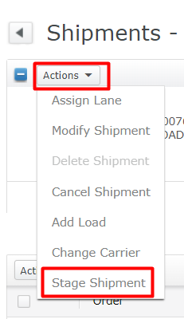

# **BASE_OUB_0250000_TRLR_LOAD_MOCA_V001**

<!-- SMART_DOC_GEN_TEST_DESCR - Start -->
Load staged inventory to trailer
<!-- SMART_DOC_GEN_TEST_DESCR - End -->

## **Test Category**

<input type="checkbox" checked disabled> Standard
 
<input type="checkbox" disabled> Custom
 
<input type="checkbox" disabled> Smart IS
 

## **Overview**

Load represents a grouping of stops that are intended to be shipped together on a single piece of transport equipment, such as a truck or a container. Before staged shipments can be loaded onto transport equipment, they must be assigned to a stop that is part of an outbound load. Each stop is assigned a stop sequence, which dictates the specific order in which the stops must be loaded into the transport equipment. This sequencing is crucial for ensuring efficient loading and unloading operations, as well as for maintaining the integrity of the shipment.

To facilitate this process, the application enforces strict adherence to the stop sequence order. However, there are certain configurations that can override this rule. For example, a load can be configured to ignore the stop sequence order, allowing for more flexibility in how shipments are loaded onto transport equipment. Additionally, if an item on the shipment belongs to an item family that has a break stop sequence code applied, this code can also override the stop sequence order. These configurations provide a level of flexibility in the loading process, enabling organizations to adapt to specific logistical requirements and optimize their shipment operations.

## **Applicable versions**

This test is designed to support versions greater than **2008.x.x**,
ensuring compatibility and smooth operation with the latest software
releases. Users can confidently utilize this test, as it is optimized
for newer versions while retaining a user-friendly testing process.

## **Test Arguments**

Test arguments are parameters or inputs that are passed to the test
cases to customize the test execution. These arguments provide
flexibility and allow for the reuse of the same test case with different
sets of data or configurations. The input is as follows:

<!-- SMART_DOC_GEN_TEST_ARG - Start -->
<table>
<tr><th>Arguments</th><th>Argument Description</th></tr>
<tr><td>schbat</td><td></td></tr>
<tr><td>uc_schbat_expr</td><td></td></tr>
<tr><td>uc_test_exec_seqnum</td><td></td></tr>
<tr><td>wh_id</td><td></td></tr>
</table>
<!-- SMART_DOC_GEN_TEST_ARG - End -->

## **TestCases using this test**

This section provides a comprehensive list of test cases that are associated with this particular test. It provides a quick reference for understanding the specific tests covered. By reviewing these test cases, users can gain a deeper understanding of how this test is used in different scenarios and ensure comprehensive test coverage.

<!-- SMART_DOC_GEN_TEST_CASE_USING_THIS - Start -->
| Test Case ID | Test Case Description |
| ------------ | --------------------- |
| BASE_ALL_GEN |  |

<!-- SMART_DOC_GEN_TEST_CASE_USING_THIS - End -->

## **RunSets using this test**

This section details the various RunSets that utilize this test as part of their execution. Each RunSet represents a collection of tests and configurations that are executed together to achieve specific testing goals. By examining the RunSets that include this test, users can understand how it fits into larger testing scenarios and how it contributes to overall test coverage and automation.

<!-- SMART_DOC_GEN_RUN_SET_USING_THIS - Start -->
| Run Set ID | Run Set Description |
| ---------- | ------------------- |
| BASE_OUB_000000_CREATE_TO_DISPATCH | create order, plan, allocate, release, pick, dispatch |
| BASE_OUB_001000_TRAFFIC_PLAN_CREATE_TO_DISPATCH | create order, plan, allocate, release, pick, dispatch |

<!-- SMART_DOC_GEN_RUN_SET_USING_THIS - End -->

## **Equivalent Usecase**

The following steps represent a general procedure for trailor load through GUI.

**Step:1**

Select **Configuration** > **Outbound Planner**

**Step:2**

Click on the **'Wave and Pick'** screen.

**Step:3**

From the **Actions** drop-down list, select **Plan Wave.**

**Step:4**

Under **Search Criteria**, from the **Rule Name** drop-down list, select the rule that defines the parameters by which to search for orders or shipments. Click **Search**. The orders or shipments that meet the search criteria are displayed.

**Step:5**

Click **Plan Wave.**

**Step:6**

Open that Plan wave and go to the '**Actions**' tab and pick '**Allocate Wave (Planned)**'.

**Note**: Picks in a specific LPN level are released whenever the check box for the LPN level is selected for immediate release or when all three LPN levels are deselected.

**Step:7**

From the Actions drop-down list, select Stage Shipment. A confirmation message is displayed.

**Step:8**

After that you need to add the load.

## **Applicable MOCA commands**

To load trailor using the MOCA command, you can use the following command.

- load trailer

This command will trigger the load trailor based on the predefined parameters and rules within the MOCA system.

## **Affected DB tables**

The following database table is typically affected while stage shipment:

- **Shipment**
- **Shipment_line**
- **stop**
- **car_move**
- **trlr**

These tables are likely to be affected to load trailor.

---

**Previous-Test**
 [BASE_OUB_0090000_STAGE_MOCA_V001](./tests_docs/BASE_OUB_0090000_STAGE_MOCA_V001.md)
 
**Next-Test**
  [BASE_OUB_0200000_TRLR_CKIN_MOCA_V001](./tests_docs/BASE_OUB_0200000_TRLR_CKIN_MOCA_V001.md)
  
[SMART-IS](https://www.smart-is.pk) 