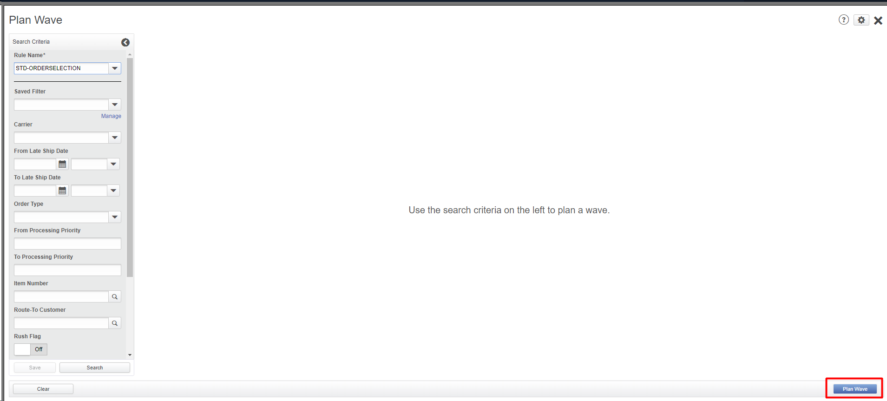

# **BASE_OUB_0300000_WAIT_ORD_DISPATCH_MOCA_V001**

<!-- SMART_DOC_GEN_TEST_DESCR - Start -->
This test builds on other BASE outbound tests.  The test will wait for the outbound order to be completely dispatched.
<!-- SMART_DOC_GEN_TEST_DESCR - End -->

## **Test Category**

**☐** Custom  
**☐** Smart IS  
**🗹** Standard  

## **Overview**

In the described use case, the system is designed to wait for an order to be dispatched, indicating a process that involves monitoring the status of an order until it reaches the "dispatched" state. This likely involves a system that tracks orders and their statuses, possibly interfacing with other systems or components that handle the actual dispatching process. The waiting mechanism may involve periodic checks of the order status or subscribing to notifications or events that indicate when an order has been dispatched. This functionality is crucial for ensuring that downstream processes or actions dependent on the order being dispatched are triggered at the right time.

To implement this use case effectively, the system needs to have a robust mechanism for tracking and managing order statuses. It should be able to handle various scenarios, such as delays or errors in the dispatch process, and provide visibility into the status of each order.

## **Applicable versions**

This test is designed to support versions greater than **2008.x.x**,
ensuring compatibility and smooth operation with the latest software
releases. Users can confidently utilize this test, as it is optimized
for newer versions while retaining a user-friendly testing process.

## **Test Arguments**

Test arguments are parameters or inputs that are passed to the test
cases to customize the test execution. These arguments provide
flexibility and allow for the reuse of the same test case with different
sets of data or configurations. The input is as follows:

<!-- SMART_DOC_GEN_TEST_ARG - Start -->
<table>
<tr><th>Arguments</th><th>Argument Description</th></tr>
<tr><td>ordnum</td><td>null</td></tr>
<tr><td>schbat</td><td>null</td></tr>
<tr><td>ship_id</td><td>null</td></tr>
<tr><td>uc_max_iter</td><td>null</td></tr>
<tr><td>uc_sleep_ms_each_iter</td><td>null</td></tr>
<tr><td>uc_test_exec_seqnum</td><td>null</td></tr>
<tr><td>uc_wave_set_expr</td><td>null</td></tr>
<tr><td>wave_set</td><td>null</td></tr>
<tr><td>wh_id</td><td>null</td></tr>
</table>
<!-- SMART_DOC_GEN_TEST_ARG - End -->

## **TestCases using this test**

This section provides a comprehensive list of test cases that are associated with this particular test. It provides a quick reference for understanding the specific tests covered. By reviewing these test cases, users can gain a deeper understanding of how this test is used in different scenarios and ensure comprehensive test coverage.

<!-- SMART_DOC_GEN_TEST_CASE_USING_THIS - Start -->
| Test Case ID | Test Case Description |
| ------------ | --------------------- |
| BASE_ALL_GEN | null |

<!-- SMART_DOC_GEN_TEST_CASE_USING_THIS - End -->

## **RunSets using this test**

This section details the various RunSets that utilize this test as part of their execution. Each RunSet represents a collection of tests and configurations that are executed together to achieve specific testing goals. By examining the RunSets that include this test, users can understand how it fits into larger testing scenarios and how it contributes to overall test coverage and automation.

<!-- SMART_DOC_GEN_RUN_SET_USING_THIS - Start -->
| Run Set ID | Run Set Description |
| ---------- | ------------------- |
| BASE_OUB_000000_CREATE_TO_DISPATCH | create order, plan, allocate, release, pick, dispatch |
| BASE_OUB_000000_CREATE_TO_DISPATCH | create order, plan, allocate, release, pick, dispatch |
| BASE_OUB_000100_CREATE_TO_DISPATCH_USING_FRONT_END | create order, plan, allocate (web), release, pick, dispatch |

<!-- SMART_DOC_GEN_RUN_SET_USING_THIS - End -->

## **Equivalent Usecase**

The following steps represent a general procedure for dispatched order through GUI.

**Step:1**

Select **Configuration** > **Outbound Planner**

**Step:2**

Click on the **'Wave and Pick'** screen.

**Step:3**

From the **Actions** drop-down list, select **Plan Wave.**

**Step:4**

Under **Search Criteria**, from the **Rule Name** drop-down list, select the rule that defines the parameters by which to search for orders or shipments. Click **Search**. The orders or shipments that meet the search criteria are displayed.

**Step:5**

Click **Plan Wave.**

**Step:6**

Open that Plan wave and go to the '**Actions**' tab and pick '**Allocate Wave (Planned)**'.

**Note**: Picks in a specific LPN level are released whenever the check box for the LPN level is selected for immediate release or when all three LPN levels are deselected.

**Step:7**

After that, you need to confirm pick and add load

**Step:8**

After that, you need to add equipment and attach that equipment to the specified load.

**Step:9**

After that, you need to go to **receiving** and **door activity** and select your equipment.

**Step:10**

Select your equipment and go to action.

## **Applicable MOCA commands**

To dispatch order using the MOCA command, you can use the following command.

- ord dispatched

This command will trigger the dispatch order based on the predefined parameters and rules within the MOCA system.

## **Affected DB tables**

The following database table is typically affected while dispatching the order:

- **Order**
- **Shipment**
- **Shipment_line**

These tables are likely to be affected to ensure proper tracking and management of the dispatch process and associated shipments.

[SMART-IS](https://www.smart-is.pk) 