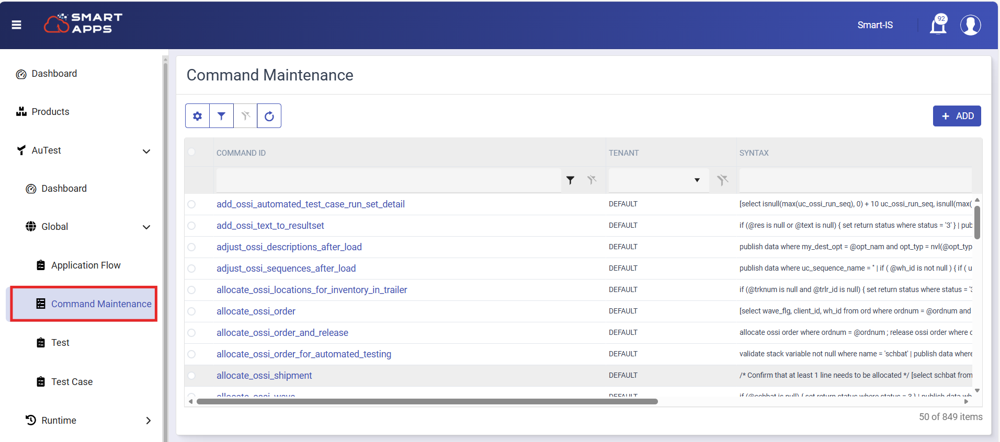

# Overview
This training will cover some of the basic concepts around the concept of "Commands" in Smart AuTest.

Commands are a basic building block for providing control over test execution.  Commands are basically MOCA snippets that perform certain actions, for example:
* We can create a complete test.  These are referrred to as MOCA based tests
* We can write expressions to control behavior.  For example, for controlling a run set step we say following.  Note that it is enclosed in "##"
````
##if( ('@uc_new_car_move_id' is not null or '@uc_src_car_move_id_expr' is not null) and int('@uc_iteration_count') = 1 ) publish data where uc_do_work=1##
````
* We can use them to provide values for variables defined in tests or run sets.  This is a powerful concept which allows us to provide meaningful values
* Commands are used to define "output" of a test.
    * "Output" of a MOCA based tests is easy to visualize - for a MOCA based test, whatever is published is deemed its output
    * For Web based or RF based tests, we can define a command with the test.  When the test has executed, this command is run and output of that command is deemed as output of the test.  This is a powerful capability to create elaborate validations
* Commands are created to validate the output

So as you can see commands form a basic building block.  So familiarily with MOCA syntax is important.

## Command Store
Commands are defined in Smart AuTest using our frontend.

 <div style="text-align: center;">
    
      </div> 


You will see a rich set of commands.  The ones provided by Smart IS have "BASE" prefix.  If you see a few of them, you will see that these
are MOCA code blocks.  For example:

| Command Name                    | Overview                               | Note                                         |
|---------------------------------|----------------------------------------|----------------------------------------------|
| BASE_GET_CODMST_DESC            | Gets description of a code             | Used extensively by front-end where we need to provide text for codes |
| BASE_GET_GLOBAL_VALUE           | To execute an expression to get value  | Used in GUI Quick Filter expressions |
| BASE_GEN_GET_INT_EVT_DATA       | Get integration data                   | Used in tests to gather integration data after execution |
| BASE_INV_LOAD_PICKUP_V001       | Pick Up a load on to a device          | Showcases the capabilities.  Also note "Script" syntax |
| BASE_INV_LOAD_DEPOSIT_V001      | Deposit a load to a location           | Showcases the capabilities.  And note "Script" syntax |
| BASE_VAL_PACKING                | Validate picking                       | See how it iterates uc_test_exec_res and then sets uc_val_sts.  uc_val_sts of 0 means success and anything else is failure |

## Testing these from MOCA Client
Smart MOCA Client can be used to test these commands.  For example lets say you want to test BASE_GET_CODMST_DESC
* Open Smart MOCA Client
* You will need to know the input that the comamnd needs.  Looking at its syntax we know that it needs a) colnam and b)codval.  And based on these it will return uc_retval.  So run
````
publish data
where colnam = 'wrktyp'
and codval = 'M'
|
Script("BASE_GET_CODMST_DESC")
````

## Creating a new command
* Press "Add" from command maintenance
* Lets create a command to do publish some data.  Lets name it TMP1_PUBLISH_DATA (TMP1 is to identify that it is for training).  Lets put the following code
````
publish data
where main_step = 'My Test'
and step = 'My Step'
and i = @i
and val = 'A'
````
* Hit Save.  Note that the command is created with a prefix for the tenant.  That will be different for you but my command was created as SIS_TMP1_PUBLISH_DATA
* Lets run it from MOCA Client.  I type following
````
publish data where i = 2
|
Script("SIS_TMP1_PUBLISH_DATA")
````
* Now we will create a second command that will call this command in a loop.  Lets call this command TMP1_DO_LOOP.  I want to call the comamnd I created above
````
publish data
where count = nvl(@count,10)
|
do loop
|
{
    Script("SIS_TMP1_PUBLISH_DATA")
}
````
* Now lets run this new command
````
publish data
where count = 20
|
Script("SIS_TMP1_DO_LOOP")
````
---
<br>
