## Oveview
We will create a sample RF test.  The underlying concepts are same as the Web Test so it is important that the web ui training has been 
complted before this.

## The form and field information
Legacy MTF tests and new Mobile RF tests can be executed with the same exact test.  In order to provide the field and form information,
we need to make sure that MTF task for legacy MTF is running with the "-G" option.

* Open MOCA Console and find the MTF task
* View its command line
    * Make sure it has -G22,1 at the end, for example:
````
java -cp %MTF_CLASSPATH% com.redprairie.mtf.terminal.Terminal -v DEFAULT -W WMD1 -a http://127.0.0,1:7010/service -P 7069 -j %MTFDIR%/data/mtf_logging.xml -N TELNET -G22,1
````
        * This says that on line# 22, column #1 we will see the form and field information.

## Example
We will use the Full Inventory Move RF form as an example.  So our manual use case is:
* Login to RF
* Inventory Menu
* Choose "Full Inv Move"
* I typed in a source load
* I observe that when I scanned the load, screen flashed and then it stays at the same location.  Inventory is on the device at this point
* Now I press F6
* My cursor is on the load number field and I dont want to do anything there so I press Enter
* Then on destination location I typed in the destination location

Once we have defined our desired "test", we should define the input paramters for the test.  Some guidelines in this regard are:
* The input parameters should be consistent.  Smart IS recommends that for any entity, use the column in the database.  For this test we will have following:
| Argument    | Description          |
|-------------| ---------------------|
| srcloc      | This is the source location from where we will move all loads to destination |
| dstloc      | This is the location we want to move it to |

## Capture the Form and Field Data (Metdata)
Once we have our plan in place, now we need to execute the use case manually and capture critical metadata
* First we need to see what is the form we need to invoke.  That is displayed on the line#21 UNDIR_TRANSFER (see note about MTF task above) 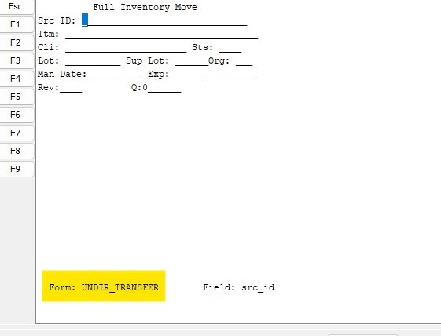
* Now see what is the RF field name where we are entering the load number.  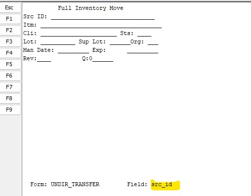
* When I press [F6]
* Then the new form that shows up is DEPOSIT_A 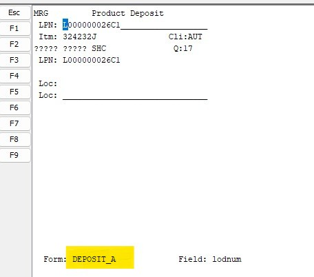
* The field where I put in destination is called "dstloc" 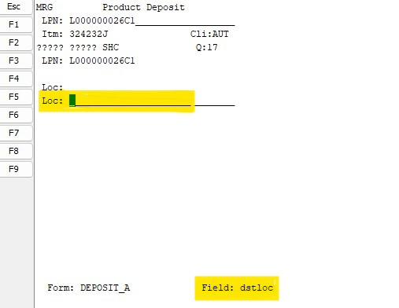

## Concepts
* When we are driving the legacy MTF form, in order to detect that the form state has changed, we see if form and field information has changed
* In form like this - that can sometimes cause an issue.  As you can see as soon as we typed load number, form looks the same afterwards.  All that happened was a flash of "Processing".  Sometimes that goes by too quickly for us to recognize that form changed
* So as a general rule, we always type in the input and stuff F6 at the same time.
    * Generally we can always give value of a field with [F6] or [Enter] and that tells our framework to stuff these keys
* Sometimes we need to scrape a value from the form.  Those can be referenced as <<form field name>>

## Create the basic RF Tests for pick and deposit
So now let us convert what we have into an application flow.  We are performing these steps on https://apps.smart-is.com

1. Select a name for this application flow.  It should be a descriptive name.  For example I will use TMP1_RF_MOVE_INVENTORY_PICKUP.  _TMP1 is simply to mark that is being created temporarily for training_.  This application flow is just to pick the load up.  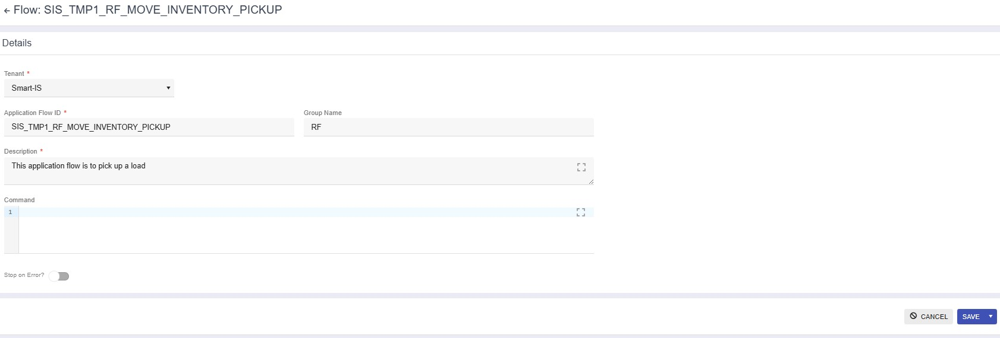
2. The first step is for invoking the form.  Here we have an important concept that we do not need to worry about which
menu options we go throigh to get to the option - instead we need to simply proivide the option name.  The RF form (UNDIR_TRANSFER) provides us
what we need but sometimes we also have some paramters.  So we should look up by form name in les_mnu_opt
````
[select * from les_mnu_opt where exec_nam like 'UNDIR_TRANSFER%']
````
    * I see that two rows are returned 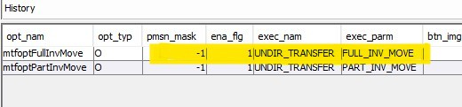
    * We want to invoke the full move which is FULL_INV_MOVE
    * Our convention is to concatenate the exec_nam and exec_parm - so we will be calling it as "UNDIR_TRANSFER.FULL_INV_MOVE"
1. So our first step is to call this 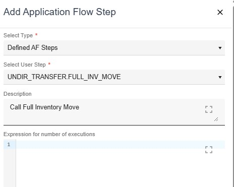
2. Now we need to map src_id to the value.  Whenever we have a flow where we enter a value and press F6, we should provide it as part of input.  So we will map src_id to a value called lodnum_enter and then pass that in with embedded F6
    * Click on the argument icon 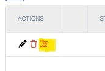
    * Provide the value as lodnum_enter (we will discuss that later) 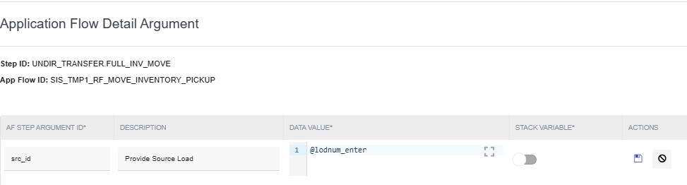
3. Now create the second application flow for deposit.  We will call it TMP1_RF_MOVE_INVENTORY_DEPOSIT 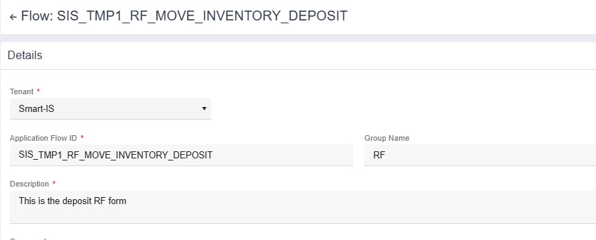
4. This application flow has a single step to wait for DEPOSIT_A 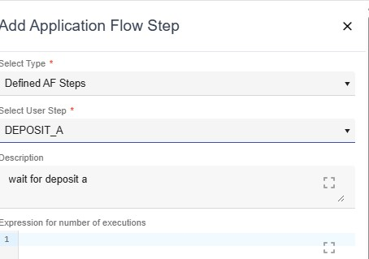
5. We need to provide value for location here.
    * Click on the argument icon 
    * And add "dstloc" as ````##publish data where @* and stoloc=@dstloc and uc_return_colnam='dstloc' |Script("BASE_GET_STOLOC_FOR_FRONT_END")##```` 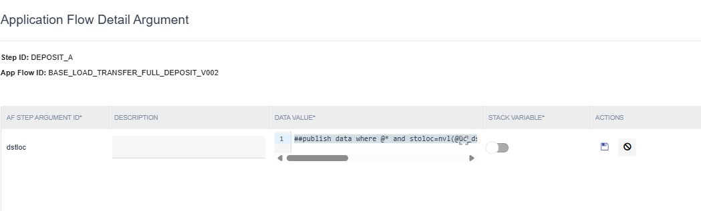
        * Whenever we are using location we should use  

### Make MAINLINE Application Flow to do pick and deposit
1. Create a new application flow called TMP1_RF_LOAD_TRANSFER_MAINLINE
2. Its first step is to call application flow TMP1_RF_MOVE_INVENTORY_PICKUP
3. And second step is to call application flow TMP1_RF_MOVE_INVENTORY_DEPOSIT

### Make CALLABLE application Flow that calls the MAINLINE
1. Create a new application flow called TMP1_RF_LOAD_TRANSFER_CALLABLE
1. Now we will integrate a powerful conept where we will "loop" an application flow.  We want to call the MAINLINE for every laod
    * In the TMP1_RF_LOAD_TRANSFER_CALLABLE application flow, click on the edit icon for MAINLINE 
    * As our input is srcloc, we want to get all distinct loads in source location.  And we want to also make a field called lodnum_enter which has F6.  So our expression of number of executions will be ````##
##
publish data where @* 
| 
[
select distinct inventory_view.lodnum, inventory_view.stoloc, inventory_view.lodnum||'[ENTER][F6]' lodnum_enter 
from inventory_view
where wh_id=@wh_id
and stoloc = @srcloc
order by 1
]
##
````
    * The execution loop will look like this 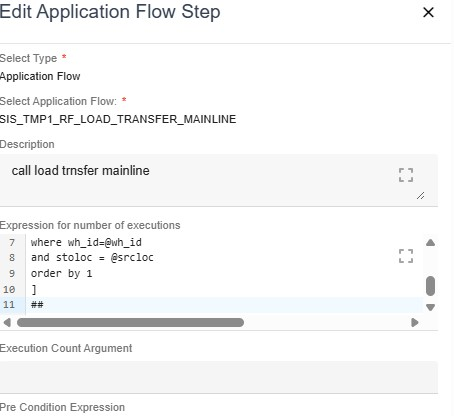

### Create test to call this application flow
Test is the basic object that can be invoked so we will now create a test to call our application flow and define the input parameters.  We already know our inputs
1. Create a new test called TMP1_RF_LOAD_TRANSFER 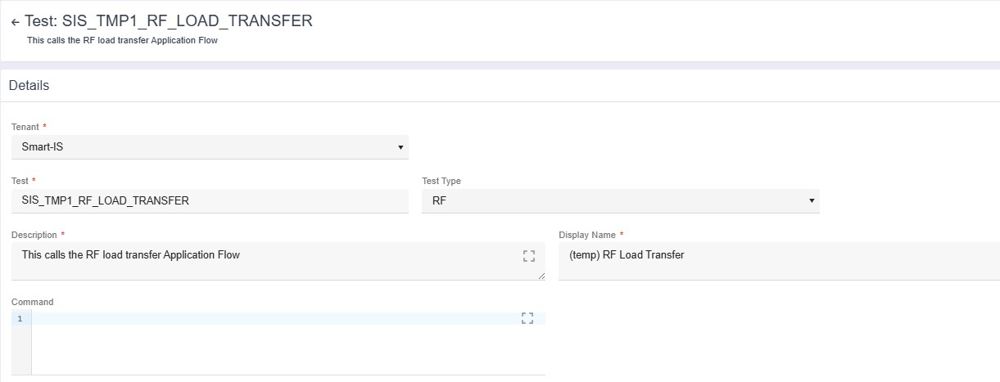
1. Add two arguments to the test 
1. Add a single step to the test to call our TMP1_RF_LOAD_TRANSFER_CALLABLE application flow


### We are ready to test it
1. Open AuTest from Smart MOCA Client
1. Find the new test we created 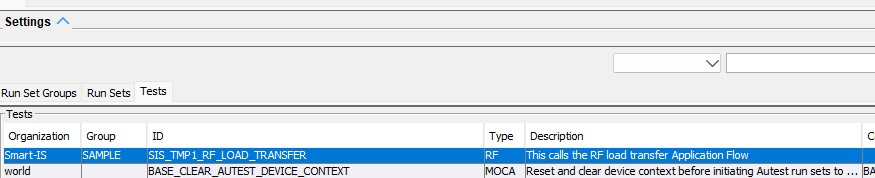
1. Press Execute
1. Put in source and destinaton 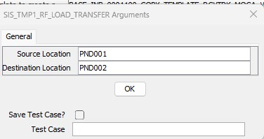

