## Overview
While tests and test cases can be executed, Run Set is the basic unit for final execution of tests.  A run set allows 
for combining **test cases**.  A run set also allows for arguments.  These arguments are **passed through** to the test and 
commands if explicit values are not passed at the test case level.

## Some Best Practices
We should follow some best practices
* While it is possible to have validation inline, create commands so that we can improve reuse.  So the validation logic we created earlier - lets turn that into a command called TMP1_VAL_LOAD_STOLOC
* The ideal place to put validation logic is not the test rather the test case.  This is because there are often subtle diffences in various test cases
    * For the test TMP1_RF_LOAD_TRANSFER, remove the validation logic we had put earlier
    * We have two test cases LOC1_TO_LOC2 amd LOC2_TO_LOC1, put validation command TMP1_VAL_LOAD_STOLOC on both test cases 

## Planning
Planning how the run sets are created as important.  Idea is to create them such that we have a wide test coverage in
each.  It is a good idea to see some of the available run sets to see how they achieve this goal.

For our exercise:
* It is a good idea to always start a run set with  
    * We have two test cases BASE_ALL_GEN for first step and BASE_GEN_CMPL for last step
* As tests are run, sometimes we have data in device_context table that may be stale.  So for run sets we should always call 
    * We have a test case BASE_ALL_GEN
* Toward the end we will call 
    * We have a test case BASE_ALL_GEN

In order to understand the concept of arguments, we will create Following arguments:
* uc_do_loc1_to_loc2_flg   (Tab Use Case Selection)
* uc_do_loc2_to_loc1_flg (Tab Use Case Selection)
* run_set_srcloc (Tab General )
* run_set_dstloc (Tab General )

We plan on running the test we created earlier, i.e. TMP1_RF_LOAD_TRANSFER. We already have two test cases for it.
We will modify them as follows:

| Test Case    | Argument     | Default Value Expression  | Evaluate Immediate |
|--------------|--------------|---------------------------|--------------------|
| LOC1_TO_LOC2 | srcloc       | @run_set_srcloc           | Yes |
|              | dstloc       | @run_set_dstloc           | Yes |
| LOC2_TO_LOC1 | srcloc       | @run_set_dstloc           | Yes |
|              | dstloc       | @run_set_srcloc           | Yes |

"Evaliuate Immediate" implies that in the course of executing the run set, as soon as it hits the point that it 
executes the test case, it will evaluate the expression.

Overall the idea is that we execute the test case twice to move back and forth and locations will be provided as part of run set.

We will name this run set TMP1_RUN_LOAD_TRANSFER

## Create Run Set
* On the web page, select "Run Set" and "Add" 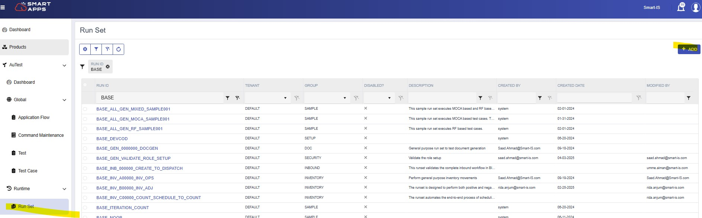
* Provide data for run set and press Save 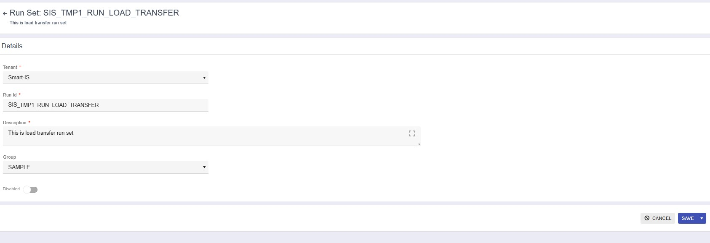
* Add Argumens of the run set 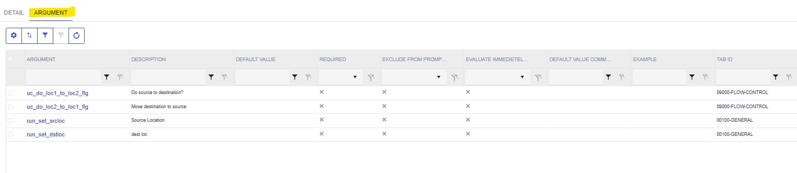

| Argument                 | Description | Tab Id             | Eval Immediate |Control Type | Default Value   |
|--------------------------|-------------|--------------------|----------------|-------------|-----------------|
| uc_test_exec_seqnum      | Test Exec#  | 00100-GENERAL      |                |             | |
| wh_id                    | Warehouse   | 00100-GENERAL      | Yes            |             | ##publish data where wh_id=@@WH_ID |
| devcod                   | device      | 00100-GENERAL      | Yes            |             | ##publish data where devcod=@@DEVCOD |
| uc_do_loc1_to_loc2_flg   | As needed   | 09000-FLOW-CONTROL |                | F           | |
| uc_do_loc2_to_loc1_flg   | As needed   | 09000-FLOW-CONTROL |                | F           | |
| run_set_srcloc           | Source Loc  | 00100-GENERAL      |                |             | |
| run_set_dstloc           | Dest Loc    | 00100-GENERAL      |                |             | |

* Now add steps 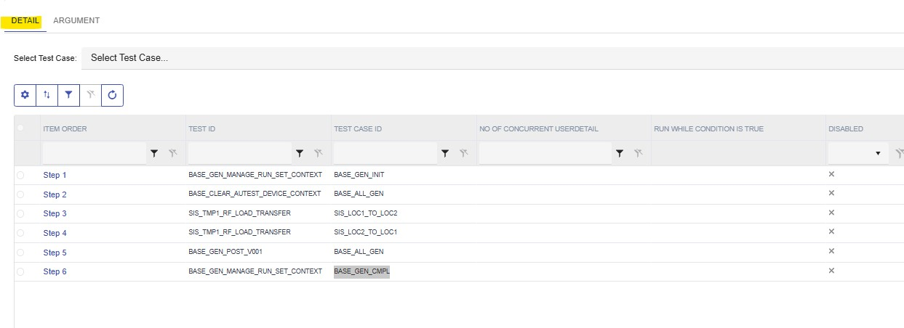
  
    1. First step will be BASE_GEN_MANAGE_RUN_SET_CONTEXT and test case BASE_ALL_GEN
    2. Then BASE_CLEAR_AUTEST_DEVICE_CONTEXT and test case BASE_ALL_GEN
    3. Then TMP1_RF_LOAD_TRANSFER and test case LOC1_TO_LOC2
    4. Then TMP1_RF_LOAD_TRANSFER and test case LOC2_TO_LOC1
    5. Then BASE_GEN_POST_V001 - test case BASE_ALL_GEN
    6. Then BASE_GEN_MANAGE_RUN_SET_CONTEXT and its test case BASE_GEN_CMPL

* For the step that calls TMP1_RF_LOAD_TRANSFER, we want to put a condition that respects uc_do_loc1_to_loc2_flg and uc_do_loc2_to_loc1_flg
    * For test case LOC1_TO_LOC2 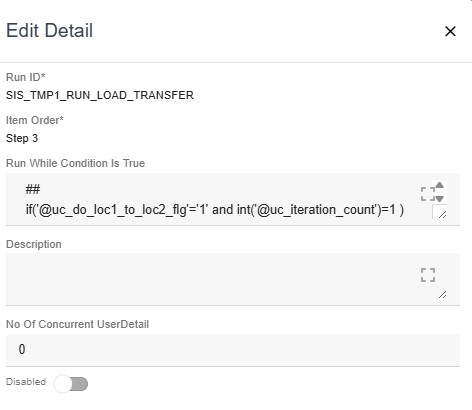

  ````
  ##
  if('@uc_do_loc1_to_loc2_flg'='1' and int('@uc_iteration_count')=1 ) 
      publish data where uc_do_work=1
  ##
  ````

    * For test case LOC2_TO_LOC1 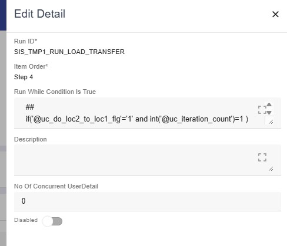
  
  ````
  ##
  if('@uc_do_loc2_to_loc1_flg'='1' and int('@uc_iteration_count')=1 ) 
      publish data where uc_do_work=1
  ##
  ````

## Run Run Set
Now that we have created the run set, lets run it:
* Find the run set.  If you do not find it, clear cache (Settings Pull Down, then Clear All Caches)  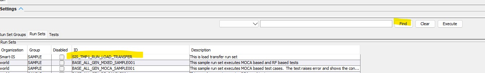
* Press Execute
* Note that we have two tabs and argumens are inside each tab.  Also note that we have checkboxes.
    * If these arguments do not have MLS Ids in the BY system then their names become prompts
    * We have description displayed as wel
    * we can put more metadata as neede
* Lets set both check boxes 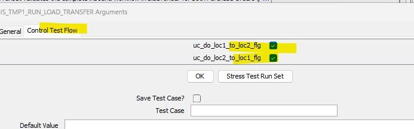
* And provide the two locations 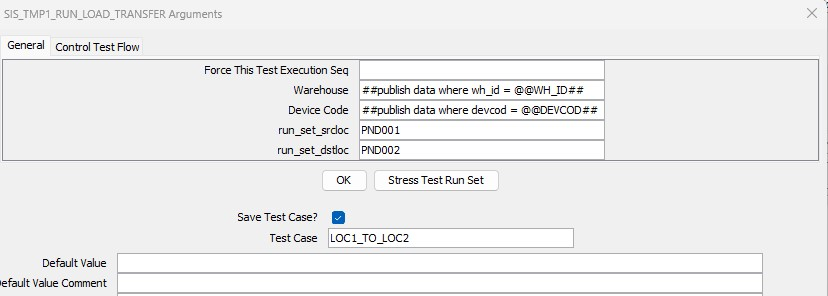
* We can also save this metadata as a "Run Set" "Test Case" 

## Understand the output
* The run set arguments are displayed when we started.  See the arguments.  uc_test_exec_seqnum gets a new value.  The wh_id and devcod were evaluated 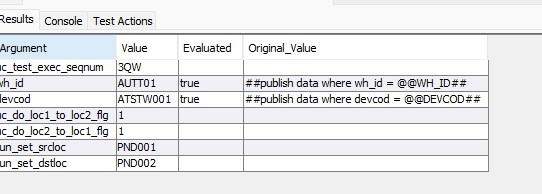
* As it is running, the "Execution Unit" is populated.  See how it shows test case, and then application flows 
* If you highlight the row for a test, you see
    * Its output 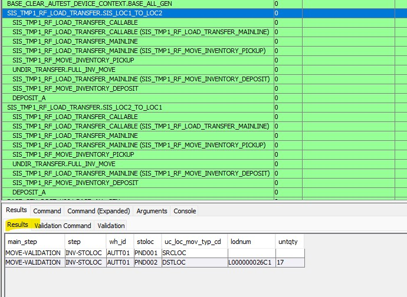
    * Its validation 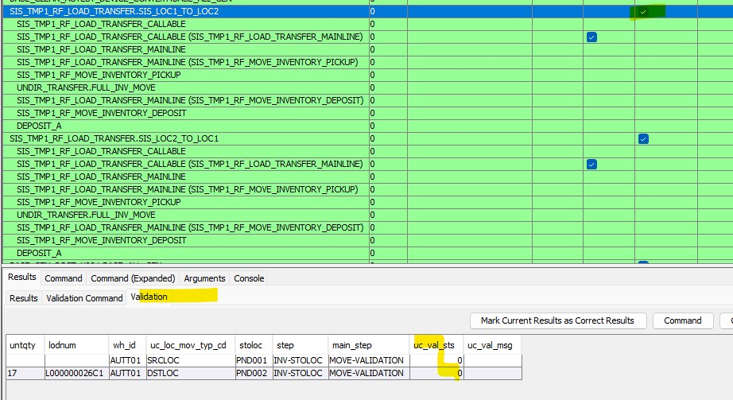
* The top tab has some interesting sections
    * The "Commands on Target Env" shows what MOCA was run on target 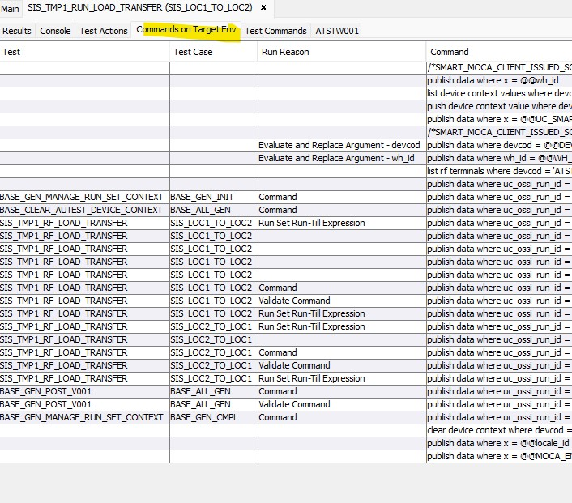
    * Tab which has the device code shows the interaction with the RF device 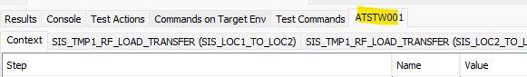
        * Under this tab we have a tab for each test for the RF 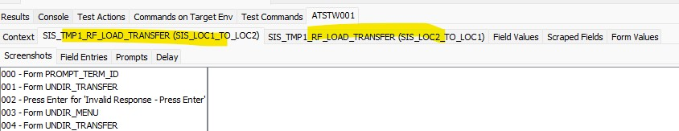
        * This is where you can see screenshots of RF 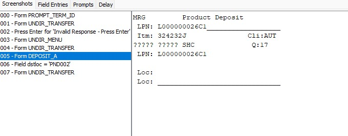
