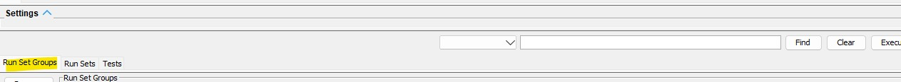
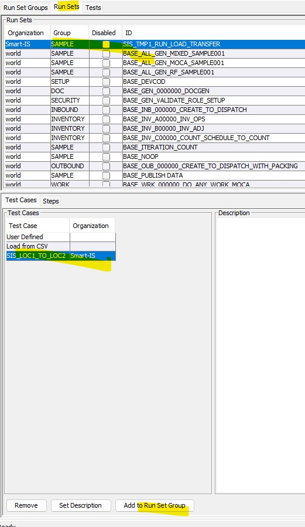
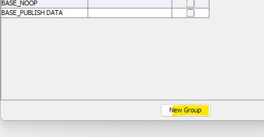
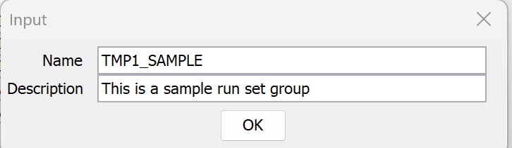
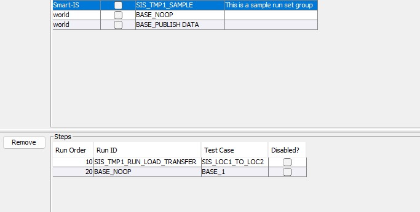

## Overview
Run Set Groups are used to define the basic unit for regression test.  A Run Set Group combines various Run Set Test Cases into a 
set and this set can then be executed from command line.

## Maintain Run Set Groups
* To view run set groups, see the "Run Set Group" tab in Smart MOCA Client AuTest 
* To add a run set test case to a group
    * Find the run set test case and press "Add To Run Set Group" 
    * Then add to an existing group or prress "New Group" 
    * Provide a name and description 
    * You can create a run set group with as many run set test cases as you want.  So lets also add BSAE_NOOP to it
* Our sample run set group has two run set test cases 
* If you press Execute it will execute all of the run set test cass

## Run as regression test
Typical reason for run set groups is to define regression test.  Once run set group is defined, it can be executed from comand line as follows:

* Find path to java on your machine.  You can open file %APPDATA%\SmartMOCAClient\config\smcagent\config.properties
    * For example ````C:\Program Files\Common Files\Oracle\Java\javapath\javaw.exe````
* You will need following paramters

| Command Line Argument   | Value                                          | Need to change? | Comments |
|-------------------------|------------------------------------------------|-----------------|----------|
| -cp                     | "mocadev.jar;lib\*;lib\selenium-java-4.33.0\*" | No              | |
|                         | com.oracular.mocadev.MOCADevLauncher           | No              | Always second parameter |
| security_key=           | Key that you provide in MOCA Client for cloud  | Yes             | This is the key you created |
| moca_conn_id=           | Connection on the machine                      | Yes             | Connection created for the user running it |
| uc_run_set_grp_id_list= | List of run set groups                         | Yes             | What you want to run |

* For example, open a command promot and run

````
cd /d %APPDATA%\SmartMOCAClient\sw\smc
"C:\Program Files\Common Files\Oracle\Java\javapath\java.exe" -cp "mocadev.jar;lib\*;lib\selenium-java-4.33.0\*" com.oracular.mocadev.MOCADevLauncher "security_key=WHAT_YOU_GENERATE_FOR_YOURSELF" moca_conn_id=WHAT_YOU_HAVE_IN_MOCA_CLIENT uc_run_set_grp_id_list=SIS_TMP1_SAMPLE
````
    * You can create a new key if you want for running as regression test
    * Put parameters in quotes as indicated

````
````
