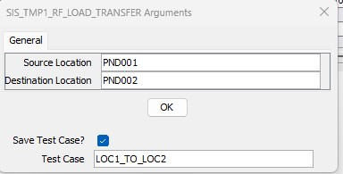
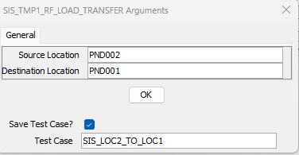
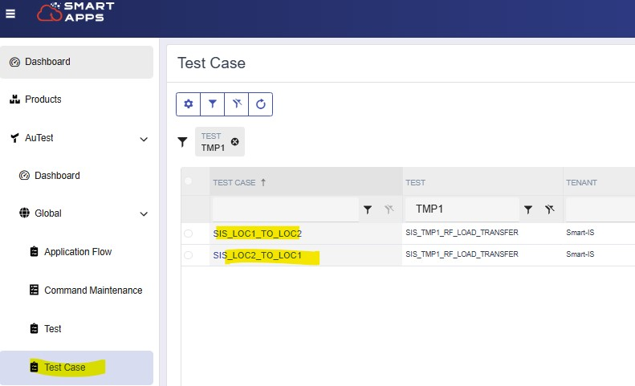
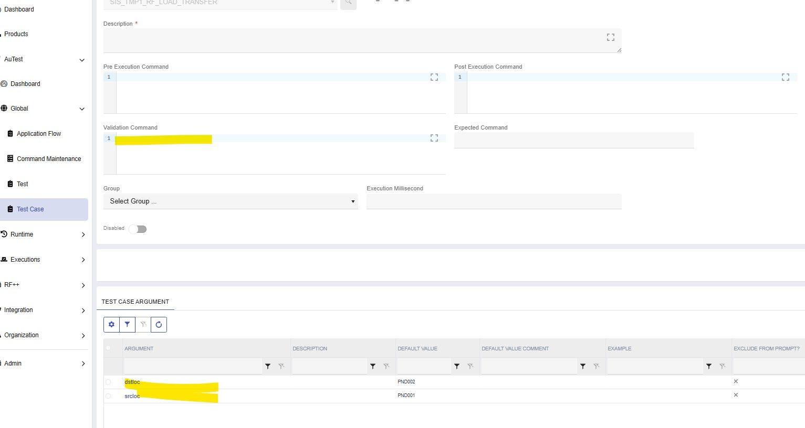

# Overview
A test case for a test is defined as an instance of test execution with parameters already proivded.  For this exercise
we will build upon the test we already created where we are moving the inventory between location.  So we will create two test cases:
* LOC1_TO_LOC2
* LOC2_TO_LOC1

## Creating a Test Case
* Press Execute
* Click on "Save Test Case" and give a test case name.

* Press Execute again and create another test case to move the other way.

  
## View Test Case on Web
* We can see the test cases on the web as well 

* You can maintain it here

 
   
    * You can provide a validation command here as well - if placing on test is not feasible.

---
 