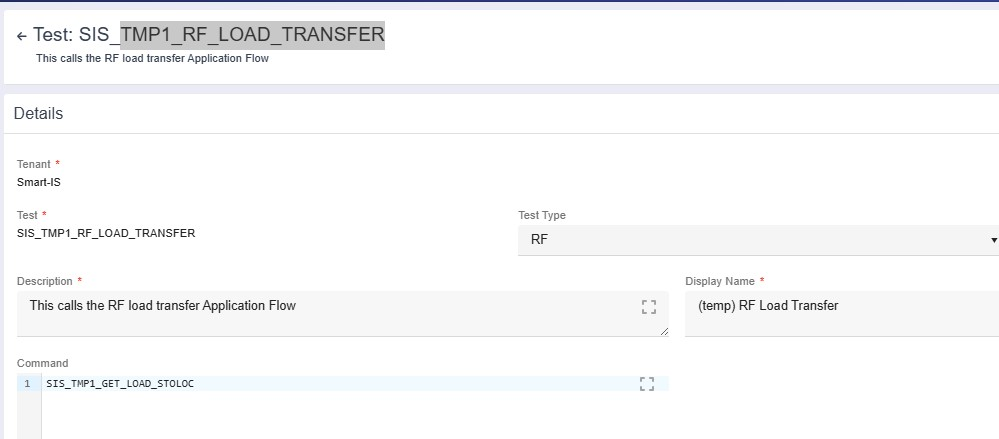
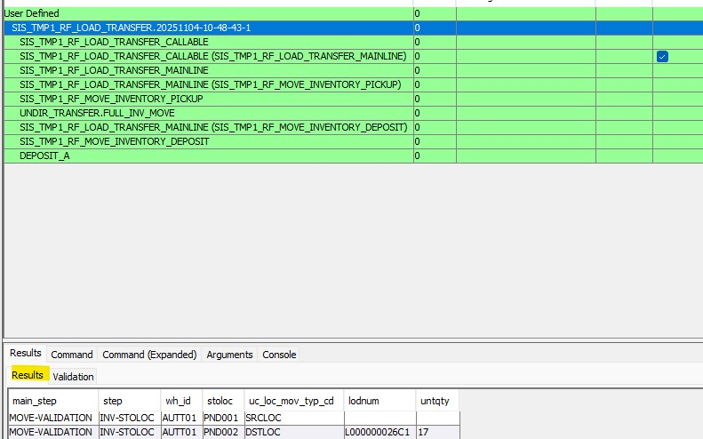
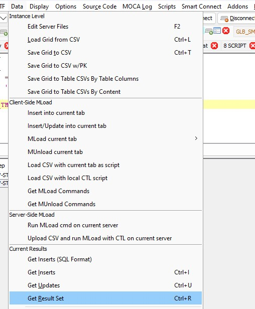
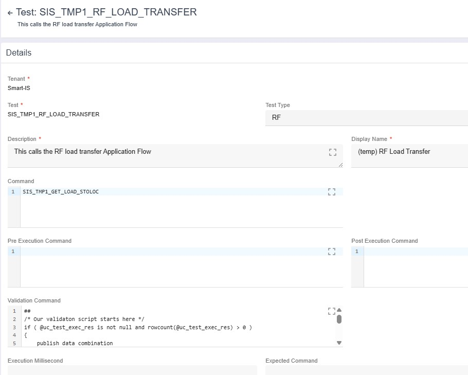
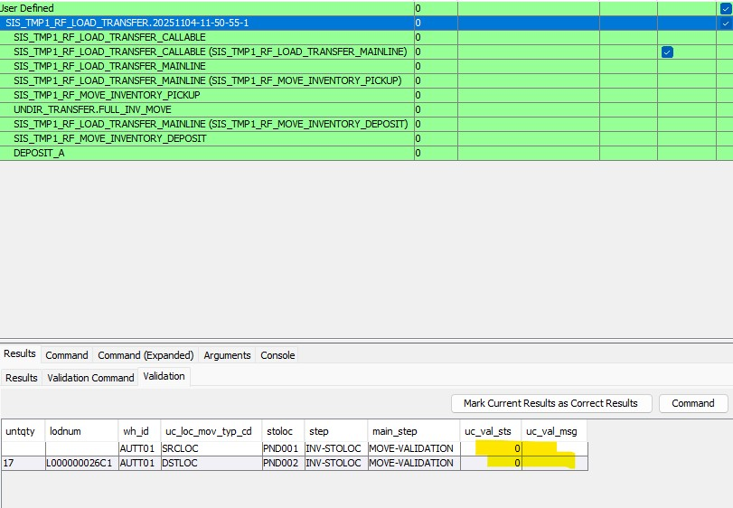

# Overview
This section covers how we define output for user interface based (RF or Web) tests.  This is needed to properly validate the test results.

## Training Overview
This training builds upon the RF training excercise.  In that exercise we created a test that picks up all loads from a location
and then drops them into destination.
* We will create a command that captures current location of the load
* Then we will call that command as part of PICK and DEPOSIT tests

### Create command to capture load location and set for test
1. Create new comamnd TMP1_GET_LOAD_STOLOC and it has following code ````
publish data
where srcloc = @srcloc
and dstloc = @dstloc
and wh_id = nvl(@wh_id,@@WH_ID)
and main_step = nvl(@main_step, 'MOVE-VALIDATION' )
and step = nvl(@step, 'INV-STOLOC' )
|
{
    [
    select ff.*
    from
    (
        select @main_step main_step,
               @step step,
              locmst.wh_id,
              locmst.stoloc,
              case
                  when locmst.stoloc = @srcloc then 'SRCLOC'
                  else 'DSTLOC'
               end uc_loc_mov_typ_cd,
               iv.lodnum,
               sum(iv.untqty) untqty
        from locmst
             left outer join inventory_view iv on iv.wh_id = locmst.wh_id and iv.stoloc = locmst.stoloc
        where locmst.wh_id = @wh_id
        and locmst.stoloc in ( @srcloc, @dstloc )
        group by
               locmst.wh_id,
               locmst.stoloc,
               iv.lodnum
    ) ff
    order by uc_loc_mov_typ_cd desc, stoloc, lodnum
    ] 
}
````
    * Note that we have made the command so that it returns inventory for both srcloc and dstloc.  It is important to create such snippets such that they can be reused
    * As a convention , "main_step" and "step" can be used to tag the rows
2. Modify the test we created earlier TMP1_RF_LOAD_TRANSFER to add "Command" to the one we created here 
    * Note that it is possible to put the code here inline.  In that case enclose code snippet between a pair of "##".  For example ````## noop ##````
    * This is a powerful capability where it allows a user-interface driven test to have a meaningful "output" that can then be validated

### View the output of a test
Now that we have defined an output command for the test, when we run the test we will see that output
* Execute the test
* In the output panel, if you highlight the test, you will see "Results" tab

 

### Validating the results
Now that the test has an "output", we can create a code snippet to _validate_ that output.  The most flexible way to validate it is to process the
result set of the command and then for each row indicate if it passes or not.

The rules of the validation command snippet are:
* Output is a resultset uc_test_exec_res
* For each row publish a column called "uc_val_sts"
    * 0 means row represents success
    * non zero means it is a failure
* Publish other columns to provide meaningful data

In order to simplify this and create reusable code we should create comamnd output in a meaningful way.  For example in our command output:
* Note that we have uc_loc_mov_typ_cd as SRCLOC or DSTLOC
* So logic of validating can simply be that rows with SRCLOC will have null for lodnum and DSTLOC will have not null

You can follow following steps:
* Run the command in MOCA Client so run

````
publish data
where srcloc = 'PND001'
and dstloc = 'PND002'
|
Script("SIS_TMP1_GET_LOAD_STOLOC")
````
* From MOCA Client, Data pulldown, select "Get Result Set"

 
 
* In a different tab, paste it - you will see a series of publish data statements.  Enclose the statements in a pair of "{}" and put ">>uc_test_exec_res".  For example

````
{
publish data where main_step = 'MOVE-VALIDATION' and step = 'INV-STOLOC' and wh_id = 'AUTT01' and stoloc = 'PND001' and uc_loc_mov_typ_cd = 'SRCLOC' and lodnum = NULL and untqty = NULL  & 
publish data where main_step = 'MOVE-VALIDATION' and step = 'INV-STOLOC' and wh_id = 'AUTT01' and stoloc = 'PND002' and uc_loc_mov_typ_cd = 'DSTLOC' and lodnum = 'L000000026C1' and untqty = '17'  
}
>> uc_test_exec_res
````

* Now you can write MOCA Snippet to validate.  For example

````
{
publish data where main_step = 'MOVE-VALIDATION' and step = 'INV-STOLOC' and wh_id = 'AUTT01' and stoloc = 'PND001' and uc_loc_mov_typ_cd = 'SRCLOC' and lodnum = NULL and untqty = NULL  & 
publish data where main_step = 'MOVE-VALIDATION' and step = 'INV-STOLOC' and wh_id = 'AUTT01' and stoloc = 'PND002' and uc_loc_mov_typ_cd = 'DSTLOC' and lodnum = 'L000000026C1' and untqty = '17'  
}
>> uc_test_exec_res
|
/* Our validaton script starts here */
if ( @uc_test_exec_res is not null and rowcount(@uc_test_exec_res) > 0 )
{
    publish data combination
    where res = @uc_test_exec_res
    |
    {   
        if ( @uc_loc_mov_typ_cd = 'SRCLOC' )
            filter data
            where moca_filter_level = 2
            and uc_val_sts = iif ( @lodnum is null, 0, -1 )
            and uc_val_msg = iif ( @lodnum is null, "", "Source Location has inventory" )
        else
            filter data
            where moca_filter_level = 2
            and uc_val_sts = iif ( @lodnum is null, -2, 0 )
            and uc_val_msg = iif ( @lodnum is null, "Destination location is empty", "" )
    }
}
else
    publish data
    where uc_val_sts = -1
    and uc_val_msh = "No resultset available"
````

* Now we can set the validation snippet for the test.  As indicated earlier:
    * We can create a new command and call it
    * We can call the snippet inlne

* So here we will call it inline

````
##
/* Our validaton script starts here */
if ( @uc_test_exec_res is not null and rowcount(@uc_test_exec_res) > 0 )
{
    publish data combination
    where res = @uc_test_exec_res
    |
    {   
        if ( @uc_loc_mov_typ_cd = 'SRCLOC' )
            filter data
            where moca_filter_level = 2
            and uc_val_sts = iif ( @lodnum is null, 0, -1 )
            and uc_val_msg = iif ( @lodnum is null, "", "Source Location has inventory" )
        else
            filter data
            where moca_filter_level = 2
            and uc_val_sts = iif ( @lodnum is null, -2, 0 )
            and uc_val_msg = iif ( @lodnum is null, "Destination location is empty", "" )
    }
}
else
    publish data
    where uc_val_sts = -1
    and uc_val_msh = "No resultset available"
##
````

* Set the above for the test 

### View Validaion Output
Now that we have defined validation, lets run the test again
* Execute the test
* In the output pane, if you highlight the test, you will see "Validation" tab


