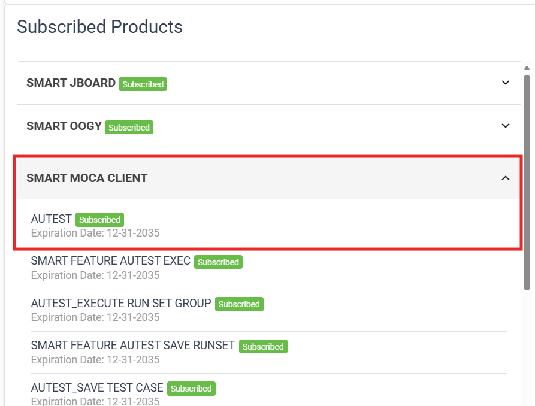
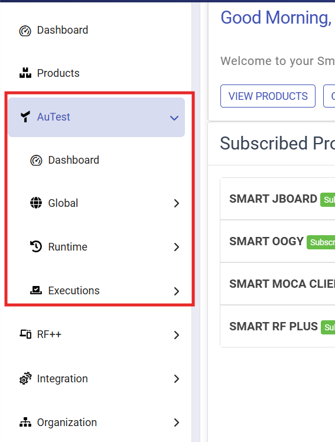
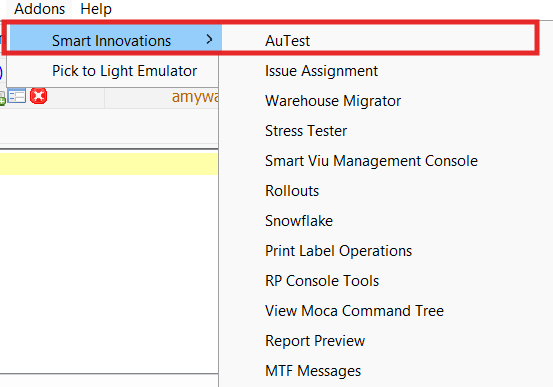
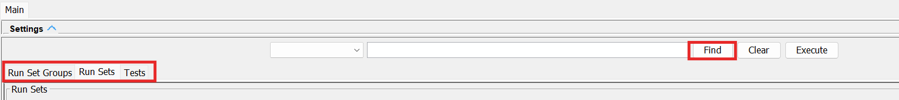

# Overview
This training tracks helps in getting started with Smart AuTest.  Smart AuTest has two basic components
- The Web based solution to maintain the metadata
- Smart MOCA Client to launch the tests

Both systems work together where the metadata is fetched from the cloud and the tests are executed in the customer environment.

## Training Objective
At the end of this lesson:
* Understand how to navigate apps.smart-is.com
* Understand how to connect Smart MOCA Client to the cloud data store
* Setup the connection in Smart AuTest for running the tests

### Get your application Key
[Follow these steps to create your application key](./Getting_AuTest?id=application-key-generation)

### Connect Smart MOCA Client to the cloud backend
[Follow these steps to connect Smart MOCA Client to the cloud backend](./Getting_AuTest?id=launching-autest-from-moca)

### Prepare Target environment for automated testing
We want to prevent a user from accidently running a test against an environment.  In order to prevent it, we enforce that
an environment variable should be set in the target envirionment.  [Follow these steps to do it](./Getting_AuTest?id=preparing-the-target-environment-for-smart-autest)

### Get familiar with Nagivating Web
- Navigate to https://apps.smart-is.com/ and login
- You will see subscriptions.

  

  
  

 
- On left hand side you will see AuTest Menu.

  

  
  

- Get famiilar with the navigation

### Define connecion in Smart MOCA Client
Smart AuTest supports following types of tests:
- MOCA Based Tests
- RF based tests
- Web UI based tests

You will need to define connection in Smart MOCA Client so that it has all of the connections defined [Define Connections](./Getting_AuTest?id=define-connections-in-moca-client)

### Validate the connections
If above steps were done properly you will be able to do following:
* Launch AuTest from Smart MOCA Client

  

  
  

* If you have access to multiple tenants, you will get a dropdown to select tenant.  If so, select the tenant
  
* You will see following screen
    * We have three basic testing objects.  Tests, Run Sets, and Ruin Set Groups
    * We can press "Find" to fetch the data from the cloud metadata store
    * Settings will show the settings inherited from the Connection defined in MOCA Client.  We should always inherit from there and not overide here
  
  

  
  

* Navigate to each tab and press Find.  You will see the data
* Recognize the "world" tenant objects.  These are maintained by Smart IS
* If you were to create custom objects they will not be in the world tenant.
* Objects have a prefix.  "World" object (mostly) have BASE prefix.  Each tenant will have a specific prefix
* Exection "Results" are available by pressing the "Results" here
