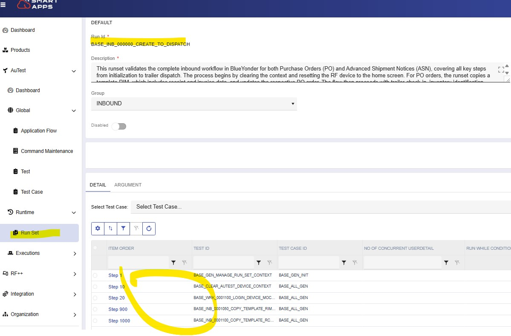
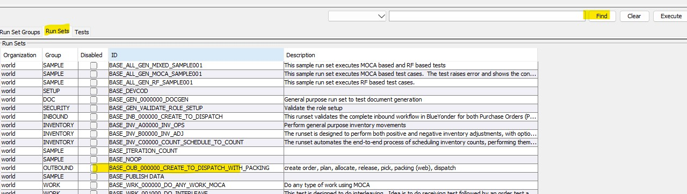
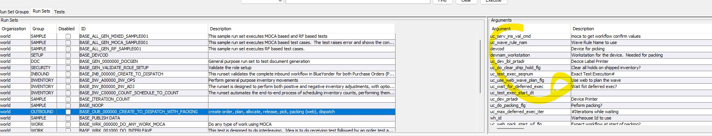
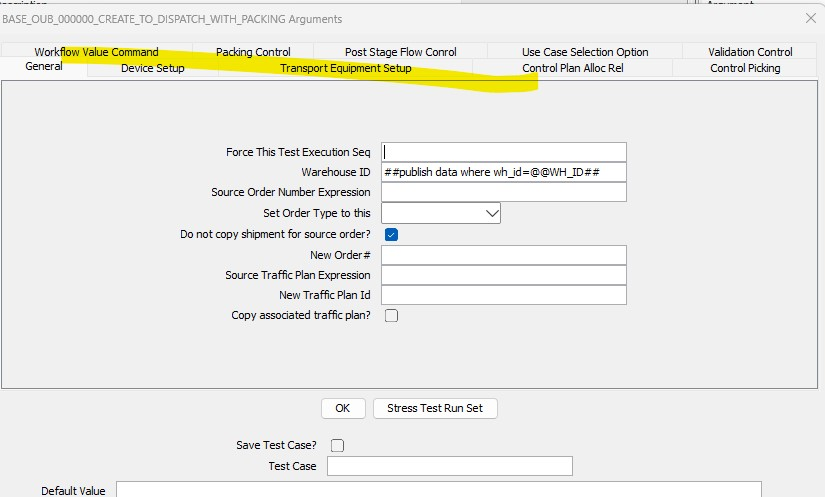
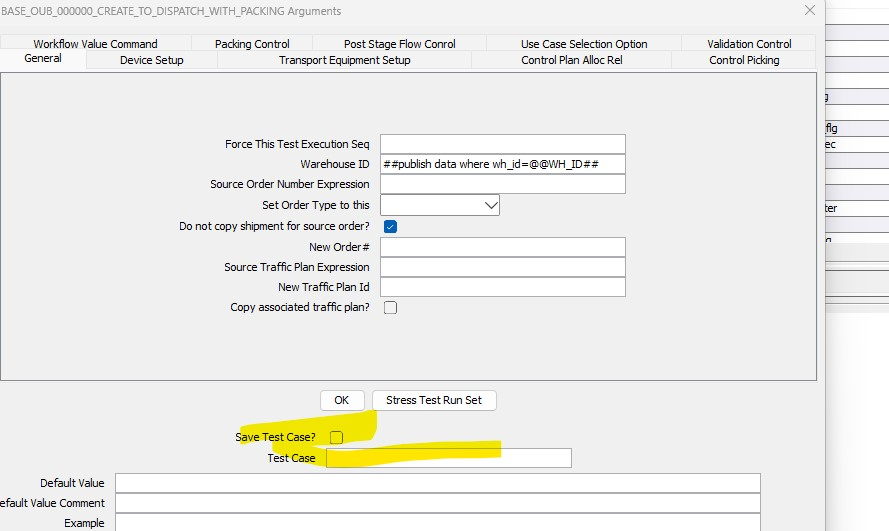
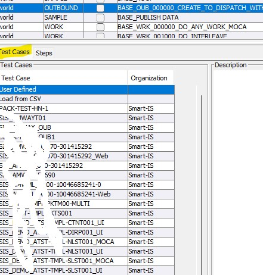
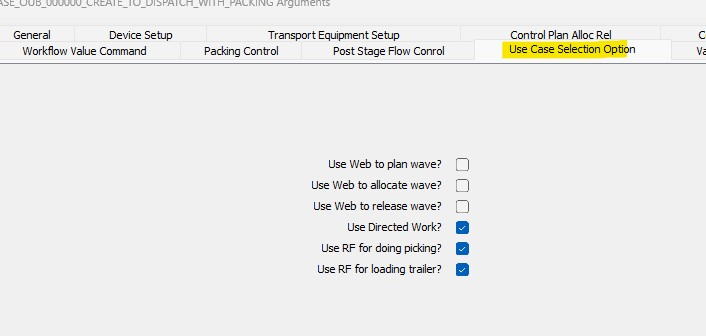
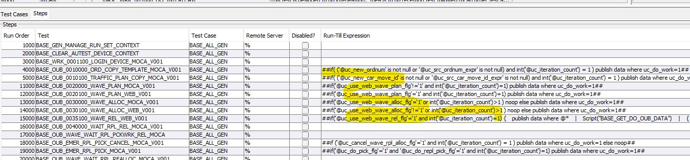

# Overview
This lesson will help you understand how to run the tests.  We have three types of objects we can execute:
- Tests:  These are the most basic object that can be executed.  These are executed stand-alone only while developing new tests.  We will generally not run tests directly
- Run Sets:  These are the typical objects we will execute as part of our testing methodology
- Run Set Group:  We can define groups of "Run Set Test Cases".  This comes in handly when we want to run regression tests - as it allows us to launch a run set group directly from command line

## Run Sets
### View Run Sets on the web
We can maintain the run sets from the web 

### View Run Sets from Smart AuTest
While we can view them on the web, in order to run a run-set, we need to find it in our Smart AuTest addon in MOCA Client.  All run-sets are 
available under the Run Sets tab.  Pressing Find while on this tab will show the run sets 

### Run Set Arguments
We can provide input to a run set in order to execute it.  If you highlight a run-set, you will see the parameters that can be passed to it
on the right hand side.  This is showing the possible parameters 

If you pressed Execute that will show the same parmeters along with a way to provide input.  You will see that input parameters are organized
in tabs 

Note that all of these parmeters, their prompts, valid possibilities, sequencing, tabs, etc are all defined in metadata.  The names of various tabs are all based on certain conventions.  Otherwise tabs have no significance.

### Run Set Test Cases
A Run Set "Test Case" is simply an instance of run sets with all of its input saved.  Whenever we run a run-set we are allowed to save that as a "Test Case". 




When we have defined test cases, they will show up in 
the "Test Cases" tab 




### Running a Run Set
In order to run a run-set, highlight it and select one. 
* Highlight the "BASE_ITERATION_COUNT" and press Execute.  You will see that a step will execute 5 times and it is running as a MOCA test
* Highlight the "BASE_ALL_GEN_RF_SAMPLE001".  This will launch RF test.  The steps themselves may not make much sense at this point.
    * Note that RF emulator launched and is connected
    * See the "uc_test_exec_seqnum" argument that is generated for each run set.  That is an important concept
    * Get familiar with how the execution is displayed
* Get familiar with the following run sets.  See how arguments are laid out.  These three run sets form the core of the testing.  Understand how
these run sets go through end to end functionality.  Relate that to the arguments
    * BASE_OUB_000000_CREATE_TO_DISPATCH_WITH_PACKING
        * See "Use Case Selection" tab.  See how we can have the same run-set but control how we do things 
        * After seeing the "Use Case" input checkboxes, come back to the "Steps" tab and see how these input fields are used to control the flow 
            * When we have a "Run-Till" like ````##if('@uc_use_web_wave_plan_flg'!='1' and int('@uc_iteration_count')=1) publish data where uc_do_work=1##````
                * uc_use_web_wave_plan_flg is our checkbox so 1 means it is checked
                * If this expression returns a value then we execute the step else we do not
                * We keep running the step until we get no rows
                * On each iteration uc_iteration_count increments
                * See if you can make sense of the expression.

    * BASE_INV_C00000_COUNT_SCHEDULE_TO_COUNT
        * See if you can make sense of the input and steps

    * BASE_INB_000000_CREATE_TO_DISPATCH
        * See if you can make sense of the input and steps


---
<br>
