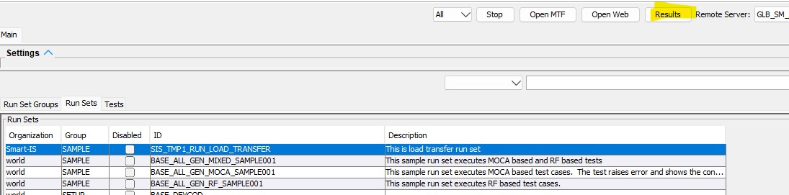
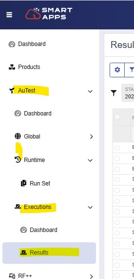
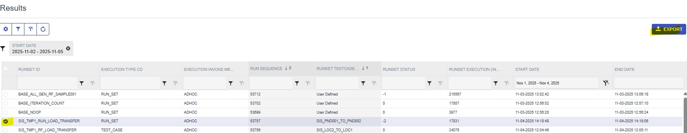

## Overview
This training is to get familiar with viewing execution results.  We can view results from MOCA Client AuTest or from the web

## View From Smart MOCA Client AuTest
* Highlight the run set and press Results 
* Validate the filter fields 

| Filter Field    | Description                     | Comments |
|-----------------|---------------------------------|----------|
| Tenant          | Tenant that we want to look up  | Available if you have access to multiplle tenants |
| Run Id          | The run set id                  | If we had one selected, it is defaulted |
| Test            | Filter for a specific test      | Applies if test is run stand-alone |
| Test Case       | Filter for a specific test case | Applies if test is run stand-alone |
| Remote Server   | The name of the connection      | Defaulted to one we logged in with |
| Run#            | Every execution is assigned a sequence | |
| Status          | Filter for a specifc error      | 0 implies success |
| Error           | Dropdown                        | Allows for easily filtering for failed runs |
| Start Date      | Filter date                     | Runs since this date are displayed |

* Pressing Find displays the reults 
* Select a row
    * Below we will see the arguments the run set was executed with 
    * To see more data, double click on the selecte row
    * It will display the same results as were displayed when test was executed.  Refer to Run Set execution training 

  ## View From Web
  * Login to the Smart Apps
  * Select Results tab 
  * Use filter row.  It will show results
  * Select a row and press "Export" to see a PDF of the execution 
  * This will export a PDF for the whole execution 
  
   
